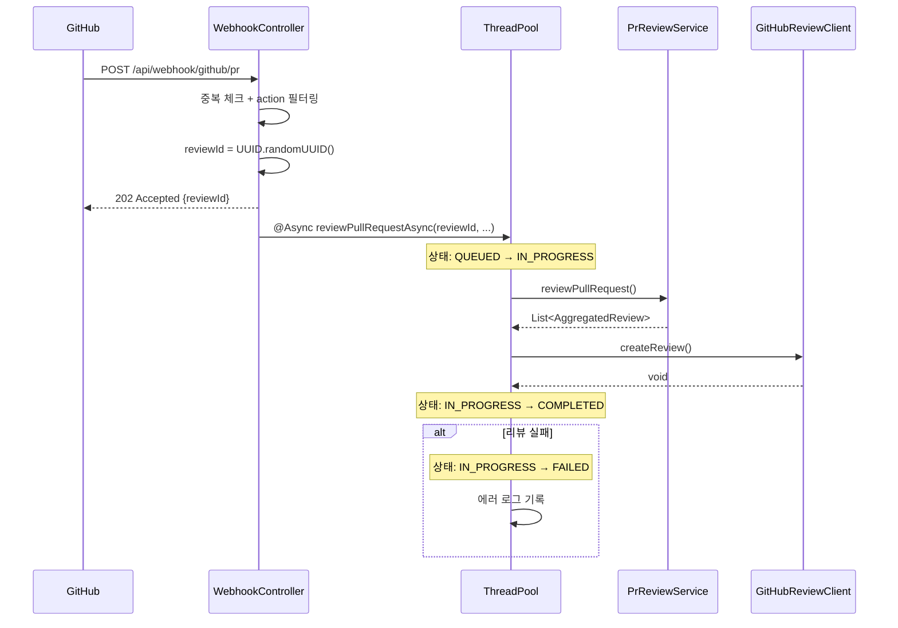

# F5: Async Processing - SPEC

## 개요
Webhook 수신 시 즉시 응답하고, 리뷰 작업을 비동기로 처리하여
GitHub의 Webhook 타임아웃(10초)을 방지하고 서버 응답성을 개선한다.

## 현재 문제점
- `WebhookController.handlePullRequestEvent()`가 리뷰 완료까지 동기적으로 블로킹
- LLM 호출 (3~15초) + GitHub API 호출로 전체 처리 시간이 20~60초 소요 가능
- GitHub Webhook은 10초 내 응답이 없으면 재시도 → 중복 처리 위험

## 시퀀스 다이어그램

### 비동기 리뷰 처리 흐름


## 범위

### In-Scope
- Webhook 즉시 응답 (202 Accepted)
- 리뷰 작업을 별도 스레드에서 비동기 실행
- 리뷰 상태 추적 (시작/진행중/완료/실패)
- 실패 시 로그 기록

### Out-of-Scope
- 메시지 큐 도입 (RabbitMQ, Kafka 등)
- 리뷰 결과 API 조회 엔드포인트 (F8에서 구현)
- 재시도 로직

## 상세 설계

### 구현 방식: Spring @Async

#### 처리 흐름
```
WebhookController
  ├─ Webhook 수신
  ├─ 중복 체크 + action 필터링 (동기)
  ├─ reviewId 생성 (UUID)
  ├─ 202 Accepted 응답 즉시 반환 (reviewId 포함)
  └─ @Async PrReviewService.reviewPullRequestAsync(reviewId, ...)
       ├─ 상태: QUEUED → IN_PROGRESS
       ├─ Feature 리뷰 수행
       ├─ GitHub에 리뷰 게시
       ├─ 상태: IN_PROGRESS → COMPLETED / FAILED
       └─ 로그 기록
```

#### 202 Accepted 응답 형식

```json
{
  "status": "accepted",
  "reviewId": "550e8400-e29b-41d4-a716-446655440000",
  "message": "Review queued for PR #42",
  "estimatedDuration": "30-60s",
  "links": {
    "status": "/api/reviews/{reviewId}/status"
  }
}
```

#### 응답 DTO

```java
@Getter @Builder
public class WebhookAcceptedResponse {
    private final String status;          // "accepted"
    private final String reviewId;        // UUID
    private final String message;         // 설명 메시지
    private final String estimatedDuration; // 예상 소요 시간
    private final Map<String, String> links; // HATEOAS 링크

    public static WebhookAcceptedResponse of(String reviewId, int prNumber) {
        return WebhookAcceptedResponse.builder()
            .status("accepted")
            .reviewId(reviewId)
            .message("Review queued for PR #" + prNumber)
            .estimatedDuration("30-60s")
            .links(Map.of("status", "/api/reviews/" + reviewId + "/status"))
            .build();
    }
}
```

#### 리뷰 상태 조회 API (F8 연동)

```
GET /api/reviews/{reviewId}/status

응답:
{
  "reviewId": "550e8400-...",
  "status": "IN_PROGRESS",    // QUEUED | IN_PROGRESS | COMPLETED | FAILED
  "prNumber": 42,
  "repositoryId": 12345,
  "startedAt": "2025-01-15T10:30:00Z",
  "completedAt": null,
  "error": null
}
```

### 리뷰 상태
```
QUEUED → IN_PROGRESS → COMPLETED
                     → FAILED
```

### ThreadPool 설정
- Core pool size: 2
- Max pool size: 5
- Queue capacity: 10
- 초과 시 거부 정책: CallerRunsPolicy

## 수정 대상 파일
- **수정**: `WebhookController.java` - 즉시 응답 + 비동기 호출
- **수정**: `PrReviewService.java` - `@Async` 메서드 추가
- **신규**: `AsyncConfig.java` - 스레드풀 설정
- **신규**: `ReviewStatus.java` - 리뷰 상태 추적 (선택)

## 테스트 케이스
1. Webhook 수신 → 202 Accepted 즉시 반환
2. 비동기 리뷰 완료 후 GitHub에 코멘트 작성
3. 비동기 리뷰 실패 시 에러 로그 기록
4. 동시 여러 PR 리뷰 요청 → 스레드풀에서 처리

## 의존성
- Phase 1 완료 후 진행

## 완료 조건
- [ ] Webhook 즉시 응답 (202 Accepted)
- [ ] 비동기 리뷰 정상 완료
- [ ] 스레드풀 설정
- [ ] 실패 시 로그 기록
- [ ] 기존 기능 정상 동작
