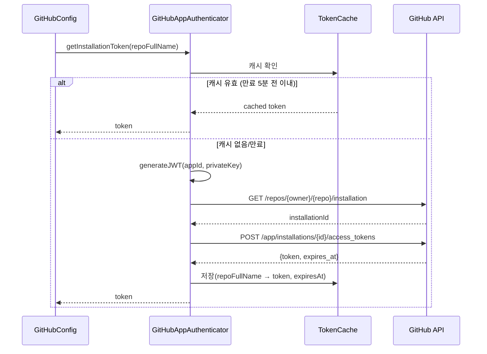

# GitHub App Auth - SPEC (MVP, 구현 완료)

## 개요
GitHub App 인증 방식으로 Repository별 Installation Token을 발급/관리하는 시스템.
JWT 생성 → Installation ID 자동 탐지 → Access Token 발급 → 캐싱.

## 상태: 구현 완료

## 관련 파일
- `GitHubAppAuthenticator.java` - JWT 생성 + Token 발급 + 캐싱
- `GitHubConfig.java` - Repository별 GitHub 클라이언트 팩토리

## 시퀀스 다이어그램

### 인증 토큰 발급 흐름


## 설정
```yaml
github:
  app:
    id: ${GITHUB_APP_ID}
    installation-id: ${GITHUB_APP_INSTALLATION_ID}   # 현재 미사용 (자동 탐지)
    private-key-path: ${GITHUB_APP_PRIVATE_KEY_PATH}
  webhook:
    secret: ${GITHUB_WEBHOOK_SECRET}                  # 검증 미구현
```

## 인증 흐름

### 전체 플로우
```
1. Private Key (PEM) → JWT 생성 (RS256, 10분 유효)
2. JWT로 GitHub API 호출 → Repository의 Installation ID 자동 탐지
3. Installation ID로 Access Token 발급 (1시간 유효)
4. Token 캐싱 (ConcurrentHashMap, Repository별)
5. 캐시된 Token이 유효하면 재사용 (만료 5분 전에 갱신)
```

### GitHubAppAuthenticator 상세

#### getInstallationToken(repoFullName)
```
1. 캐시 확인 → 유효하면 반환
2. generateJWT() → RS256 JWT 생성
3. GET /repos/{owner}/{repo}/installation → Installation ID 조회
4. POST /app/installations/{id}/access_tokens → Token 발급
5. Token + 만료시간 캐시 저장
6. Token 반환
```

#### TokenCache
```java
private static class TokenCache {
    String token;
    Instant expiresAt;

    boolean isValid() {
        // 만료 5분 전에 갱신
        return token != null && expiresAt != null
            && Instant.now().isBefore(expiresAt.minusSeconds(300));
    }
}
```

#### generateJWT() [private]
- PEM 파일에서 PrivateKey 읽기 (BouncyCastle)
- JJWT로 JWT 생성:
  - iss: GitHub App ID
  - iat: 현재 시각
  - exp: 10분 후
  - 서명: RS256

#### readPrivateKey(path) [private]
- PEMParser로 PEM 파일 읽기
- PrivateKeyInfo 또는 PEMKeyPair 형식 모두 지원

### GitHubConfig

#### createGitHubClient(repoFullName)
```
1. authenticator.getInstallationToken(repoFullName)
2. GitHubBuilder().withAppInstallationToken(token).build()
3. GitHub 클라이언트 반환
```
- Bean이 아닌 동적 생성 (Repository별로 다른 Token)

## 의존성
| 라이브러리 | 용도 |
|------------|------|
| `io.jsonwebtoken:jjwt-*:0.12.3` | JWT 생성 |
| `org.bouncycastle:bcpkix-jdk18on:1.77` | PEM 파일 읽기 |
| `org.kohsuke:github-api:1.319` | GitHub API 클라이언트 |

## 에러 처리 정책

| 상황 | 동작 | 영향 |
|------|------|------|
| PEM 파일 미존재/읽기 실패 | 서버 시작 시 실패 (Fatal) | 서버 가동 불가 |
| PEM 형식 잘못됨 | JWT 생성 실패 → 예외 전파 | 모든 리뷰 실패 |
| JWT 생성 실패 | 예외 전파 | 해당 요청 실패 |
| Installation ID 조회 실패 (403/404) | 예외 전파 | Repository 리뷰 불가 |
| Access Token 발급 실패 | 예외 전파 | Repository 리뷰 불가 |
| Token 만료 (캐시 미갱신) | 다음 요청에서 자동 갱신 | 1회 실패 가능 |
| GitHub API Rate Limit | 예외 전파 (재시도 없음) | 임시 리뷰 불가 |

## 테스트 현황
- **없음** (외부 API 의존으로 mock 기반 테스트 필요)

## 알려진 제한
- `installation-id` 설정이 존재하지만 실제로 미사용 (자동 탐지)
- `getInstallationToken()` (인자 없는 deprecated 버전)이 남아있음
- Token 캐시가 메모리 기반 → 서버 재시작 시 초기화
- GitHub API Rate Limit 에러 처리 미구현
- RestTemplate 사용 (WebClient 아님)
