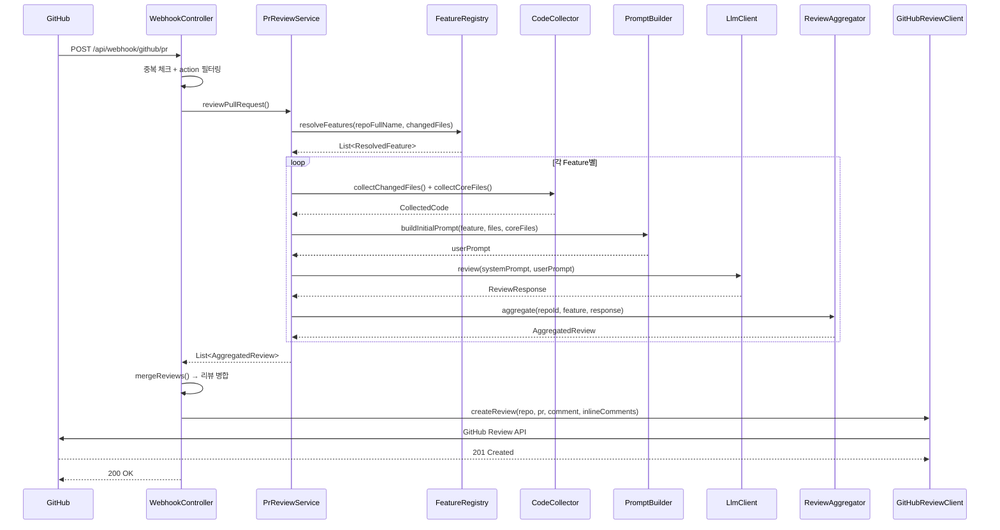

# Webhook Receiver - SPEC (MVP, 구현 완료)

## 개요
GitHub Webhook 이벤트를 수신하여 PR 리뷰 파이프라인을 시작하는 엔드포인트.

## 상태: 구현 완료

## 관련 파일
- `WebhookController.java` - REST 컨트롤러
- `WebhookPayload.java` - Webhook 요청 DTO

## 시퀀스 다이어그램

### 전체 리뷰 파이프라인


## 엔드포인트
```
POST /api/webhook/github/pr
GET  /api/webhook/health
```

## 범위 정의

### In-Scope
- PR 이벤트(`opened`, `synchronize`) 수신 및 리뷰 파이프라인 트리거
- 중복 Webhook 이벤트 방지 (delivery ID 기반)
- 리뷰 결과를 GitHub Review API로 게시
- Health check 엔드포인트

### Out-of-Scope
- Webhook Secret HMAC 검증 → F3: webhook-security
- 비동기 처리 → F5: async-processing
- Draft PR 리뷰 (현재 필터링하지 않지만 향후 고려)

## 의존성
- **호출**: `PrReviewService.reviewPullRequest()` → 리뷰 수행
- **호출**: `GitHubReviewClient.createReview()` / `createSimpleComment()` → GitHub 게시

## 동작

### 입력
- **Header**: `X-GitHub-Delivery` (중복 방지용 delivery ID, optional)
- **Header**: `X-GitHub-Event` (이벤트 타입 - 현재 미검증)
- **Body**: `WebhookPayload` (GitHub PR Webhook JSON)

### WebhookPayload DTO 정의

| 필드 | 타입 | 필수 | JSON 매핑 | 설명 |
|------|------|------|-----------|------|
| `action` | String | **필수** | `action` | PR 이벤트 액션 (opened, synchronize, closed 등) |
| `pullRequest` | PullRequest | **필수** | `pull_request` | PR 정보 |
| `repository` | Repository | **필수** | `repository` | 저장소 정보 |

**PullRequest:**

| 필드 | 타입 | 필수 | 설명 |
|------|------|------|------|
| `number` | int | **필수** | PR 번호 |
| `title` | String | **필수** | PR 제목 |
| `body` | String | 선택 | PR 본문 (null 가능) |
| `base` | Branch | **필수** | base 브랜치 (병합 대상) |
| `head` | Branch | **필수** | head 브랜치 (PR 소스) |

**Branch:**

| 필드 | 타입 | 필수 | 설명 |
|------|------|------|------|
| `ref` | String | **필수** | 브랜치명 |
| `sha` | String | **필수** | 커밋 SHA |

**Repository:**

| 필드 | 타입 | 필수 | JSON 매핑 | 설명 |
|------|------|------|-----------|------|
| `id` | Long | **필수** | `id` | GitHub Repository ID |
| `fullName` | String | **필수** | `full_name` | 저장소 전체 이름 (owner/repo) |
| `name` | String | 선택 | `name` | 저장소명 |
| `owner` | Owner | 선택 | `owner` | Owner 정보 |

### Validation 규칙
- `action`이 null/empty → 400 Bad Request
- `pullRequest`가 null → 400 Bad Request
- `repository`가 null → 400 Bad Request
- `repository.id`가 null → 400 Bad Request
- `repository.fullName`이 null/empty → 400 Bad Request

### 처리 흐름
```
1. 중복 이벤트 체크 (ConcurrentHashMap<String> deliveryId)
2. action 필터링 → "opened", "synchronize"만 처리
3. PR 정보 추출 (repositoryId, repoFullName, prNumber, prTitle, prBody, baseBranch, headBranch)
4. PrReviewService.reviewPullRequest() 호출 (동기)
5. 리뷰 결과를 GitHub에 게시 (postReviews)
6. 응답 반환
```

### 응답
| 상황 | 응답 |
|------|------|
| 중복 delivery | `200 OK` - "Duplicate delivery ignored" |
| 무시되는 action | `200 OK` - "Ignored action: {action}" |
| 리뷰 없음 | `200 OK` - "No reviews generated" |
| 리뷰 성공 | `200 OK` - "Review completed for PR #{n}" |
| 에러 | `500 Internal Server Error` |

### 리뷰 게시 로직 (postReviews)
- 여러 Feature의 리뷰를 하나의 리뷰로 병합
- 전체 리뷰: `# 전체 리뷰 결과` → Feature별 섹션
- Inline comments: 모든 Feature의 코멘트를 합산
- inline comments 있으면 → `GitHubReviewClient.createReview()`
- inline comments 없으면 → `GitHubReviewClient.createSimpleComment()`

## 테스트 현황
- **없음** (향후 F4에서 추가 예정)

## 엣지 케이스
1. `X-GitHub-Delivery` 헤더 없음 (null) → 중복 체크 스킵, 정상 처리
2. `action`이 null/빈 문자열 → `isReviewableAction()` false → "Ignored action" 응답
3. `pullRequest`가 null → NullPointerException → 500 응답 (현재), 개선 필요
4. `body`가 null → PrParser에서 빈 결과 반환 (Feature 추출 불가)
5. 중복 방지 Set 무한 증가 → 메모리 누수 가능 (상한: 미설정, 개선 필요)
6. `postReviews` GitHub API 실패 → 로그만 기록, 200 OK 반환 (리뷰는 완료된 것으로 간주)

## 에러 처리 정책
| 상황 | 동작 | 응답 |
|------|------|------|
| Payload 역직렬화 실패 | Spring이 400 반환 | `400 Bad Request` |
| 필수 필드 null | 현재 NPE → 500 (개선: 400) | `500` → `400` |
| PrReviewService 예외 | catch → 500 응답 | `500 Internal Server Error` |
| postReviews 실패 | catch → 로그, 200 반환 | `200 OK` (리뷰 자체는 완료) |

## 알려진 제한
- 중복 방지 Set이 메모리 기반 → 서버 재시작 시 초기화, 무한 증가 가능 (최대 10000개 유지 후 LRU 제거 권장)
- Webhook Secret 검증 미구현 → F3에서 해결 예정
- 동기 처리 → Webhook 타임아웃 위험 → F5에서 해결 예정
- payload validation 미구현 → 필수 필드 null 시 NPE 발생
