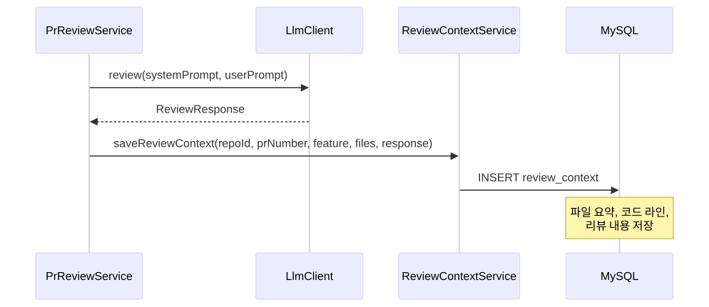
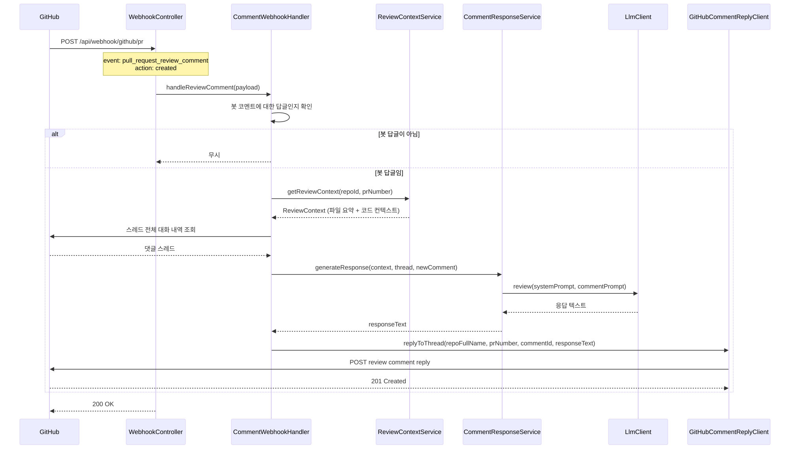

# F9: Review Comment Reply - SPEC

## 개요
봇이 작성한 리뷰 코멘트에 개발자가 답글을 달면, 저장된 리뷰 컨텍스트를 활용하여
LLM이 해당 스레드에 대화형으로 응답하는 기능.

## 상태: 미구현

## 관련 파일 (예정)
- `CommentWebhookHandler.java` - 댓글 Webhook 이벤트 처리
- `ReviewContextService.java` - 리뷰 컨텍스트 저장/조회
- `ReviewContextRepository.java` - JPA Repository
- `CommentResponseService.java` - 댓글 응답 생성 로직
- `GitHubCommentReplyClient.java` - 스레드 답글 작성 API

## 시퀀스 다이어그램

### 1차 리뷰 시 컨텍스트 저장



### 댓글 응답 흐름



## 범위 정의

### In-Scope
- 봇이 작성한 리뷰 코멘트에 대한 답글 감지
- 1차 리뷰 시 코드 컨텍스트를 DB에 저장 (파일 요약, 코드 라인, 리뷰 내용)
- 저장된 컨텍스트 + 댓글 스레드를 LLM에 제공하여 응답 생성
- 해당 리뷰 스레드에 답글로 응답 게시
- 다중 턴 대화 지원 (한 스레드에서 여러 번 왕복)

### Out-of-Scope
- 봇 리뷰가 아닌 일반 PR 코멘트에 대한 응답
- @멘션 기반 트리거
- 코드 수정 제안 (Auto-fix)
- 리뷰 스레드 resolve/unresolve 자동화

## 의존성
- **의존**: `PrReviewService` → 1차 리뷰 시 컨텍스트 저장 트리거
- **의존**: `LlmClient` → 댓글 응답 생성
- **의존**: `GitHubConfig` / `GitHubAppAuthenticator` → GitHub API 인증
- **의존**: MySQL → review_context 테이블
- **선행 권장**: F1 (review-quality) - 더 나은 컨텍스트 요약
- **선행 권장**: F8 (review-dashboard) - review_history 테이블 구조 공유 가능

## 상세 설계

### 1. Review Context Storage

#### DB 스키마: `review_context`
```sql
CREATE TABLE review_context (
    id              BIGINT AUTO_INCREMENT PRIMARY KEY,
    repository_id   BIGINT NOT NULL,
    pr_number       INT NOT NULL,
    feature_name    VARCHAR(255) NOT NULL,
    -- Feature별 1행 저장 (PR에 Feature 3개면 3행)

    -- 리뷰 시점 커밋 SHA (코드 변경 감지용)
    head_sha        VARCHAR(40) NOT NULL,

    -- 파일 컨텍스트: 요약 + 코드 스니펫 + diff
    file_contexts   JSON NOT NULL,
    -- 구조: [{ "path", "summary", "codeSnippets", "diff", "keyLines" }]

    -- 원본 리뷰 내용
    general_review  TEXT,
    inline_comments JSON,
    -- 구조: [{"path": "src/AuthService.java", "line": 45, "body": "[Major] ..."}]

    -- 봇 GitHub 코멘트 ID (JSON 배열, 답글 시 ID 추가)
    bot_comment_ids JSON NOT NULL DEFAULT ('[]'),
    -- 구조: [12345, 12346, 12347]
    -- 봇이 답글할 때마다 새 ID 추가 → 다중 턴 감지 가능

    created_at      TIMESTAMP DEFAULT CURRENT_TIMESTAMP,
    updated_at      TIMESTAMP DEFAULT CURRENT_TIMESTAMP ON UPDATE CURRENT_TIMESTAMP,

    UNIQUE INDEX idx_repo_pr_feature (repository_id, pr_number, feature_name),
    INDEX idx_created (created_at)
);
```

#### 저장 단위: Feature별 1행

PR에 여러 Feature가 있을 때 각각 독립적인 컨텍스트로 저장:
```
PR #42: "결제 + 인증 리팩토링"
  → review_context (id=1, feature=AUTH, file_contexts=[AuthService.java, ...])
  → review_context (id=2, feature=PAYMENT, file_contexts=[PaymentService.java, ...])
```
댓글이 달린 파일 경로 → 해당 Feature 컨텍스트만 로드 (토큰 절약)

#### file_contexts JSON 구조

1차 리뷰 시 **코드 스니펫 + diff를 함께 저장** (요약만이 아닌 실제 코드 포함):

```json
[
  {
    "path": "src/main/java/com/example/AuthService.java",
    "summary": "JWT 기반 인증 서비스. login(), validateToken(), refreshToken() 메서드 포함",
    "keyLines": [45, 67, 89],
    "changes": "validateToken()에 만료 체크 로직 추가, refreshToken() 신규 구현",
    "codeSnippets": [
      {
        "startLine": 40,
        "endLine": 55,
        "code": "public boolean validateToken(String token) {\n    if (token == null) return false;\n    ..."
      },
      {
        "startLine": 65,
        "endLine": 75,
        "code": "public String refreshToken(String oldToken) {\n    ..."
      }
    ],
    "diff": "@@ -40,5 +40,10 @@\n+ if (token.isExpired()) {\n+     throw new TokenExpiredException();\n+ }"
  }
]
```

#### 코드 변경 감지 (HEAD SHA 비교)

댓글 응답 시 **리뷰 이후 코드가 변경되었는지** 감지하여 최신 코드도 함께 제공:

```
댓글 수신
  → review_context.head_sha 로드 (리뷰 시점 SHA)
  → PR의 현재 HEAD SHA 조회 (GitHub API)
  → SHA 비교
    ├─ 동일: 저장된 컨텍스트만 사용
    └─ 다름: 해당 파일의 최신 코드를 GitHub API로 조회
             → LLM에 "리뷰 시점 코드" + "현재 코드 (변경됨)" 함께 제공
```

**변경 감지 시 LLM 프롬프트 추가 섹션**:
```
# 주의: 리뷰 이후 코드가 변경되었습니다
## 리뷰 시점 코드 (SHA: abc123)
{저장된 codeSnippet}

## 현재 코드 (SHA: def456)
{GitHub API로 조회한 최신 코드}

변경사항을 반영하여 답변해주세요.
```

#### 저장 시점
1. `PrReviewService.reviewPullRequest()` 완료 후
2. `ReviewAggregator.aggregate()` 결과에서 file_contexts 추출
3. GitHub 리뷰 게시 후 반환된 코멘트 ID → `bot_comment_ids`에 저장
4. PR의 현재 HEAD SHA → `head_sha`에 저장

### 2. Comment Webhook Handler

#### 트리거 이벤트
- **Event**: `pull_request_review_comment`
- **Action**: `created`
- 기존 `pull_request` 이벤트와 별도 핸들러 필요

#### Webhook Payload 구조 (GitHub)
```json
{
  "action": "created",
  "comment": {
    "id": 999888,
    "body": "이 부분은 왜 이렇게 구현했나요?",
    "user": { "login": "developer1" },
    "in_reply_to_id": 999777,
    "pull_request_review_id": 555666,
    "path": "src/AuthService.java",
    "line": 45
  },
  "pull_request": {
    "number": 42
  },
  "repository": {
    "id": 12345,
    "full_name": "owner/repo"
  }
}
```

#### 봇 답글 감지 로직 (DB 기반)

`review_context.bot_comment_ids` JSON 배열로 감지 (GitHub API 호출 불필요):

```
1. comment.in_reply_to_id 확인 (null이면 무시 - 최초 코멘트)
2. SELECT review_context WHERE repository_id AND pr_number
3. bot_comment_ids JSON 배열에 in_reply_to_id 포함 여부 확인
   → MySQL: JSON_CONTAINS(bot_comment_ids, CAST(in_reply_to_id AS JSON))
4. 포함 → 봇 답글 → 댓글 응답 프로세스 시작
5. 미포함 → 무시 (다른 사람의 코멘트에 대한 답글)
```

**다중 턴 지원**: 봇이 답글할 때마다 새 코멘트 ID를 `bot_comment_ids`에 추가:
```
초기:    [100, 101, 102]        ← 1차 리뷰 코멘트 3개
1턴 후:  [100, 101, 102, 200]   ← 봇 답글 #200 추가
2턴 후:  [100, 101, 102, 200, 300] ← 봇 답글 #300 추가
→ 개발자가 #200이나 #300에 답글해도 감지 가능
```

### 3. Comment Response Logic

#### LLM 프롬프트 구성

**System Prompt (댓글 응답용)**:
```
당신은 코드 리뷰어입니다. 이전에 PR에 대한 코드 리뷰를 수행했습니다.
개발자가 당신의 리뷰 코멘트에 질문이나 의견을 남겼습니다.

규칙:
1. 이전 리뷰의 맥락을 유지하며 답변하세요.
2. 구체적인 코드 라인을 참조하세요.
3. 질문에 정확하게 답변하세요.
4. 필요하면 대안적인 구현 방법을 제안하세요.
5. 간결하게 답변하세요 (불필요한 반복 금지).
```

**User Prompt 구성**:
```
# 리뷰 컨텍스트
## 파일: {path}
- 요약: {summary}
- 변경 내용: {changes}

### 코드 스니펫 (리뷰 시점)
```java
{codeSnippets[0].code}  (L{startLine}-L{endLine})
```

### diff
```diff
{diff}
```

## 원본 리뷰 코멘트
{봇이 작성한 원본 inline comment}

# 코드 변경 감지                          ← head_sha가 다를 때만 포함
⚠️ 리뷰 이후 코드가 변경되었습니다.
### 현재 코드 (SHA: {currentSha})
```java
{GitHub API로 조회한 최신 코드}
```
변경사항을 반영하여 답변해주세요.

# 대화 스레드
[봇]: {원본 코멘트}
[개발자]: {답글 1}
[봇]: {이전 응답 1} (있을 경우)
[개발자]: {답글 2} (있을 경우)
...

# 새 댓글
{개발자의 최신 댓글}

위 댓글에 대해 답변해주세요.
```

#### 토큰 관리
| 섹션 | 예상 토큰 | 비고 |
|------|-----------|------|
| System Prompt | ~200 | 고정 |
| 파일 요약 | ~200 | 해당 Feature만 |
| 코드 스니펫 + diff | ~300-800 | 저장된 코드 |
| 코드 변경 감지 (선택) | ~200-500 | SHA 다를 때만 |
| 원본 리뷰 코멘트 | ~200 | 해당 코멘트 |
| 대화 스레드 | ~100-1000 | 턴 수에 따라 |
| 새 댓글 | ~100 | 고정 |
| **합계** | **~1300-3000** | 1차 리뷰보다 가벼움 |

→ 코드 변경이 없으면 ~1300 토큰, 변경 감지 시 ~2000-3000 토큰

#### 응답 maxTokens
- 댓글 응답: **2000 토큰** (1차 리뷰의 4000보다 적음)
- 간결한 답변 유도

### 4. Thread Reply API

#### GitHub API
```
POST /repos/{owner}/{repo}/pulls/{pull_number}/comments/{comment_id}/replies
Body: { "body": "응답 내용" }
```

또는 기존 `GHPullRequestReviewComment` API 활용:
```java
pullRequest.createReviewComment()
    .inReplyTo(originalCommentId)
    .body(responseText)
    .create();
```

#### 응답 게시 후
- 새로 작성된 봇 코멘트 ID를 `review_context.bot_comment_ids`에 추가
- 다음 답글도 봇 답글로 감지 가능 (다중 턴 지원)

## 에러 처리 정책

| 상황 | 동작 | 영향 |
|------|------|------|
| review_context 미존재 (1차 리뷰 없음) | 기본 컨텍스트로 응답 시도 | 응답 품질 저하 가능 |
| 댓글 스레드 조회 실패 | 새 댓글만으로 응답 | 맥락 부족한 응답 |
| LLM API 호출 실패 | 에러 로그 + 무시 (답글 안 남김) | 개발자에게 응답 없음 |
| 답글 게시 실패 (GitHub API) | 에러 로그 + 무시 | 응답 미게시 |
| 봇 코멘트 ID 감지 실패 | 해당 댓글 무시 | 봇 답글 놓침 |
| 동일 댓글에 중복 응답 | delivery ID 기반 중복 방지 | 정상 |

## 크기 및 제한

| 항목 | 권장 값 | 비고 |
|------|---------|------|
| 스레드당 최대 봇 응답 수 | **10회** | 무한 대화 방지 |
| 응답 maxTokens | **2000** | 간결한 답변 |
| review_context 보존 기간 | **30일** | PR merge 후 자동 정리 |
| bot_comment_ids 최대 수 | **100개/PR** | 충분한 크기 |
| 댓글 응답 동시 처리 | **1개/PR** | 동일 PR 답글 순차 처리 |

## 수정 대상 파일

### 신규
- `CommentWebhookHandler.java` - 댓글 Webhook 이벤트 처리
- `ReviewContextService.java` - 리뷰 컨텍스트 저장/조회 서비스
- `ReviewContext.java` - JPA Entity
- `ReviewContextRepository.java` - JPA Repository
- `CommentResponseService.java` - 댓글 응답 생성 (프롬프트 구성 + LLM 호출)
- `CommentPromptBuilder.java` - 댓글 응답용 프롬프트 빌더
- `GitHubCommentReplyClient.java` - 스레드 답글 API 클라이언트
- `CommentWebhookPayload.java` - 댓글 Webhook DTO

### 수정
- `WebhookController.java` - `pull_request_review_comment` 이벤트 라우팅 추가
- `PrReviewService.java` - 1차 리뷰 완료 후 컨텍스트 저장 호출
- `PromptBuilder.java` - 파일 요약 생성 프롬프트 추가 (선택)
- `build.gradle` - 새 의존성 (필요 시)

## 서브 Feature 분해 및 실행 순서

```
SF9-1: Review Context Storage ─────────────────┐
    (DB 스키마 + 저장 로직, 독립 작업)           │
                                                 │
SF9-2: Comment Webhook Handler ────────────────┤  ← 병렬 가능
    (이벤트 수신 + 봇 감지, 독립 작업)           │
                                                 ▼
SF9-3: Comment Response Logic ─────────────────────
    (SF9-1 + SF9-2 완료 후, LLM 프롬프트 + 응답)
                                                 │
                                                 ▼
SF9-4: Thread Reply API ───────────────────────────
    (SF9-3 완료 후, GitHub 답글 게시 + 통합)
```

### 권장 실행 순서
1. **SF9-1**: Review Context Storage - DB 스키마 + Entity + 저장 서비스
2. **SF9-2**: Comment Webhook Handler - 댓글 이벤트 수신 + 봇 감지 (SF9-1과 병렬)
3. **SF9-3**: Comment Response Logic - 프롬프트 구성 + LLM 응답 생성
4. **SF9-4**: Thread Reply API - GitHub 답글 + 다중 턴 지원 + 통합 테스트

## 테스트 케이스
1. 1차 리뷰 완료 → review_context DB 저장 확인 (Feature별 1행, file_contexts + head_sha)
2. 봇 코멘트에 답글 → 봇 응답 생성 + 스레드 답글 게시
3. 봇이 아닌 코멘트에 답글 → 무시
4. review_context 없는 PR에 답글 → 기본 컨텍스트 응답
5. 스레드 다중 턴 (3회 왕복) → 대화 이력 정상 포함 + bot_comment_ids 누적
6. 스레드 최대 응답 수 (10회) 초과 → 응답 거부
7. 동일 댓글 중복 Webhook → 중복 방지
8. LLM 응답 실패 → 에러 로그, 답글 미게시
9. 리뷰 이후 코드 변경 (HEAD SHA 다름) → 최신 코드 조회 + "변경 감지" 프롬프트 포함
10. 리뷰 이후 코드 변경 없음 (HEAD SHA 동일) → 저장된 컨텍스트만 사용
11. PR에 Feature 2개 → 댓글 파일에 맞는 Feature 컨텍스트만 로드

## 완료 조건
- [ ] review_context 테이블 생성 (Feature별 1행, head_sha, file_contexts, bot_comment_ids)
- [ ] 1차 리뷰 시 코드 스니펫 + diff + head_sha DB 저장
- [ ] GitHub 리뷰 게시 후 bot_comment_ids 저장
- [ ] `pull_request_review_comment` Webhook 이벤트 처리
- [ ] bot_comment_ids JSON 기반 봇 답글 감지
- [ ] HEAD SHA 비교 → 코드 변경 감지 + 최신 코드 조회
- [ ] 댓글 응답용 LLM 프롬프트 구성 (코드 스니펫 + 변경 감지 포함)
- [ ] GitHub 스레드 답글 게시 + 새 코멘트 ID를 bot_comment_ids에 추가
- [ ] 다중 턴 대화 지원 (10회 상한)
- [ ] Feature별 컨텍스트 분리 로드
- [ ] 단위 테스트 11개 이상
