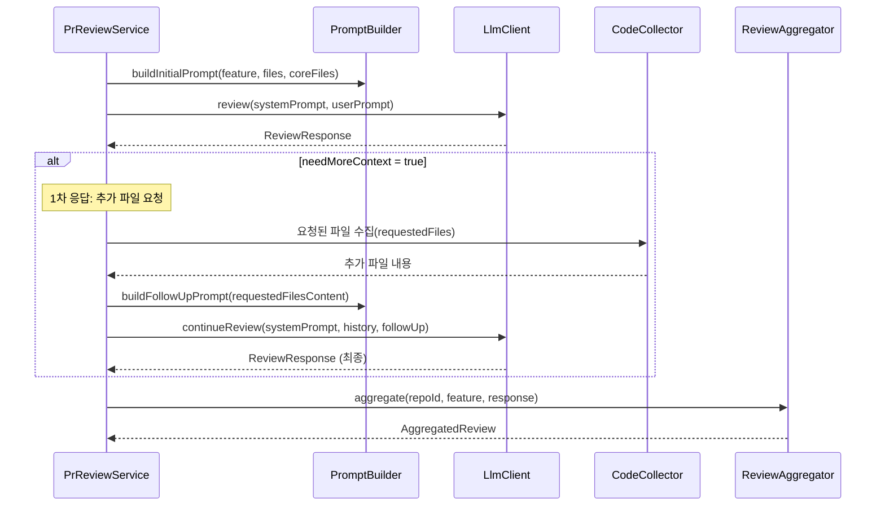

# F2: Two-Stage Review - SPEC

## 개요
LLM이 리뷰 중 추가 파일을 요청하면, 해당 파일을 수집하여 2차 리뷰를 수행한다.
현재 `PrReviewService:175`에서 `break`로 건너뛰고 있는 TODO를 완성한다.

## 시퀀스 다이어그램

### 2차 리뷰 흐름


## 현재 상태
```java
// PrReviewService.java:174-183
while (reviewResponse.isNeedMoreContext()) {
    log.info("LLM requested more context: {}", reviewResponse.getRequestedFiles());
    List<String> additionalFiles = reviewResponse.getRequestedFiles();
    // TODO: 추가 파일 수집 및 2차 리뷰
    break;  // ← 현재 여기서 중단
}
```

- `LlmClient.continueReview()` 메서드는 이미 존재
- `CodeCollector.collectAdditionalFiles()` 메서드도 이미 존재
- `PromptBuilder.buildFollowUpPrompt()` 메서드도 이미 존재
- **연결만 하면 되는 상태**

## 범위

### In-Scope
- `PrReviewService`에서 2차 리뷰 루프 완성
- 최대 리뷰 라운드 제한 (무한 루프 방지)
- 대화 히스토리 관리 (1차 → 2차 컨텍스트 유지)
- 요청된 파일이 존재하지 않을 때 처리

### Out-of-Scope
- 3차 이상 리뷰 (최대 2라운드로 제한)
- 요청 파일 권한 검증 (Repository 외부 파일 차단)

## 상세 동작

### 2차 리뷰 플로우
```
1차 LLM 응답: needMoreContext=true, requestedFiles=["FileA.java"]
    ↓
CodeCollector.collectAdditionalFiles() → FileA.java 내용 수집
    ↓
PromptBuilder.buildFollowUpPrompt() → 추가 파일 프롬프트 생성
    ↓
LlmClient.continueReview() → 대화 히스토리 포함 2차 요청
    ↓
2차 LLM 응답: needMoreContext=false → 최종 리뷰 완료
```

### 라운드 제한
- 최대 2라운드 (1차 + 2차)
- 2차에서도 `needMoreContext=true`면 강제로 최종 리뷰 요청
- 라운드 수 설정값으로 관리: `review.max-rounds=2`

### 에러 처리
- 요청된 파일이 없으면: "요청된 파일을 찾을 수 없습니다" 메시지와 함께 최종 리뷰 요청
- 파일 수집 실패 시: 수집 가능한 파일만으로 계속 진행

## 수정 대상 파일
- **수정**: `PrReviewService.java` - 2차 리뷰 루프 완성
- **수정**: `application.yml` - `review.max-rounds` 설정 추가

## 테스트 케이스
1. 1차 리뷰에서 바로 최종 응답 → 기존 동작 유지
2. 1차 추가 요청 → 2차 최종 응답 → 정상 완료
3. 1차 추가 요청 → 2차에서도 추가 요청 → 강제 종료
4. 추가 요청 파일이 존재하지 않을 때 → graceful 처리
5. 대화 히스토리가 올바르게 유지되는지 확인

## 의존성
- **F1: review-quality** 이후 진행 권장 (개선된 프롬프트가 2차 리뷰 품질에 영향)

## 완료 조건
- [ ] 2차 리뷰 루프 구현 완료
- [ ] 최대 라운드 제한 동작
- [ ] 파일 미존재 시 graceful 처리
- [ ] 단위 테스트 4개 이상 통과
- [ ] 기존 1차 리뷰 동작에 영향 없음
