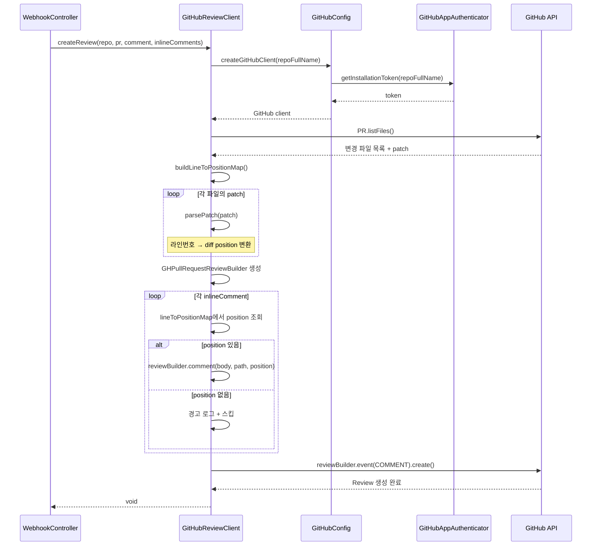

# GitHub Review Client - SPEC (MVP, 구현 완료)

## 개요
GitHub Pull Request Review API를 사용하여 리뷰 코멘트와 인라인 코멘트를 게시하는 클라이언트.
핵심은 LLM이 반환한 절대 라인 번호를 GitHub API가 요구하는 diff position으로 변환하는 것.

## 상태: 구현 완료

## 관련 파일
- `GitHubReviewClient.java` - Review API 클라이언트
- `GitHubCommentService.java` - 단순 코멘트 서비스 (레거시, 현재 미사용)

## 범위 정의

### In-Scope
- GitHub Pull Request Review API를 통한 리뷰 게시
- 절대 라인 번호 → diff position 변환 (parsePatch)
- Inline comments + General review 동시 게시
- COMMENT 이벤트로 리뷰 제출

### Out-of-Scope
- APPROVE / REQUEST_CHANGES 이벤트
- 리뷰 수정/삭제
- 리뷰 스레드 대화

## 의존성
- **의존**: `GitHubConfig` → GitHub 클라이언트 생성
- **의존**: `GitHubAppAuthenticator` → Installation Token
- **피의존**: `WebhookController` → 리뷰 게시 요청

## 시퀀스 다이어그램

### 리뷰 게시 흐름


## 주요 메서드

### createReview(repoFullName, prNumber, generalComment, inlineComments)
PR에 Review를 생성하고 제출:
```
1. GitHub 클라이언트 생성 (GitHubConfig)
2. PR 조회
3. inlineComments가 있으면 → buildLineToPositionMap() 호출
4. GHPullRequestReviewBuilder 생성
5. generalComment → reviewBuilder.body()
6. 각 inlineComment:
   - lineToPositionMap에서 파일+라인 → position 변환
   - position 못 찾으면 → 경고 로그 + 스킵
   - reviewBuilder.comment(body, path, position)
7. reviewBuilder.event(COMMENT).create() → 즉시 게시
```

### createSimpleComment(repoFullName, prNumber, comment)
- 인라인 코멘트 없이 전체 코멘트만 작성
- 내부적으로 `createReview(repo, pr, comment, List.of())` 호출

### buildLineToPositionMap(pullRequest) [private]
PR의 모든 변경 파일의 라인→position 매핑 생성:
```
PR.listFiles() → 각 파일별로:
  - file.getPatch() → diff 텍스트
  - parsePatch(patch) → Map<line, position>
  - result.put(filename, lineToPosition)
```

### parsePatch(patch) [private] - 핵심 알고리즘
diff 텍스트를 파싱하여 라인 번호 → diff position 매핑 생성:

```
입력: diff patch 문자열
출력: Map<Integer, Integer> (라인번호 → position)

알고리즘:
position = 0 (1-based 카운터)
currentLine = 0 (파일의 현재 라인 번호)

각 diff 라인에 대해:
  position++

  @@ hunk header → currentLine = +시작라인 추출, continue
  "+" 시작 (추가된 라인) → map.put(currentLine, position), currentLine++
  "-" 시작 (삭제된 라인) → position만 증가 (파일에 없으므로 매핑 안 함)
  그 외 (context 라인) → map.put(currentLine, position), currentLine++
```

**Hunk header 정규식:**
```
^@@\s+-\d+,?\d*\s+\+(\d+),?\d*\s+@@
```
- `+(\d+)` 에서 새 파일의 시작 라인 번호 추출

**예시:**
```diff
@@ -3,5 +3,7 @@ class User {     ← position=1, currentLine=3
  private String name;             ← position=2, line 3→pos 2
  private int age;                 ← position=3, line 4→pos 3
+ private String email;            ← position=4, line 5→pos 4 (추가)
+ private boolean active;          ← position=5, line 6→pos 5 (추가)
                                   ← position=6, line 7→pos 6
  public void setName() {          ← position=7, line 8→pos 7
```

결과: `{3:2, 4:3, 5:4, 6:5, 7:6, 8:7}`

## GitHubCommentService (레거시)
- `postReviewComment()` - PR에 단순 이슈 코멘트 작성
- Review API가 아닌 `pullRequest.comment()` 사용
- inline comments 불가
- 현재 WebhookController에서 사용하지 않음

## 에러 처리 정책

| 상황 | 동작 | 영향 |
|------|------|------|
| GitHub API 인증 실패 (401) | 예외 전파 → 리뷰 게시 실패 | 리뷰 미게시 (리뷰 자체는 완료) |
| PR 조회 실패 (404) | 예외 전파 | 리뷰 게시 실패 |
| patch null (바이너리/이름변경) | 해당 파일 스킵 | 해당 파일 inline 코멘트 불가 |
| 라인→position 매핑 실패 | 해당 inline 코멘트 스킵 + 경고 로그 | 일부 코멘트 누락 |
| Review 생성 API 실패 | 예외 전파 → WebhookController에서 catch | 리뷰 미게시, 200 OK 반환 |
| Rate Limit 초과 | 예외 전파 | 리뷰 게시 실패 |

## 테스트 현황
- **없음** (향후 F4에서 `parsePatch` 중심으로 추가 예정)

## 알려진 제한
- 삭제된 라인에는 코멘트 불가 (position 매핑 안 함)
- 다중 hunk가 있는 diff에서 position 재계산 (정상 동작하지만 복잡)
- patch가 null인 파일 (바이너리, 이름 변경만) 스킵
- Review 이벤트가 COMMENT 고정 (APPROVE, REQUEST_CHANGES 미지원)
