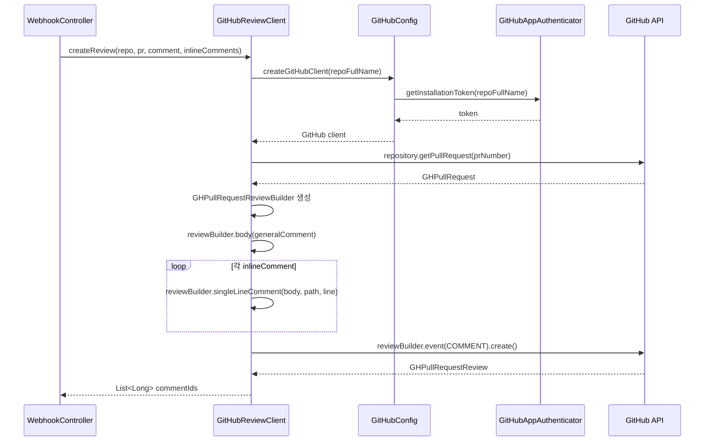

# GitHub Review Client - SPEC

## 목적 (Purpose)

GitHub Pull Request Review API를 사용하여 리뷰 코멘트와 인라인 코멘트를 게시하는 클라이언트.
LLM이 반환한 절대 라인 번호를 그대로 GitHub API에 전달하여 파일의 어느 줄에나 인라인 코멘트를 달 수 있다. (DL-01)

## 상태: 구현 완료 (DL-01 적용 예정)

## 관련 파일
- `GitHubReviewClient.java` - Review API 클라이언트
- `GitHubCommentService.java` - 단순 코멘트 서비스 (레거시, 현재 미사용)
- `build.gradle` - `github-api:1.330` (DL-01 업그레이드 대상)

## 범위 정의

### In-Scope
- GitHub Pull Request Review API를 통한 리뷰 게시
- 절대 라인 번호 기반 Inline comment 게시 (`singleLineComment`)
- Inline comments + General review 동시 게시
- COMMENT 이벤트로 리뷰 제출
- PR HEAD SHA 조회 (코드 변경 감지용)
- 특정 SHA의 파일 내용 조회
- 리뷰 코멘트 스레드 답글 작성

### Out-of-Scope
- APPROVE / REQUEST_CHANGES 이벤트
- 리뷰 수정/삭제
- 삭제된 라인(old file 기준 LEFT side)에 대한 코멘트 → DL-01 재검토 조건 참고
- Multiline comment (여러 줄 범위 지정) → 필요 시 `multiLineComment()` API 확장 가능

## 의존성
- **의존**: `GitHubConfig` → GitHub 클라이언트 생성
- **의존**: `GitHubAppAuthenticator` → Installation Token
- **피의존**: `WebhookController` → 리뷰 게시 요청

## 시퀀스 다이어그램

### 리뷰 게시 흐름 (DL-01 적용 후)


## 주요 메서드

### createReview(repoFullName, prNumber, generalComment, inlineComments)
PR에 Review를 생성하고 제출:
```
1. GitHub 클라이언트 생성 (GitHubConfig)
2. PR 조회
3. GHPullRequestReviewBuilder 생성
4. generalComment → reviewBuilder.body()
5. 각 inlineComment:
   - reviewBuilder.singleLineComment(body, path, line)
6. reviewBuilder.event(COMMENT).create() → 즉시 게시
7. 생성된 review의 commentId 목록 반환
```

### createSimpleComment(repoFullName, prNumber, comment)
- 인라인 코멘트 없이 전체 코멘트만 작성
- 내부적으로 `createReview(repo, pr, comment, List.of())` 호출

### getPrHeadSha(repoFullName, prNumber)
- PR의 현재 HEAD SHA 반환
- 코드 변경 감지 용도

### getFileContent(repoFullName, sha, filePath)
- 특정 SHA 기준 파일 내용 반환

### replyToReviewComment(repoFullName, prNumber, commentId, replyBody)
- 특정 리뷰 코멘트 스레드에 답글 작성
- `targetComment.reply(replyBody)` 호출
- 새로 생성된 commentId 반환 (다중 턴 감지용)

## DL-01: position → line 전환 배경

기존 구현(`parsePatch`)은 diff hunk 범위 안에 있는 라인만 position으로 변환할 수 있었다.
LLM은 `addLineNumbers()`로 전달받은 전체 파일 코드를 보고 임의의 라인을 지목하므로,
hunk 밖 라인에 대한 코멘트가 누락되는 문제가 발생했다.

`kohsuke/github-api 1.330`의 `singleLineComment(body, path, line)` API를 사용하면
diff position 변환 없이 파일의 어느 줄에나 코멘트를 달 수 있다.

자세한 내용 → [DECISION_LOG.md DL-01](DECISION_LOG.md)

## 에러 처리 정책

| 상황 | 동작 | 영향 |
|------|------|------|
| GitHub API 인증 실패 (401) | 예외 전파 → 리뷰 게시 실패 | 리뷰 미게시 |
| PR 조회 실패 (404) | 예외 전파 | 리뷰 게시 실패 |
| 유효하지 않은 라인 번호 (422) | 해당 inline 코멘트 스킵 + 에러 로그 | 일부 코멘트 누락 |
| patch null (바이너리/이름변경) | 해당 인라인 코멘트 스킵 | 해당 파일 inline 코멘트 불가 |
| Review 생성 API 실패 | 예외 전파 → WebhookController에서 catch | 리뷰 미게시, 200 OK 반환 |
| Rate Limit 초과 | 예외 전파 | 리뷰 게시 실패 |

## 테스트 전략

### 단위 테스트
- `createReview()` — `singleLineComment()` 호출 횟수/인자 검증 (Mock GH 클라이언트)
- `replyToReviewComment()` — 대상 코멘트 찾기 + reply 호출 검증

### 통합 테스트
- 실제 GitHub API 호출은 수동 테스트로 검증 (GitHub App 설치 환경 필요)

## 알려진 제한
- 삭제된 라인(old file, LEFT side) 코멘트 미지원 → v2.0 stable 후 `side` 파라미터 추가 검토
- Review 이벤트가 COMMENT 고정 (APPROVE, REQUEST_CHANGES 미지원)
- patch가 null인 파일 (바이너리, 이름 변경만) 스킵
