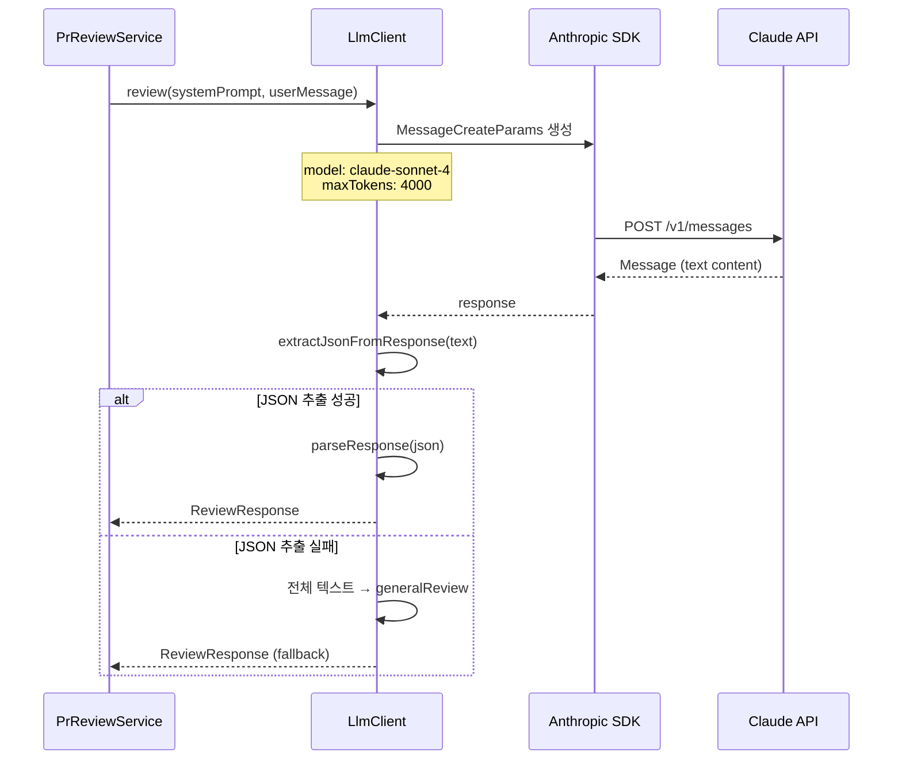

# LLM Client - SPEC (MVP, 구현 완료)

## 개요
Claude API를 호출하여 코드 리뷰를 수행하고, JSON 형식의 응답을 파싱하는 클라이언트.

## 상태: 구현 완료

## 관련 파일
- `LlmClient.java` - API 호출 + 응답 파싱
- `llm/dto/ReviewResponse.java` - 리뷰 응답 DTO
- `llm/dto/InlineComment.java` - 인라인 코멘트 DTO
- `llm/dto/MemorySuggestion.java` - 메모리 제안 DTO

## 범위 정의

### In-Scope
- Claude API 호출 (Anthropic Java SDK)
- JSON 응답 파싱 (ReviewResponse)
- Fallback 파싱 (JSON 실패 시 텍스트 사용)

### Out-of-Scope
- 다중 LLM Provider (F7에서 구현)
- 응답 캐싱
- 스트리밍 응답

## 의존성
- **의존**: Anthropic Java SDK (`com.anthropic:anthropic-java:2.11.1`)
- **의존**: `ANTHROPIC_API_KEY` 환경변수
- **피의존**: `PrReviewService` → LLM 리뷰 요청

## 시퀀스 다이어그램

### LLM API 호출 흐름


## API 설정
| 항목 | 값 |
|------|-----|
| SDK | `com.anthropic:anthropic-java:2.11.1` |
| 모델 | `Model.CLAUDE_SONNET_4_20250514` |
| maxTokens | `4000` |
| HTTP Client | AnthropicOkHttpClient |

## ReviewResponse 구조
```java
@Getter @Builder
public class ReviewResponse {
    private String generalReview;              // 전체 리뷰 (마크다운)
    private List<InlineComment> inlineComments; // 인라인 코멘트
    private boolean needMoreContext;             // 추가 파일 요청 여부
    private List<String> requestedFiles;         // 요청 파일 목록
    private String reason;                       // 요청 이유
    private MemorySuggestion memorySuggestion;   // 메모리 업데이트 제안
}
```

## InlineComment 구조
```java
@Getter @Builder
public class InlineComment {
    private String path;  // 파일 경로
    private int line;     // 라인 번호
    private String body;  // 코멘트 내용
}
```

## MemorySuggestion 구조
```java
@Getter @Builder
public class MemorySuggestion {
    private String summary;           // Feature 요약
    private List<String> keyPoints;   // 핵심 포인트
    private List<String> relatedFiles;// 관련 파일
}
```

## 주요 메서드

### startReview(systemPrompt, userMessage)
- 1차 리뷰 요청
- USER role 메시지 1개로 요청

### continueReview(systemPrompt, conversationHistory, additionalContext)
- 2차 리뷰 요청 (대화 히스토리 유지)
- 기존 히스토리 + 새 USER 메시지 추가
- 현재 F2 미구현으로 미사용

### sendRequest(systemPrompt, messages) [private]
- Anthropic SDK로 실제 API 호출
- `MessageCreateParams` 빌더로 요청 구성

### extractContent(message) [private]
- `Message.content()` → TextBlock에서 텍스트 추출

### parseResponse(content) [private]
JSON 응답 파싱 흐름:
```
1. ```json ... ``` 블록 추출 (정규식)
2. JSON 파싱 → Map<String, Object>
3. needMoreContext 확인
4. true → requestedFiles + reason 추출
5. false → generalReview + inlineComments + memorySuggestion 추출
6. JSON 블록 없음 → 전체 텍스트를 generalReview로 사용
7. 파싱 실패 → 전체 텍스트를 generalReview로 fallback
```

## 크기 및 제한

| 항목 | 현재 값 | 설명 |
|------|---------|------|
| 모델 | `claude-sonnet-4-20250514` | 하드코딩 |
| Context Window | 200K 토큰 | Claude Sonnet 4 기준 |
| maxTokens (응답) | 4,000 토큰 | F1에서 8,000으로 상향 예정 |
| 요청 타임아웃 | SDK 기본값 (~120초) | 명시적 설정 없음 |
| 재시도 | 없음 | SDK 기본 재시도 정책만 적용 |
| 동시 요청 | 제한 없음 (Feature 수만큼) | Anthropic Rate Limit에 의존 |

### Anthropic API Rate Limits

| 제한 항목 | 값 (Tier 기본) | 비고 |
|-----------|----------------|------|
| RPM (분당 요청) | 50 | Feature 수 × PR 수 고려 필요 |
| TPM (분당 토큰) | 40,000 | 대용량 PR에서 초과 가능 |
| Daily limit | 사용량 기반 | Tier에 따라 다름 |

## 에러 처리 정책

| 상황 | 동작 | 영향 |
|------|------|------|
| Anthropic API 호출 실패 (네트워크) | 예외 전파 → 해당 Feature 리뷰 실패 | Feature 리뷰 누락 |
| API Rate Limit (429) | 예외 전파 (재시도 없음) | Feature 리뷰 실패 |
| API 응답 타임아웃 | SDK 기본 타임아웃 → 예외 | Feature 리뷰 실패 |
| JSON 응답 파싱 실패 | 전체 텍스트를 generalReview로 사용 (fallback) | Inline comments 없음 |
| 응답 텍스트 비어있음 | "리뷰를 생성하지 못했습니다" 메시지 반환 | 빈 리뷰 |
| inlineComment 필드 누락 (line/path) | 해당 코멘트 스킵 | 일부 inline 코멘트 누락 |
| needMoreContext=true 응답 | requestedFiles 반환 (현재 미처리, F2에서 구현) | 1차 리뷰만 수행 |

## 테스트 현황
- **없음** (향후 F4에서 추가 예정)

## 알려진 제한
- maxTokens 4000은 복잡한 PR에서 응답이 잘릴 수 있음 → F1에서 8000으로 조정 예정
- JSON 파싱이 `\`\`\`json` 블록에만 의존 (순수 JSON 미탐지)
- 파싱 실패 시 inlineComments 전부 손실 (fallback이 generalReview만 보존)
- inlineComment의 line 번호 유효성 미검증
