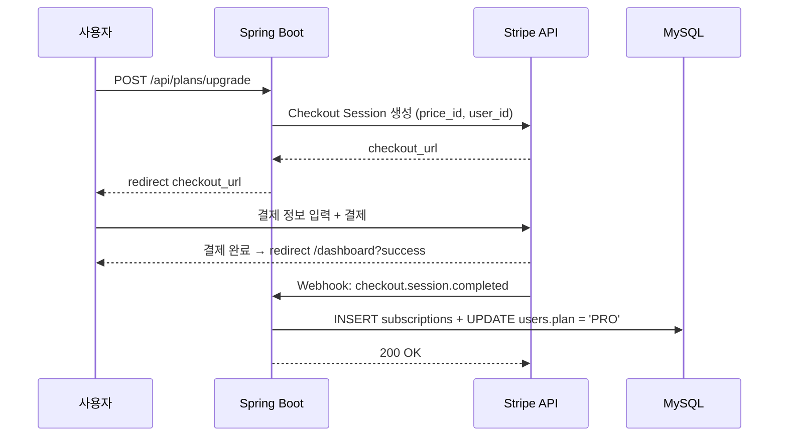

# F14: Pricing Plans - SPEC

## 개요
무료/유료 2개 플랜을 제공하고, Stripe 구독 결제를 통해
유료 플랜 전환 및 관리를 처리한다.

## 상태: 미구현

## 관련 파일 (예정)
- `PlanService.java` - 플랜 관리 서비스
- `StripeWebhookHandler.java` - Stripe Webhook 처리
- `SubscriptionEntity.java` - 구독 JPA Entity
- `SubscriptionRepository.java` - JPA Repository
- `PlanController.java` - 플랜 관리 API

## 시퀀스 다이어그램

### 유료 플랜 구독 흐름


## 범위 정의

### In-Scope
- 2개 플랜 정의 (FREE, PRO)
- Stripe Checkout으로 유료 플랜 구독
- Stripe Webhook으로 결제 상태 동기화
- 구독 취소 (다음 결제일에 FREE로 전환)
- 유료 플랜 월 $15 API 비용 상한 관리
- 플랜별 기능 제한 적용

### Out-of-Scope
- 연간 결제
- 쿠폰/프로모션
- 환불 처리 (Stripe Dashboard에서 수동)
- 다중 플랜 (Enterprise 등)

## 의존성
- **의존**: F10 (user-auth) → users.plan 필드
- **의존**: F13 (usage-tracking) → 사용량/비용 데이터
- **의존**: Stripe API (stripe-java SDK)
- **피의존**: F17 (web-ui-settings) → 플랜 관리 UI

## 상세 설계

### 플랜 정의

| 항목 | FREE | PRO ($15/월) |
|------|------|-------------|
| 월간 리뷰 수 | 30회 | 무제한 |
| API 비용 상한 | - | $15/월 |
| 댓글 응답 (F9) | 10회/월 | 무제한 |
| Feature Memory | 5개 Feature | 무제한 |
| Repository 수 | 3개 | 무제한 |

### DB 스키마: `subscriptions`
```sql
CREATE TABLE subscriptions (
    id                  BIGINT AUTO_INCREMENT PRIMARY KEY,
    user_id             BIGINT NOT NULL UNIQUE,
    stripe_customer_id  VARCHAR(255),
    stripe_subscription_id VARCHAR(255),
    plan                VARCHAR(20) NOT NULL DEFAULT 'FREE',
    status              VARCHAR(20) NOT NULL,  -- ACTIVE, CANCELED, PAST_DUE
    current_period_start TIMESTAMP,
    current_period_end  TIMESTAMP,
    canceled_at         TIMESTAMP,
    created_at          TIMESTAMP DEFAULT CURRENT_TIMESTAMP,
    updated_at          TIMESTAMP DEFAULT CURRENT_TIMESTAMP ON UPDATE CURRENT_TIMESTAMP,

    FOREIGN KEY (user_id) REFERENCES users(id),
    INDEX idx_stripe_customer (stripe_customer_id)
);
```

### Stripe Webhook 이벤트

| Event | 동작 |
|-------|------|
| `checkout.session.completed` | 구독 생성, plan → PRO |
| `invoice.paid` | 구독 갱신 확인 |
| `invoice.payment_failed` | status → PAST_DUE, 알림 |
| `customer.subscription.deleted` | plan → FREE, 구독 종료 |

### API 비용 상한 관리

유료 플랜은 무제한이지만 월 $15 API 비용 초과 시 리뷰 중단:
```
리뷰 요청 시:
  1. usage_log에서 당월 estimated_cost 합산
  2. 합산 >= $15 → 리뷰 거부 + "월간 API 비용 한도 도달" 메시지
  3. 합산 < $15 → 리뷰 수행
```

### REST API

| Method | Path | 설명 |
|--------|------|------|
| `GET` | `/api/plans/current` | 현재 플랜 정보 |
| `POST` | `/api/plans/upgrade` | Stripe Checkout으로 upgrade |
| `POST` | `/api/plans/cancel` | 구독 취소 (기간 끝까지 유지) |
| `POST` | `/api/webhook/stripe` | Stripe Webhook 수신 |

## 에러 처리 정책

| 상황 | 동작 | 영향 |
|------|------|------|
| Stripe Checkout 생성 실패 | 에러 메시지 반환 | 결제 불가 |
| Stripe Webhook 서명 검증 실패 | 403 반환 | 이벤트 무시 |
| 결제 실패 (카드 거부) | status → PAST_DUE + 이메일 알림 | 7일 유예 후 FREE 전환 |
| 중복 Webhook | idempotency key로 방지 | 정상 |
| 구독 취소 후 재구독 | 새 Checkout Session | 정상 |

## 테스트 케이스
1. FREE → PRO 업그레이드 (Stripe Checkout)
2. checkout.session.completed → users.plan = PRO
3. 구독 취소 → 기간 종료 후 FREE 전환
4. 결제 실패 → PAST_DUE 상태
5. 유료 플랜 월 $15 초과 → 리뷰 거부
6. 무료 플랜 30회 초과 → 리뷰 거부 + 업그레이드 안내
7. Stripe Webhook 서명 검증

## 완료 조건
- [ ] subscriptions 테이블 생성
- [ ] Stripe Checkout 연동
- [ ] Stripe Webhook 핸들러 (4개 이벤트)
- [ ] 플랜별 기능 제한 적용
- [ ] 구독 취소/재구독
- [ ] API 비용 상한 체크
- [ ] 단위 테스트 7개 이상
