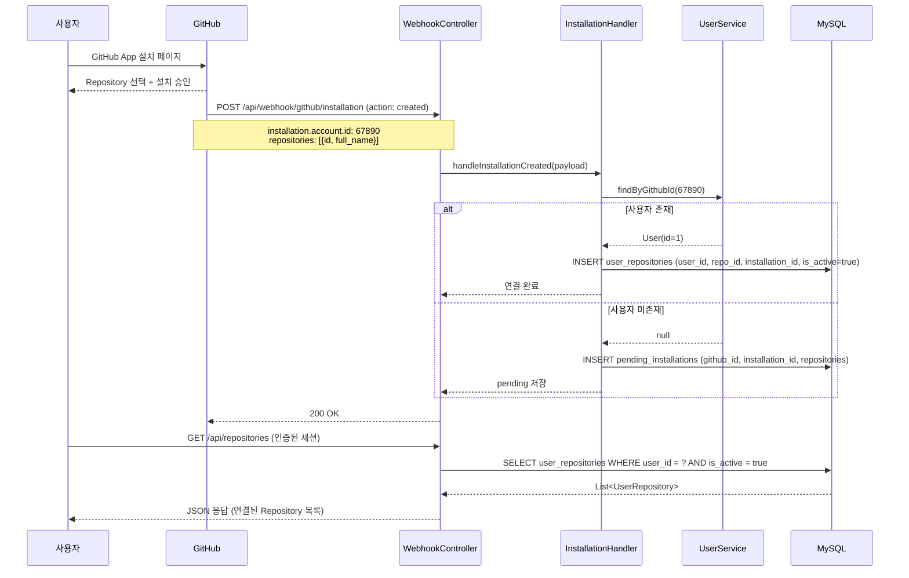
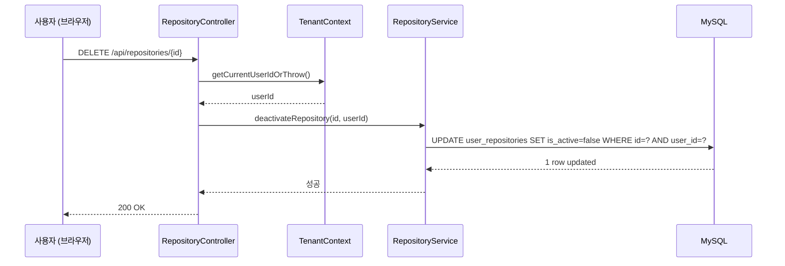

# F12: Repository Management - SPEC

## 목적 (Purpose)

GitHub App 설치 시 사용자-Repository 연결을 자동으로 생성하고, 연결된 Repository 관리(조회/활성화/해제) 기능을 제공하여 멀티 테넌트 환경에서 사용자별 리뷰 대상을 관리한다.

## 시퀀스 다이어그램

### GitHub App 설치 → Repository 연결


### Repository 해제 흐름


### 흐름 요약
1. **GitHub App 설치**: `installation` Webhook → `account.id`로 사용자 조회 → `user_repositories` 생성
2. **사용자 미가입**: `pending_installations` 테이블에 임시 저장 → 가입 후 자동 연결
3. **Repository 조회**: TenantContext에서 `userId` 추출 → 해당 사용자의 활성 Repository만 반환
4. **Repository 해제**: `is_active = false` 업데이트 (soft delete)

## 범위 정의

### In-Scope
- GitHub App `installation` Webhook 이벤트 처리 (created, deleted)
- GitHub App `installation_repositories` Webhook 이벤트 처리 (added, removed)
- 사용자-Repository 자동 연결 (`user_repositories` 테이블)
- 미가입 사용자 설치 시 `pending_installations` 저장
- 연결된 Repository 목록 조회 API (`GET /api/repositories`)
- Repository 상세 정보 조회 API (`GET /api/repositories/{id}`)
- Repository 활성/비활성 토글 API (`PATCH /api/repositories/{id}`)
- Repository 연결 해제 API (`DELETE /api/repositories/{id}`)

### Out-of-Scope
- Repository 설정 편집 (feature registry, custom prompt) → F17에서 구현
- GitHub App 설치 UI → GitHub 자체 제공 페이지 사용
- Organization 레벨 일괄 설치 → Phase 2 이후
- Repository 통계/차트 → F16(dashboard)에서 구현
- 수동 Repository 추가 (Webhook 없이) → Phase 2 이후

## 입력/출력 (Inputs/Outputs)

| 입력 | 출처 | 형식 |
|------|------|------|
| Installation Webhook | GitHub | `X-GitHub-Event: installation` |
| Installation Repositories Webhook | GitHub | `X-GitHub-Event: installation_repositories` |
| Repository ID | API 경로 파라미터 | `Long id` |
| 현재 사용자 ID | TenantContext | `Long userId` |

| 출력 | 대상 | 형식 |
|------|------|------|
| Repository 목록 | 브라우저 | JSON (배열) |
| Repository 상세 정보 | 브라우저 | JSON (객체) |
| 연결 성공/실패 | 로그 | `INFO`/`WARN` |

## 행위 규칙 (Behavior Rules)

1. **Installation Webhook은 인증 없이 처리**: `/api/webhook/**` 경로는 TenantFilter 제외
2. **사용자 매핑 실패 시 pending 저장**: `pending_installations` 테이블에 저장 후 가입 시 자동 연결
3. **중복 연결은 UPSERT**: 같은 `user_id + repository_id`는 기존 레코드 업데이트
4. **삭제는 Soft Delete**: `is_active = false`로 비활성화, 물리 삭제 안 함
5. **Repository 조회는 본인 것만**: TenantContext에서 `userId` 추출 → WHERE 조건 추가
6. **Installation ID 추적**: GitHub App 제거 시 해당 Installation의 모든 Repository 비활성화

## 상세 설계

### DB 스키마 변경

#### 신규: `pending_installations` (미가입 사용자 임시 저장)
```sql
CREATE TABLE pending_installations (
    id              BIGINT AUTO_INCREMENT PRIMARY KEY,
    github_id       BIGINT NOT NULL,              -- installation.account.id
    installation_id BIGINT NOT NULL,
    repositories    JSON NOT NULL,                 -- [{id, full_name}, ...]
    created_at      TIMESTAMP DEFAULT CURRENT_TIMESTAMP,

    INDEX idx_github_id (github_id),
    INDEX idx_installation_id (installation_id)
);
```

**용도**: 사용자가 GitHub App을 설치했지만 아직 서비스에 가입하지 않은 경우, 가입 시 자동 연결하기 위한 임시 저장소.

### GitHub App Installation Webhook 처리

#### 처리할 이벤트

| Event | Action | 동작 |
|-------|--------|------|
| `installation` | `created` | 새 설치 → `user_repositories`에 모든 repo 추가 (또는 pending) |
| `installation` | `deleted` | 설치 제거 → 해당 installation의 모든 repo 비활성화 |
| `installation_repositories` | `added` | Repository 추가 → `user_repositories`에 추가 |
| `installation_repositories` | `removed` | Repository 제거 → 해당 repo 비활성화 |

#### Installation Webhook Payload 예시

**Event: installation.created**:
```json
{
  "action": "created",
  "installation": {
    "id": 12345,
    "account": {
      "id": 67890,
      "login": "username",
      "type": "User"
    }
  },
  "repositories": [
    {"id": 111, "full_name": "username/repo1"},
    {"id": 222, "full_name": "username/repo2"}
  ]
}
```

**Event: installation_repositories.added**:
```json
{
  "action": "added",
  "installation": {
    "id": 12345,
    "account": {"id": 67890}
  },
  "repositories_added": [
    {"id": 333, "full_name": "username/repo3"}
  ]
}
```

#### WebhookController 수정

기존 `/api/webhook/github/pr` 외에 Installation 이벤트 처리 추가:

```java
@PostMapping("/github/installation")
public ResponseEntity<String> handleInstallationEvent(
        @RequestHeader(value = "X-GitHub-Event", required = false) String eventType,
        @RequestBody InstallationWebhookPayload payload) {

    log.info("Received installation webhook: event={}, action={}", eventType, payload.getAction());

    if ("installation".equals(eventType)) {
        if ("created".equals(payload.getAction())) {
            installationHandler.handleCreated(payload);
        } else if ("deleted".equals(payload.getAction())) {
            installationHandler.handleDeleted(payload);
        }
    } else if ("installation_repositories".equals(eventType)) {
        if ("added".equals(payload.getAction())) {
            installationHandler.handleRepositoriesAdded(payload);
        } else if ("removed".equals(payload.getAction())) {
            installationHandler.handleRepositoriesRemoved(payload);
        }
    }

    return ResponseEntity.ok("Installation event processed");
}
```

#### InstallationHandler 구현

```java
package greensnaback0229.pr_review_server.installation;

@Service
@RequiredArgsConstructor
@Slf4j
public class InstallationHandler {

    private final UserRepository userRepository;
    private final UserRepositoryRepository userRepoRepository;
    private final PendingInstallationRepository pendingRepository;

    public void handleCreated(InstallationWebhookPayload payload) {
        Long githubId = payload.getInstallation().getAccount().getId();
        Long installationId = payload.getInstallation().getId();
        List<RepositoryInfo> repositories = payload.getRepositories();

        // 1. 사용자 조회
        Optional<User> userOpt = userRepository.findByGithubId(githubId);

        if (userOpt.isPresent()) {
            User user = userOpt.get();
            // 2. user_repositories에 연결
            for (RepositoryInfo repo : repositories) {
                UserRepository userRepo = UserRepository.builder()
                    .userId(user.getId())
                    .repositoryId(repo.getId())
                    .repoFullName(repo.getFullName())
                    .installationId(installationId)
                    .isActive(true)
                    .build();
                userRepoRepository.save(userRepo);
                log.info("Connected repository: userId={}, repoId={}, fullName={}",
                         user.getId(), repo.getId(), repo.getFullName());
            }
        } else {
            // 3. 미가입 사용자 → pending 저장
            PendingInstallation pending = PendingInstallation.builder()
                .githubId(githubId)
                .installationId(installationId)
                .repositories(toJson(repositories))
                .build();
            pendingRepository.save(pending);
            log.warn("User not found for github_id={}, saved to pending", githubId);
        }
    }

    public void handleDeleted(InstallationWebhookPayload payload) {
        Long installationId = payload.getInstallation().getId();

        // 해당 installation의 모든 repository 비활성화
        int deactivated = userRepoRepository.deactivateByInstallationId(installationId);
        log.info("Deactivated {} repositories for installation_id={}", deactivated, installationId);
    }

    public void handleRepositoriesAdded(InstallationWebhookPayload payload) {
        // handleCreated()와 유사, repositories_added 필드 사용
    }

    public void handleRepositoriesRemoved(InstallationWebhookPayload payload) {
        // 제거된 repository_id로 비활성화
    }

    private String toJson(List<RepositoryInfo> repositories) {
        // ObjectMapper로 JSON 직렬화
    }
}
```

### Repository 조회 API

#### GET /api/repositories (목록 조회)

**Controller**:
```java
@RestController
@RequestMapping("/api/repositories")
@RequiredArgsConstructor
public class RepositoryController {

    private final RepositoryService repositoryService;

    @GetMapping
    public ResponseEntity<RepositoryListResponse> getRepositories() {
        Long userId = TenantContext.getCurrentUserIdOrThrow();
        List<UserRepository> repositories = repositoryService.findActiveRepositories(userId);

        RepositoryListResponse response = RepositoryListResponse.builder()
            .repositories(repositories.stream()
                .map(this::toDto)
                .toList())
            .total(repositories.size())
            .build();

        return ResponseEntity.ok(response);
    }

    private RepositoryDto toDto(UserRepository repo) {
        return RepositoryDto.builder()
            .id(repo.getId())
            .repositoryId(repo.getRepositoryId())
            .fullName(repo.getRepoFullName())
            .installationId(repo.getInstallationId())
            .isActive(repo.getIsActive())
            .createdAt(repo.getCreatedAt())
            // reviewCount, lastReviewAt는 별도 쿼리 (선택)
            .build();
    }
}
```

**Service**:
```java
@Service
@RequiredArgsConstructor
public class RepositoryService {

    private final UserRepositoryRepository userRepoRepository;

    public List<UserRepository> findActiveRepositories(Long userId) {
        return userRepoRepository.findByUserIdAndIsActive(userId, true);
    }
}
```

**Repository**:
```java
public interface UserRepositoryRepository extends JpaRepository<UserRepository, Long> {

    List<UserRepository> findByUserIdAndIsActive(Long userId, Boolean isActive);

    @Modifying
    @Query("UPDATE UserRepository ur SET ur.isActive = false WHERE ur.installationId = :installationId")
    int deactivateByInstallationId(@Param("installationId") Long installationId);

    @Modifying
    @Query("UPDATE UserRepository ur SET ur.isActive = false WHERE ur.id = :id AND ur.userId = :userId")
    int deactivateByIdAndUserId(@Param("id") Long id, @Param("userId") Long userId);
}
```

#### GET /api/repositories/{id} (상세 조회)

```java
@GetMapping("/{id}")
public ResponseEntity<RepositoryDto> getRepository(@PathVariable Long id) {
    Long userId = TenantContext.getCurrentUserIdOrThrow();
    UserRepository repo = repositoryService.findById(id, userId)
        .orElseThrow(() -> new ResponseStatusException(HttpStatus.NOT_FOUND));

    return ResponseEntity.ok(toDto(repo));
}
```

#### PATCH /api/repositories/{id} (활성/비활성 토글)

```java
@PatchMapping("/{id}")
public ResponseEntity<Void> toggleRepository(@PathVariable Long id, @RequestBody ToggleRequest request) {
    Long userId = TenantContext.getCurrentUserIdOrThrow();
    repositoryService.toggleActive(id, userId, request.getIsActive());

    return ResponseEntity.ok().build();
}
```

**Request Body**:
```json
{
  "isActive": false
}
```

#### DELETE /api/repositories/{id} (연결 해제)

```java
@DeleteMapping("/{id}")
public ResponseEntity<Void> deleteRepository(@PathVariable Long id) {
    Long userId = TenantContext.getCurrentUserIdOrThrow();
    repositoryService.deactivate(id, userId);

    return ResponseEntity.noContent().build();
}
```

**Service 구현**:
```java
@Transactional
public void deactivate(Long id, Long userId) {
    int updated = userRepoRepository.deactivateByIdAndUserId(id, userId);
    if (updated == 0) {
        throw new ResponseStatusException(HttpStatus.NOT_FOUND, "Repository not found or not owned");
    }
}
```

### 미가입 사용자 처리 (Pending → Active)

F10(user-auth)의 `CustomOAuth2UserService.loadUser()`에서 가입 시 pending 연결 처리:

```java
@Override
@Transactional
public OAuth2User loadUser(OAuth2UserRequest userRequest) {
    // ... 기존 사용자 저장 로직

    // 가입 직후 pending_installations 확인
    List<PendingInstallation> pendings = pendingInstallationRepository.findByGithubId(githubId);
    if (!pendings.isEmpty()) {
        for (PendingInstallation pending : pendings) {
            // user_repositories로 이동
            installationHandler.convertPendingToActive(user.getId(), pending);
        }
        pendingInstallationRepository.deleteAll(pendings);
        log.info("Converted {} pending installations for user {}", pendings.size(), user.getId());
    }

    return new CustomOAuth2User(user, oAuth2User.getAttributes());
}
```

## 엣지 케이스

| 상황 | 처리 방식 |
|------|----------|
| Installation Webhook에 사용자 없음 | `pending_installations`에 저장 → 가입 시 자동 연결 |
| 중복 Repository 연결 시도 | UPSERT (Unique 제약: `user_id + repository_id`) |
| 삭제된 Installation의 Webhook | 해당 `installation_id`의 모든 Repository 비활성화 |
| Repository 접근 권한 없음 (403) | 에러 로그 + 해당 Repository 비활성화 |
| 다른 사용자의 Repository 조회/수정 시도 | 404 Not Found (WHERE user_id 조건으로 필터링) |
| pending_installations 중복 | Installation ID 기준 UPSERT (재설치 시 덮어쓰기) |
| Installation 삭제 후 재설치 | `is_active = true`로 재활성화 |

## 에러 처리 정책

| 에러 상황 | HTTP 상태 | 동작 | 영향 |
|-----------|-----------|------|------|
| Installation Webhook 파싱 실패 | 200 | 에러 로그 + 무시 | 해당 설치 연결 안 됨 |
| 사용자 미가입 (pending) | 200 | `pending_installations` 저장 | 가입 후 자동 연결 |
| Repository 조회 시 존재하지 않음 | 404 | `ResponseStatusException` | 클라이언트 에러 표시 |
| 다른 사용자의 Repository 수정 시도 | 404 | WHERE 조건으로 필터링 (0 row updated) | 권한 없음 (암묵적) |
| DB 저장 실패 (Unique 제약 위반) | 500 | 에러 로그 + 롤백 | 재시도 필요 |
| GitHub API 호출 실패 (토큰 만료) | - | 에러 로그 | Repository 정보 불완전 |

## 테스트 전략

### 단위 테스트
1. **InstallationHandler**:
   - `handleCreated()` (사용자 존재) → `user_repositories` 생성 확인
   - `handleCreated()` (사용자 미존재) → `pending_installations` 저장 확인
   - `handleDeleted()` → 해당 Installation의 Repository 비활성화 확인
2. **RepositoryService**:
   - `findActiveRepositories()` → 해당 사용자의 활성 Repository만 반환
   - `deactivate()` → `is_active = false` 업데이트 확인

### 통합 테스트
1. GitHub App 설치 Webhook → `user_repositories` 생성 확인
2. 설치 삭제 Webhook → 해당 Repository 비활성화 확인
3. `installation_repositories.added` → 추가 Repository 연결 확인
4. 미가입 사용자 설치 → `pending_installations` 저장 → 가입 시 자동 연결
5. `GET /api/repositories` → 본인 것만 반환 (다른 사용자 Repository 제외)
6. `DELETE /api/repositories/{id}` → Soft Delete 확인 (`is_active = false`)

### 수동 테스트
1. 실제 GitHub App 설치 → Webhook 수신 → DB 저장 확인
2. Dashboard에서 Repository 목록 조회
3. Repository 비활성화 → 해당 Repo Webhook 무시 확인

## 의존성

### 의존 (Depends On)
- F10 (user-auth): `users` 테이블, `github_id` 매핑
- F11 (tenant-isolation): `user_repositories` 테이블, TenantContext

### 피의존 (Depended By)
- F13 (usage-tracking): Repository별 사용량 추적
- F16 (web-ui-dashboard): Repository 목록 표시
- F17 (web-ui-settings): Repository 설정 편집

## 완료 조건

- [x] `pending_installations` 테이블 생성
- [x] `/api/webhook/github/installation` 엔드포인트 추가
- [x] `InstallationHandler` 구현 (created/deleted/added/removed 처리)
- [x] 사용자-Repository 자동 연결 로직 (pending 포함)
- [x] `GET /api/repositories` 구현 (목록 조회)
- [x] `GET /api/repositories/{id}` 구현 (상세 조회)
- [x] `PATCH /api/repositories/{id}` 구현 (토글)
- [x] `DELETE /api/repositories/{id}` 구현 (Soft Delete)
- [x] F10 연동 (가입 시 pending 자동 연결)
- [x] 단위 테스트 6개 이상 (InstallationHandler, RepositoryService)
- [x] 통합 테스트 6개 이상 (Webhook 처리, API)
- [x] `UserRepositoryRepository` 쿼리 메서드 구현 (user_id 조건 포함)