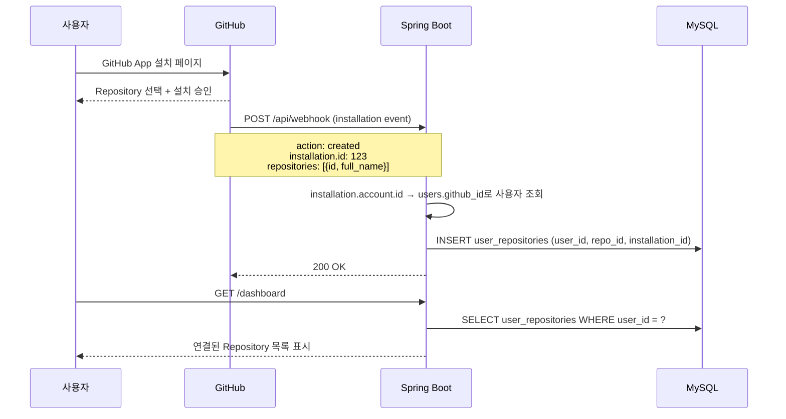

# F12: Repository Management - SPEC

## 개요
사용자가 GitHub App을 Repository에 설치하면 자동으로 사용자-Repository 연결을 생성하고,
연결된 Repository를 관리(조회/해제)할 수 있는 기능.

## 상태: 미구현

## 관련 파일 (예정)
- `InstallationWebhookHandler.java` - GitHub App 설치 콜백 처리
- `RepositoryService.java` - Repository CRUD 서비스
- `RepositoryController.java` - Repository 관리 API
- `UserRepository.java` - 사용자-Repo 연결 Repository

## 시퀀스 다이어그램

### GitHub App 설치 → Repository 연결


## 범위 정의

### In-Scope
- GitHub App `installation` Webhook 이벤트 처리 (created, deleted, repositories added/removed)
- 사용자-Repository 연결 자동 생성
- 연결된 Repository 목록 조회 API
- Repository 연결 해제 (비활성화)
- Repository별 리뷰 활성/비활성 토글

### Out-of-Scope
- Repository 설정 편집 (F17에서 구현)
- GitHub App 설치 UI (GitHub 자체 제공)
- Organization 레벨 일괄 설치

## 의존성
- **의존**: F10 (user-auth) → users 테이블
- **의존**: F11 (tenant-isolation) → user_repositories 테이블
- **피의존**: F13 (usage-tracking), F16 (web-ui-dashboard), F17 (web-ui-settings)

## 상세 설계

### GitHub App Installation Webhook

#### 처리할 이벤트

| Event | Action | 동작 |
|-------|--------|------|
| `installation` | `created` | 새 설치 → user_repositories에 모든 repo 추가 |
| `installation` | `deleted` | 설치 제거 → 해당 installation의 모든 repo 비활성화 |
| `installation_repositories` | `added` | Repository 추가 → user_repositories에 추가 |
| `installation_repositories` | `removed` | Repository 제거 → 해당 repo 비활성화 |

#### Installation Webhook Payload
```json
{
  "action": "created",
  "installation": {
    "id": 12345,
    "account": {
      "id": 67890,
      "login": "username",
      "type": "User"
    }
  },
  "repositories": [
    {"id": 111, "full_name": "username/repo1"},
    {"id": 222, "full_name": "username/repo2"}
  ]
}
```

#### 사용자 매핑 로직
```
installation.account.id → users.github_id로 사용자 조회
  → 사용자 존재: user_repositories에 연결
  → 사용자 미존재: 로그 기록 (가입 후 재연결 필요)
```

### REST API

| Method | Path | 설명 |
|--------|------|------|
| `GET` | `/api/repositories` | 연결된 Repository 목록 |
| `GET` | `/api/repositories/{id}` | Repository 상세 정보 |
| `PATCH` | `/api/repositories/{id}` | 활성/비활성 토글 |
| `DELETE` | `/api/repositories/{id}` | 연결 해제 |

#### GET /api/repositories 응답
```json
{
  "repositories": [
    {
      "id": 1,
      "repositoryId": 111,
      "fullName": "username/repo1",
      "installationId": 12345,
      "isActive": true,
      "reviewCount": 42,
      "lastReviewAt": "2025-01-15T10:30:00Z",
      "createdAt": "2025-01-01T00:00:00Z"
    }
  ],
  "total": 1
}
```

## 에러 처리 정책

| 상황 | 동작 | 영향 |
|------|------|------|
| Installation Webhook에 사용자 없음 | 경고 로그 + pending 상태로 저장 | 가입 후 자동 연결 |
| 중복 Repository 연결 | UPSERT (기존 업데이트) | 정상 |
| 삭제된 설치의 Webhook | 해당 repo 비활성화 | 리뷰 중단 |
| Repository 접근 권한 없음 | 에러 로그 + 비활성화 | 해당 Repo 리뷰 불가 |

## 테스트 케이스
1. GitHub App 설치 Webhook → user_repositories 생성
2. 설치 삭제 Webhook → 해당 repo 비활성화
3. repositories added → 추가 repo 연결
4. 미가입 사용자의 설치 → pending 저장
5. GET /api/repositories → 연결된 목록 반환 (본인 것만)
6. DELETE → 연결 해제 (is_active = false)

## 완료 조건
- [ ] installation Webhook 핸들러 구현
- [ ] 사용자-Repository 자동 연결
- [ ] Repository CRUD API 4개
- [ ] 미가입 사용자 설치 시 pending 처리
- [ ] 단위 테스트 6개 이상
