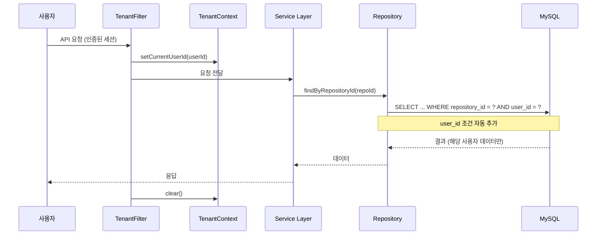

# F11: Tenant Isolation - SPEC

## 개요
기존 단일 테넌트 데이터 모델을 멀티 테넌트로 마이그레이션한다.
모든 기존 테이블에 `user_id`를 추가하고, 데이터 접근 시 사용자별 격리를 보장한다.

## 상태: 미구현

## 관련 파일 (예정)
- `TenantContext.java` - 현재 사용자 컨텍스트 유틸리티
- `TenantFilter.java` - 요청별 테넌트 설정 필터
- 기존 Repository 클래스 전체 수정

## 시퀀스 다이어그램

### 멀티 테넌트 데이터 접근 흐름


## 범위 정의

### In-Scope
- 기존 테이블에 `user_id` 컬럼 추가 (feature_memory, review_context, review_history)
- `user_repositories` 연결 테이블 생성
- 모든 데이터 접근 쿼리에 user_id 조건 추가
- Webhook 처리 시 repository → user 매핑
- 기존 데이터 마이그레이션 전략

### Out-of-Scope
- Row-Level Security (DB 레벨 격리)
- 별도 DB/스키마 분리
- 조직 단위 데이터 공유

## 의존성
- **의존**: F10 (user-auth) → users 테이블 필요
- **피의존**: F12 (repository-management), F13-F17 전체

## 상세 설계

### DB 스키마 변경

#### 신규: `user_repositories`
```sql
CREATE TABLE user_repositories (
    id              BIGINT AUTO_INCREMENT PRIMARY KEY,
    user_id         BIGINT NOT NULL,
    repository_id   BIGINT NOT NULL,
    repo_full_name  VARCHAR(255) NOT NULL,
    installation_id BIGINT,
    is_active       BOOLEAN DEFAULT TRUE,
    created_at      TIMESTAMP DEFAULT CURRENT_TIMESTAMP,

    FOREIGN KEY (user_id) REFERENCES users(id),
    UNIQUE INDEX idx_user_repo (user_id, repository_id),
    INDEX idx_repo_id (repository_id)
);
```

#### 기존 테이블 마이그레이션

```sql
-- feature_memory 테이블
ALTER TABLE feature_memory ADD COLUMN user_id BIGINT;
ALTER TABLE feature_memory ADD FOREIGN KEY (user_id) REFERENCES users(id);

-- review_context 테이블 (F9에서 생성 예정)
ALTER TABLE review_context ADD COLUMN user_id BIGINT;

-- review_history 테이블 (F8에서 생성 예정)
ALTER TABLE review_history ADD COLUMN user_id BIGINT;
```

### Webhook → User 매핑

Webhook은 사용자 세션 없이 도착하므로, repository_id로 사용자를 찾아야 함:
```
Webhook 수신 (repository_id)
  → user_repositories에서 해당 repository_id의 user_id 조회
  → TenantContext.setCurrentUserId(userId)
  → 이후 로직은 기존과 동일
```

**주의**: 하나의 Repository에 여러 사용자가 연결된 경우
→ 해당 Repository를 연결한 **모든 사용자**에 대해 각각 리뷰 수행 (사용량 차감도 각각)

### TenantContext (ThreadLocal)
```java
public class TenantContext {
    private static final ThreadLocal<Long> currentUserId = new ThreadLocal<>();

    public static void setCurrentUserId(Long userId) { currentUserId.set(userId); }
    public static Long getCurrentUserId() { return currentUserId.get(); }
    public static void clear() { currentUserId.remove(); }
}
```

## 에러 처리 정책

| 상황 | 동작 | 영향 |
|------|------|------|
| user_repositories에 매핑 없음 | Webhook 무시 + 경고 로그 | 미연결 Repo 리뷰 안 함 |
| user_id null (마이그레이션 전 데이터) | 레거시 모드로 동작 | 기존 데이터 접근 가능 |
| TenantContext 미설정 상태에서 쿼리 | 예외 발생 (안전장치) | 데이터 누출 방지 |
| DB 마이그레이션 실패 | 롤백 + 에러 로그 | 서비스 일시 중단 |

## 테스트 케이스
1. 사용자 A의 feature_memory → 사용자 B가 조회 불가
2. Webhook 수신 → repository_id로 user_id 매핑 성공
3. 매핑 없는 Repository → Webhook 무시
4. user_id null (레거시 데이터) → 정상 접근
5. TenantContext 미설정 → 예외 발생
6. 하나의 Repo에 2명 연결 → 각각 리뷰 수행

## 완료 조건
- [ ] user_repositories 테이블 생성
- [ ] 기존 테이블 user_id 컬럼 추가
- [ ] TenantContext + TenantFilter 구현
- [ ] Webhook → User 매핑 로직
- [ ] 모든 Repository 쿼리에 user_id 조건 추가
- [ ] 기존 데이터 마이그레이션 스크립트
- [ ] 단위 테스트 6개 이상
