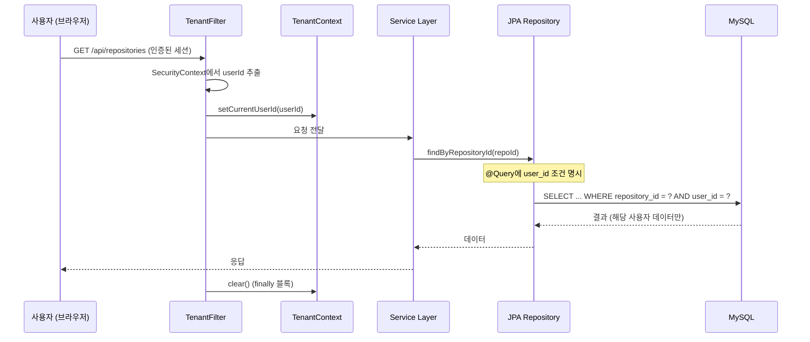
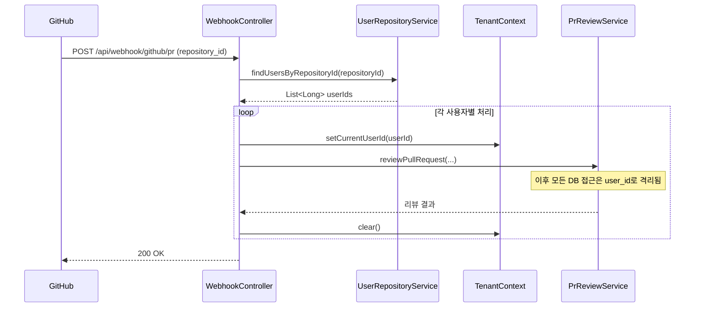

# F11: Tenant Isolation - SPEC

## 목적 (Purpose)

기존 단일 테넌트 아키텍처를 멀티 테넌트로 전환. 모든 데이터 접근에 `user_id` 기반 격리를 적용하여, 사용자 간 데이터 누출을 원천 차단하고 SaaS 운영 기반을 마련한다.

## 시퀀스 다이어그램

### 멀티 테넌트 데이터 접근 흐름 (인증된 요청)


### Webhook 처리 흐름 (인증 없는 요청)


### 흐름 요약
1. **인증된 요청**: `TenantFilter`가 세션에서 `userId` 추출 → `TenantContext` 설정
2. **Webhook 요청**: `repository_id`로 연결된 모든 사용자 조회 → 각 사용자별로 순회 처리
3. **JPA Repository**: 모든 쿼리에 `user_id` 조건 명시 (`@Query` 또는 메서드 파라미터)
4. **요청 종료**: `finally` 블록에서 `TenantContext.clear()` (ThreadLocal 메모리 누수 방지)

## 범위 정의

### In-Scope
- 기존 테이블에 `user_id` 컬럼 추가 (`repositories`, `feature_memory`, `review_context`)
- `user_repositories` 연결 테이블 생성 (사용자 ↔ Repository N:N 관계)
- `TenantContext` (ThreadLocal) 구현
- `TenantFilter` (Spring Security Filter) 구현
- 모든 JPA Repository 쿼리에 `user_id` 조건 추가
- Webhook 처리 시 `repository_id` → `user_id` 매핑 로직
- 기존 익명 데이터 마이그레이션 (F10의 첫 가입자에게 귀속)

### Out-of-Scope
- Row-Level Security (PostgreSQL RLS 등 DB 레벨 격리)
- 별도 DB/스키마 물리적 분리
- 조직(Organization) 단위 데이터 공유
- 사용자 간 Repository 공유 기능 (Phase 2 이후)
- `review_history` 테이블 격리 (F8에서 처리)

## 입력/출력 (Inputs/Outputs)

| 입력 | 출처 | 형식 |
|------|------|------|
| 현재 사용자 ID | Spring Security Context | `Long userId` |
| Repository ID | Webhook Payload | `Long repositoryId` |
| 데이터 접근 요청 | Service Layer | JPA 쿼리 메서드 호출 |

| 출력 | 대상 | 형식 |
|------|------|------|
| 격리된 데이터 | Service Layer | Entity 객체 (해당 사용자 소유만) |
| 접근 거부 | 예외 처리 | `TenantContextException` |
| Webhook 매핑 실패 | 로그 | `WARN` 로그 + Webhook 무시 |

## 행위 규칙 (Behavior Rules)

1. **모든 데이터 접근은 user_id 조건 필수**: `TenantContext.getCurrentUserId()`가 `null`이면 예외 발생 (안전장치)
2. **Webhook 처리는 다중 사용자 반복**: 하나의 Repository에 여러 사용자가 연결된 경우, 각 사용자별로 독립적으로 처리
3. **매핑 없는 Repository는 무시**: `user_repositories`에 없는 Repository의 Webhook은 경고 로그 후 무시
4. **TenantContext는 요청 종료 시 반드시 정리**: `finally` 블록에서 `clear()` 호출 (ThreadLocal 메모리 누수 방지)
5. **기존 익명 데이터는 레거시 모드 지원**: `user_id IS NULL`인 데이터는 마이그레이션 전까지 전역 접근 허용 (과도기)
6. **Webhook 경로는 TenantFilter 제외**: `/api/webhook/**`는 인증 필터와 동일하게 제외

## 상세 설계

### DB 스키마 변경

#### 신규: `user_repositories` (사용자 ↔ Repository 연결)
```sql
CREATE TABLE user_repositories (
    id              BIGINT AUTO_INCREMENT PRIMARY KEY,
    user_id         BIGINT NOT NULL,
    repository_id   BIGINT NOT NULL,
    repo_full_name  VARCHAR(255) NOT NULL,  -- 예: "owner/repo"
    installation_id BIGINT,                  -- GitHub App Installation ID (선택)
    is_active       BOOLEAN DEFAULT TRUE,    -- 연결 활성화 상태
    created_at      TIMESTAMP DEFAULT CURRENT_TIMESTAMP,
    updated_at      TIMESTAMP DEFAULT CURRENT_TIMESTAMP ON UPDATE CURRENT_TIMESTAMP,

    FOREIGN KEY (user_id) REFERENCES users(id) ON DELETE CASCADE,
    UNIQUE INDEX idx_user_repo (user_id, repository_id),
    INDEX idx_repo_id (repository_id),
    INDEX idx_user_id (user_id)
);
```

#### 기존 테이블 마이그레이션 (user_id 추가)

**1. repositories 테이블** (F10에서 이미 추가됨):
```sql
-- F10에서 이미 추가됨 (확인용)
-- ALTER TABLE repositories
-- ADD COLUMN user_id BIGINT NULL,
-- ADD CONSTRAINT fk_repository_user FOREIGN KEY (user_id) REFERENCES users(id) ON DELETE SET NULL;
```

**2. feature_memory 테이블**:
```sql
ALTER TABLE feature_memory
ADD COLUMN user_id BIGINT NULL,
ADD CONSTRAINT fk_feature_memory_user FOREIGN KEY (user_id) REFERENCES users(id) ON DELETE SET NULL;

-- 복합 인덱스 추가 (user_id + repository_id + feature_name)
CREATE INDEX idx_feature_memory_user_repo_feature ON feature_memory(user_id, repository_id, feature_name);
```

**3. review_context 테이블**:
```sql
ALTER TABLE review_context
ADD COLUMN user_id BIGINT NULL,
ADD CONSTRAINT fk_review_context_user FOREIGN KEY (user_id) REFERENCES users(id) ON DELETE SET NULL;

-- 복합 인덱스 추가 (user_id + repository_id + pr_number)
CREATE INDEX idx_review_context_user_repo_pr ON review_context(user_id, repository_id, pr_number);
```

**기존 데이터 마이그레이션**:
```sql
-- F10의 첫 가입자(ADMIN)에게 모든 익명 데이터 귀속
-- 실행은 CustomOAuth2UserService.migrateAnonymousData()에서 처리
UPDATE repositories SET user_id = ? WHERE user_id IS NULL;
UPDATE feature_memory SET user_id = ? WHERE user_id IS NULL;
UPDATE review_context SET user_id = ? WHERE user_id IS NULL;
```

### TenantContext (ThreadLocal 기반)

`TenantContext.java` 구현:

```java
package greensnaback0229.pr_review_server.tenant;

public class TenantContext {

    private static final ThreadLocal<Long> currentUserId = new ThreadLocal<>();

    public static void setCurrentUserId(Long userId) {
        if (userId == null) {
            throw new IllegalArgumentException("userId cannot be null");
        }
        currentUserId.set(userId);
    }

    public static Long getCurrentUserId() {
        return currentUserId.get();
    }

    public static Long getCurrentUserIdOrThrow() {
        Long userId = currentUserId.get();
        if (userId == null) {
            throw new TenantContextException("TenantContext not initialized");
        }
        return userId;
    }

    public static void clear() {
        currentUserId.remove();
    }
}
```

**주의사항**:
- `ThreadLocal`은 요청당 스레드에 바인딩됨 (Spring MVC 스레드 모델)
- 반드시 `finally` 블록에서 `clear()` 호출 (메모리 누수 방지)
- 비동기 처리(`@Async`)는 별도 처리 필요 (Phase 2)

### TenantFilter (Spring Security Filter)

`TenantFilter.java` 구현:

```java
package greensnaback0229.pr_review_server.tenant;

import jakarta.servlet.*;
import jakarta.servlet.http.HttpServletRequest;
import lombok.extern.slf4j.Slf4j;
import org.springframework.security.core.Authentication;
import org.springframework.security.core.context.SecurityContextHolder;
import org.springframework.stereotype.Component;

import java.io.IOException;

@Slf4j
@Component
public class TenantFilter implements Filter {

    @Override
    public void doFilter(ServletRequest request, ServletResponse response, FilterChain chain)
            throws IOException, ServletException {

        HttpServletRequest httpRequest = (HttpServletRequest) request;
        String requestURI = httpRequest.getRequestURI();

        // Webhook 경로는 제외 (별도 매핑 로직 사용)
        if (requestURI.startsWith("/api/webhook/")) {
            chain.doFilter(request, response);
            return;
        }

        try {
            Authentication auth = SecurityContextHolder.getContext().getAuthentication();
            if (auth != null && auth.isAuthenticated()) {
                // CustomOAuth2User에서 userId 추출 (F10에서 구현)
                Long userId = extractUserId(auth);
                if (userId != null) {
                    TenantContext.setCurrentUserId(userId);
                    log.debug("TenantContext set: userId={}", userId);
                }
            }

            chain.doFilter(request, response);

        } finally {
            TenantContext.clear();
            log.debug("TenantContext cleared");
        }
    }

    private Long extractUserId(Authentication auth) {
        Object principal = auth.getPrincipal();
        if (principal instanceof CustomOAuth2User) {
            return ((CustomOAuth2User) principal).getUserId();
        }
        return null;
    }
}
```

**SecurityConfig에 필터 추가**:
```java
@Bean
public SecurityFilterChain filterChain(HttpSecurity http, TenantFilter tenantFilter) throws Exception {
    http
        .addFilterAfter(tenantFilter, OAuth2LoginAuthenticationFilter.class)
        // ... 기존 설정
}
```

### JPA Repository 쿼리 수정

**기존 코드** (user_id 조건 없음):
```java
public interface FeatureMemoryJpaRepository extends JpaRepository<FeatureMemory, Long> {
    Optional<FeatureMemory> findByRepositoryIdAndFeatureName(Long repositoryId, String featureName);
}
```

**수정 후** (user_id 조건 추가):
```java
public interface FeatureMemoryJpaRepository extends JpaRepository<FeatureMemory, Long> {

    @Query("SELECT fm FROM FeatureMemory fm WHERE fm.repositoryId = :repositoryId " +
           "AND fm.featureName = :featureName AND fm.userId = :userId")
    Optional<FeatureMemory> findByRepositoryIdAndFeatureName(
        @Param("repositoryId") Long repositoryId,
        @Param("featureName") String featureName,
        @Param("userId") Long userId
    );

    // 또는 메서드 네이밍 컨벤션 사용
    Optional<FeatureMemory> findByRepositoryIdAndFeatureNameAndUserId(
        Long repositoryId, String featureName, Long userId
    );
}
```

**Service Layer 호출 예시**:
```java
@Service
public class FeatureMemoryService {

    public Optional<FeatureMemory> getFeatureMemory(Long repositoryId, String featureName) {
        Long userId = TenantContext.getCurrentUserIdOrThrow();
        return featureMemoryRepository.findByRepositoryIdAndFeatureNameAndUserId(
            repositoryId, featureName, userId
        );
    }
}
```

### Webhook → User 매핑 로직

`WebhookController` 수정:

```java
@PostMapping("/github/pr")
public ResponseEntity<String> handleWebhookEvent(
        @RequestHeader(value = "X-GitHub-Event", required = false) String eventType,
        @RequestBody WebhookPayload payload) {

    Long repositoryId = payload.getRepository().getId();

    // 1. repository_id로 연결된 사용자 조회
    List<Long> userIds = userRepositoryService.findUserIdsByRepositoryId(repositoryId);

    if (userIds.isEmpty()) {
        log.warn("No users found for repository_id={}, ignoring webhook", repositoryId);
        return ResponseEntity.ok("No users mapped to this repository");
    }

    // 2. 각 사용자별로 독립적으로 리뷰 수행
    for (Long userId : userIds) {
        try {
            TenantContext.setCurrentUserId(userId);

            // API Key 설정 여부 확인 (사용자별 Anthropic API Key)
            String apiKey = apiKeyService.getDecryptedApiKey(userId);
            if (apiKey == null) {
                log.info("Skipping review for userId={}: API Key not configured", userId);
                // PR 코멘트로 API Key 설정 안내 (선택)
                gitHubReviewClient.postApiKeyMissingComment(payload);
                continue;
            }

            // 기존 리뷰 로직 (user_id로 격리됨, 사용자별 API Key 사용)
            prReviewService.reviewPullRequest(...);

        } catch (Exception e) {
            log.error("Review failed for userId={}, repositoryId={}: {}",
                      userId, repositoryId, e.getMessage(), e);
        } finally {
            TenantContext.clear();
        }
    }

    return ResponseEntity.ok("Review completed for " + userIds.size() + " user(s)");
}
```

**UserRepositoryService 예시**:
```java
@Service
public class UserRepositoryService {

    public List<Long> findUserIdsByRepositoryId(Long repositoryId) {
        return userRepositoryRepository.findByRepositoryIdAndIsActive(repositoryId, true)
            .stream()
            .map(UserRepository::getUserId)
            .toList();
    }
}
```

## 엣지 케이스

| 상황 | 처리 방식 |
|------|----------|
| `user_repositories`에 매핑 없는 Repository | Webhook 무시 + `WARN` 로그, 정상 응답 (200 OK) |
| `user_id IS NULL` (마이그레이션 전 레거시 데이터) | 전역 접근 허용 (과도기), 마이그레이션 후 점진적 제거 |
| `TenantContext` 미설정 상태에서 쿼리 | `TenantContextException` 발생, 500 에러 (안전장치) |
| 하나의 Repository에 여러 사용자 연결 | 각 사용자별로 독립적으로 리뷰 수행, 사용량도 각각 차감 |
| ThreadLocal 메모리 누수 | `finally` 블록에서 `clear()` 강제 호출로 방지 |
| 비동기 처리(`@Async`)에서 TenantContext 소실 | Phase 2에서 TaskDecorator 구현 (현재는 동기 처리만 지원) |
| SecurityContext 없는 내부 스케줄러 작업 | 시스템 계정(`user_id = -1`) 또는 관리자 계정으로 명시적 설정 |

## 에러 처리 정책

| 에러 상황 | HTTP 상태 | 동작 | 영향 |
|-----------|-----------|------|------|
| TenantContext 미설정 상태에서 데이터 접근 | 500 | `TenantContextException` 발생, 에러 로그 | 데이터 누출 방지 (안전장치) |
| Webhook 매핑 없음 (`user_repositories`) | 200 | 경고 로그 + 무시 | 미연결 Repository는 리뷰 안 함 |
| DB 마이그레이션 실패 (user_id 컬럼 추가) | - | 트랜잭션 롤백 + 에러 로그 | 서비스 일시 중단, 수동 복구 필요 |
| 여러 사용자 중 일부 실패 (Webhook) | 200 | 실패 로그 + 다음 사용자 계속 처리 | 부분 성공 (최선 노력) |
| ThreadLocal 정리 실패 (`finally` 미실행) | - | 메모리 누수 가능 | 스레드 풀 재사용 시 잘못된 user_id 참조 |

## 테스트 전략

### 단위 테스트
1. **TenantContext**:
   - `setCurrentUserId(null)` → `IllegalArgumentException`
   - `getCurrentUserIdOrThrow()` (미설정) → `TenantContextException`
   - `clear()` → `null` 반환 확인
2. **TenantFilter**:
   - 인증된 요청 → `TenantContext` 설정 확인
   - Webhook 경로 → 필터 제외 확인
   - 요청 종료 → `TenantContext` 정리 확인

### 통합 테스트
1. 사용자 A가 feature_memory 생성 → 사용자 B가 조회 불가 (404 또는 빈 결과)
2. Webhook 수신 → `repository_id`로 `user_id` 매핑 성공 → 리뷰 수행
3. 매핑 없는 Repository Webhook → 무시 (200 OK)
4. 하나의 Repository에 2명 연결 → 각각 독립적으로 리뷰 수행
5. `/api/webhook/**` 경로 → TenantFilter 제외 확인

### 수동 테스트
1. 실제 사용자 로그인 → TenantContext 설정 확인 (로그)
2. 다른 사용자 데이터 조회 시도 → 접근 거부 확인
3. Webhook 수신 → 여러 사용자에게 각각 리뷰 생성 확인

## 의존성

### 의존 (Depends On)
- F10 (user-auth): `users` 테이블, `CustomOAuth2User` (userId 추출)
- Spring Security: `SecurityContext`, `Authentication`
- 기존 Entity: `Repository`, `FeatureMemory`, `ReviewContext` (외래키 추가)

### 피의존 (Depended By)
- F12 (repository-management): Repository 소유권 검증
- F13 (usage-tracking): 사용자별 사용량 추적
- F15-F17 (모든 API 기능): 데이터 격리 전제

## 완료 조건

- [ ] `user_repositories` 테이블 생성 (N:N 연결)
- [ ] 기존 테이블에 `user_id` 컬럼 추가 (`repositories`, `feature_memory`, `review_context`)
- [ ] 복합 인덱스 생성 (`user_id` + 기존 조건)
- [ ] `TenantContext.java` 구현 (ThreadLocal, 예외 처리)
- [ ] `TenantFilter.java` 구현 (SecurityContext 연동, Webhook 제외)
- [ ] 모든 JPA Repository 쿼리에 `user_id` 조건 추가
- [ ] `WebhookController`에 `repository_id` → `user_id` 매핑 로직 추가
- [ ] `UserRepositoryService` 구현 (매핑 조회)
- [ ] 기존 익명 데이터 마이그레이션 (F10 연동)
- [ ] 단위 테스트 6개 이상 (TenantContext, TenantFilter)
- [ ] 통합 테스트 5개 이상 (데이터 격리, Webhook 매핑)
- [ ] `TenantContextException` 커스텀 예외 클래스 구현