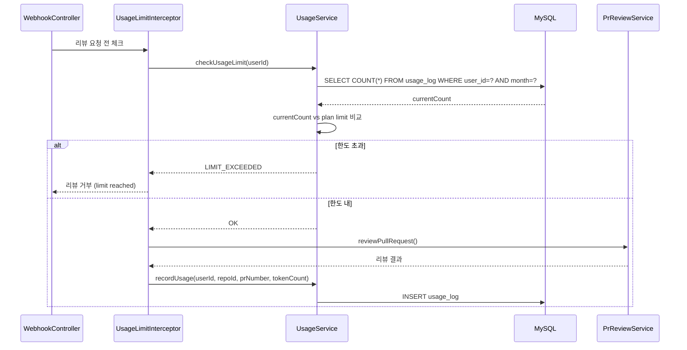

# F13: Usage Tracking - SPEC

## 개요
사용자별 월간 리뷰 횟수를 추적하고, Anthropic API 호출 비용을 추정하여
플랜 제한 및 비용 관리를 위한 데이터를 제공한다.

## 상태: 미구현

## 관련 파일 (예정)
- `UsageService.java` - 사용량 추적 서비스
- `UsageLog.java` - JPA Entity
- `UsageLogRepository.java` - JPA Repository
- `UsageLimitInterceptor.java` - 사용량 제한 인터셉터

## 시퀀스 다이어그램

### 리뷰 시 사용량 기록 + 제한 체크


## 범위 정의

### In-Scope
- 리뷰 횟수 추적 (usage_log 테이블)
- 월간 사용량 집계 (사용자별)
- LLM API 토큰 사용량 기록
- API 비용 추정 (토큰 × 단가)
- 사용량 조회 API
- 플랜별 사용 제한 체크

### Out-of-Scope
- 실시간 비용 알림
- 일별 사용량 제한
- 팀 단위 사용량 공유

## 의존성
- **의존**: F10 (user-auth) → users 테이블
- **의존**: F12 (repository-management) → user_repositories
- **피의존**: F14 (pricing-plans) → 사용량 기반 제한/결제

## 상세 설계

### DB 스키마: `usage_log`
```sql
CREATE TABLE usage_log (
    id              BIGINT AUTO_INCREMENT PRIMARY KEY,
    user_id         BIGINT NOT NULL,
    repository_id   BIGINT NOT NULL,
    pr_number       INT NOT NULL,
    feature_name    VARCHAR(255),
    input_tokens    INT NOT NULL DEFAULT 0,
    output_tokens   INT NOT NULL DEFAULT 0,
    estimated_cost  DECIMAL(10, 6) NOT NULL DEFAULT 0,  -- USD
    review_type     VARCHAR(20) NOT NULL,  -- PR_REVIEW, COMMENT_REPLY
    created_at      TIMESTAMP DEFAULT CURRENT_TIMESTAMP,

    FOREIGN KEY (user_id) REFERENCES users(id),
    INDEX idx_user_month (user_id, created_at),
    INDEX idx_repo (repository_id)
);
```

### 비용 추정 로직
```
Claude Sonnet 4 가격:
  - Input:  $3 / 1M tokens
  - Output: $15 / 1M tokens

1회 리뷰 예상 비용:
  - Input: ~5000 tokens × $3/1M = $0.015
  - Output: ~2000 tokens × $15/1M = $0.030
  - 합계: ~$0.045/리뷰

월 $15 상한 = ~333회 리뷰 (유료 플랜 실질 상한)
```

### 사용량 조회 API

| Method | Path | 설명 |
|--------|------|------|
| `GET` | `/api/usage` | 현재 월 사용량 요약 |
| `GET` | `/api/usage/history?months=6` | 월별 사용량 이력 |

#### GET /api/usage 응답
```json
{
  "userId": 1,
  "plan": "FREE",
  "currentMonth": "2025-01",
  "reviewCount": 18,
  "reviewLimit": 30,
  "remainingReviews": 12,
  "totalInputTokens": 90000,
  "totalOutputTokens": 36000,
  "estimatedCost": 0.81,
  "costLimit": null
}
```

## 에러 처리 정책

| 상황 | 동작 | 영향 |
|------|------|------|
| 사용량 기록 실패 (DB) | 에러 로그 + 리뷰는 계속 | 사용량 누락 (리뷰 우선) |
| 사용량 조회 실패 | 제한 없이 통과 + 경고 로그 | 일시적 제한 해제 |
| 비용 계산 오류 | 기본 단가로 계산 | 추정치 오차 |

## 테스트 케이스
1. 리뷰 완료 → usage_log 기록 확인
2. 무료 플랜 30회 초과 → 리뷰 거부
3. 유료 플랜 $15 초과 → 리뷰 거부
4. 월 변경 시 카운트 리셋
5. GET /api/usage → 현재 월 사용량 반환
6. 댓글 응답도 usage_log 기록 (COMMENT_REPLY)

## 완료 조건
- [ ] usage_log 테이블 생성 + Entity/Repository
- [ ] 리뷰 시 사용량 자동 기록
- [ ] 토큰 수 기반 비용 추정
- [ ] 플랜별 사용 제한 체크
- [ ] 사용량 조회 API 2개
- [ ] 단위 테스트 6개 이상
