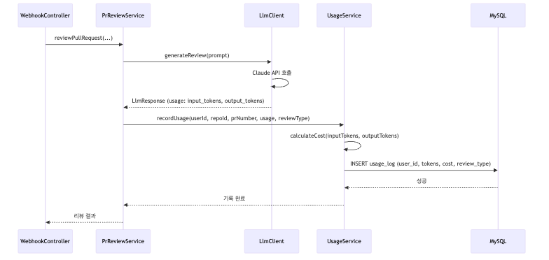
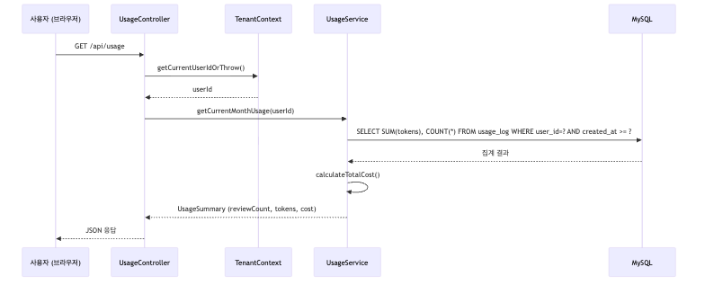

# F13: Usage Tracking - SPEC

## 목적 (Purpose)

사용자별 리뷰 사용량을 추적하고 LLM API 비용을 추정하여, 향후 플랜별 제한 및 비용 관리를 위한 데이터 기반을 제공한다. 현재는 추적만 수행하며, 플랜별 제한은 F14 제거로 제외된다.

## 시퀀스 다이어그램

### 리뷰 시 사용량 기록



### 사용량 조회 흐름



### 흐름 요약
1. **리뷰 수행**: LlmClient에서 Claude API 응답의 `usage` 필드 추출 → UsageService 호출
2. **사용량 기록**: `input_tokens`, `output_tokens`, `estimated_cost` 계산 후 `usage_log` 삽입
3. **사용량 조회**: 현재 월 기준 집계 쿼리 → 비용 추정치 포함 응답
4. **플랜 제한 체크**: F14 제거로 현재는 제외 (미래 구현)

## 범위 정의

### In-Scope
- 리뷰 횟수 추적 (`usage_log` 테이블)
- LLM API 토큰 사용량 기록 (`input_tokens`, `output_tokens`)
- API 비용 추정 (토큰 × Claude Sonnet 4 단가)
- 월간 사용량 집계 (사용자별)
- 사용량 조회 API (`GET /api/usage`, `GET /api/usage/history`)
- 댓글 응답(COMMENT_REPLY) 사용량 별도 추적

### Out-of-Scope
- **플랜별 사용 제한 체크** (F14 제거로 제외, Phase 2 이후)
- 실시간 비용 알림 (이메일/Slack)
- 일별 사용량 제한
- 팀/조직 단위 사용량 공유
- 사용량 초과 시 자동 차단 (Phase 2 이후)
- Repository별 사용량 분석 (Phase 2 이후)

## 입력/출력 (Inputs/Outputs)

| 입력 | 출처 | 형식 |
|------|------|------|
| LLM API 응답 | Anthropic Claude API | `{usage: {input_tokens, output_tokens}}` |
| 현재 사용자 ID | TenantContext | `Long userId` |
| Repository ID | PrReviewService | `Long repositoryId` |
| PR 번호 | PrReviewService | `Integer prNumber` |

| 출력 | 대상 | 형식 |
|------|------|------|
| 사용량 요약 | 브라우저 | JSON (reviewCount, tokens, cost) |
| 사용량 이력 | 브라우저 | JSON (월별 배열) |
| 비용 추정치 | 로그 | `INFO` (리뷰당 비용) |

## 행위 규칙 (Behavior Rules)

1. **모든 리뷰는 usage_log에 기록**: PR 리뷰, 댓글 응답 모두 포함
2. **비용 추정은 Claude Sonnet 4 단가 기준**: Input $3/1M, Output $15/1M
3. **사용량 기록 실패는 리뷰를 막지 않음**: 리뷰 우선, 기록 실패 시 경고 로그만 출력
4. **월간 집계는 UTC 기준**: `created_at >= YYYY-MM-01 00:00:00 UTC`
5. **TenantContext 기반 격리**: 사용자는 본인의 사용량만 조회 가능
6. **플랜 제한 체크는 제외**: F14 제거로 사용량 추적만 수행 (제한 없음)
7. **사용자별 API Key 사용**: 서비스 레벨 Key 없음, LlmClient는 사용자의 `anthropic_api_key`로 동적 호출
8. **비용은 사용자 개인 비용**: 추정 비용은 사용자가 자신의 API Key로 소비한 비용 (서비스 비용 아님)

## 상세 설계

### DB 스키마: `usage_log`

```sql
CREATE TABLE usage_log (
    id              BIGINT AUTO_INCREMENT PRIMARY KEY,
    user_id         BIGINT NOT NULL,
    repository_id   BIGINT NOT NULL,
    pr_number       INT NOT NULL,
    feature_name    VARCHAR(255),                       -- 리뷰한 Feature (선택)
    input_tokens    INT NOT NULL DEFAULT 0,
    output_tokens   INT NOT NULL DEFAULT 0,
    estimated_cost  DECIMAL(10, 6) NOT NULL DEFAULT 0,  -- USD
    review_type     VARCHAR(20) NOT NULL,               -- PR_REVIEW, COMMENT_REPLY
    created_at      TIMESTAMP DEFAULT CURRENT_TIMESTAMP,

    FOREIGN KEY (user_id) REFERENCES users(id) ON DELETE CASCADE,
    INDEX idx_user_month (user_id, created_at),
    INDEX idx_repo (repository_id),
    INDEX idx_review_type (review_type)
);
```

**필드 설명**:
- `input_tokens`: LLM API 입력 토큰 수 (프롬프트)
- `output_tokens`: LLM API 출력 토큰 수 (생성된 리뷰)
- `estimated_cost`: 토큰 기반 비용 추정치 (USD)
- `review_type`: `PR_REVIEW` (1차 리뷰), `COMMENT_REPLY` (댓글 응답)
- `feature_name`: 어떤 Feature를 리뷰했는지 (선택, 통계용)

### 비용 추정 로직

**Claude Sonnet 4 가격 (2025년 1월 기준)**:
```
- Input:  $3 / 1M tokens
- Output: $15 / 1M tokens
```

**1회 리뷰 예상 비용** (평균):
```
- Input: ~5,000 tokens × $3/1M = $0.015
- Output: ~2,000 tokens × $15/1M = $0.030
- 합계: ~$0.045/리뷰
```

**비용 계산 공식**:
```java
public BigDecimal calculateCost(int inputTokens, int outputTokens) {
    BigDecimal inputCost = BigDecimal.valueOf(inputTokens)
        .multiply(BigDecimal.valueOf(3.0))
        .divide(BigDecimal.valueOf(1_000_000), 6, RoundingMode.HALF_UP);

    BigDecimal outputCost = BigDecimal.valueOf(outputTokens)
        .multiply(BigDecimal.valueOf(15.0))
        .divide(BigDecimal.valueOf(1_000_000), 6, RoundingMode.HALF_UP);

    return inputCost.add(outputCost);
}
```

### UsageService 구현

`UsageService.java`:

```java
package greensnaback0229.pr_review_server.usage;

@Service
@RequiredArgsConstructor
@Slf4j
public class UsageService {

    private final UsageLogRepository usageLogRepository;

    @Transactional
    public void recordUsage(Long userId, Long repositoryId, Integer prNumber,
                            String featureName, int inputTokens, int outputTokens,
                            ReviewType reviewType) {
        try {
            BigDecimal cost = calculateCost(inputTokens, outputTokens);

            UsageLog log = UsageLog.builder()
                .userId(userId)
                .repositoryId(repositoryId)
                .prNumber(prNumber)
                .featureName(featureName)
                .inputTokens(inputTokens)
                .outputTokens(outputTokens)
                .estimatedCost(cost)
                .reviewType(reviewType)
                .build();

            usageLogRepository.save(log);

            log.info("Usage recorded: userId={}, repo={}, pr={}, type={}, tokens=({}/{}), cost=${}",
                     userId, repositoryId, prNumber, reviewType, inputTokens, outputTokens, cost);

        } catch (Exception e) {
            log.warn("Failed to record usage: {}", e.getMessage());
            // 리뷰는 계속 진행 (사용량 기록 실패가 리뷰를 막지 않음)
        }
    }

    public UsageSummary getCurrentMonthUsage(Long userId) {
        LocalDateTime monthStart = LocalDateTime.now()
            .withDayOfMonth(1)
            .withHour(0)
            .withMinute(0)
            .withSecond(0);

        // 월간 집계
        List<UsageLog> logs = usageLogRepository.findByUserIdAndCreatedAtAfter(userId, monthStart);

        int reviewCount = logs.size();
        int totalInputTokens = logs.stream().mapToInt(UsageLog::getInputTokens).sum();
        int totalOutputTokens = logs.stream().mapToInt(UsageLog::getOutputTokens).sum();
        BigDecimal totalCost = logs.stream()
            .map(UsageLog::getEstimatedCost)
            .reduce(BigDecimal.ZERO, BigDecimal::add);

        return UsageSummary.builder()
            .userId(userId)
            .currentMonth(monthStart.format(DateTimeFormatter.ofPattern("yyyy-MM")))
            .reviewCount(reviewCount)
            .totalInputTokens(totalInputTokens)
            .totalOutputTokens(totalOutputTokens)
            .estimatedCost(totalCost)
            .build();
    }

    public List<MonthlyUsage> getUsageHistory(Long userId, int months) {
        // 최근 N개월 사용량
        LocalDateTime startDate = LocalDateTime.now().minusMonths(months);
        List<UsageLog> logs = usageLogRepository.findByUserIdAndCreatedAtAfter(userId, startDate);

        // 월별 그룹화
        Map<String, List<UsageLog>> byMonth = logs.stream()
            .collect(Collectors.groupingBy(log ->
                log.getCreatedAt().format(DateTimeFormatter.ofPattern("yyyy-MM"))
            ));

        return byMonth.entrySet().stream()
            .map(entry -> {
                List<UsageLog> monthLogs = entry.getValue();
                return MonthlyUsage.builder()
                    .month(entry.getKey())
                    .reviewCount(monthLogs.size())
                    .totalCost(monthLogs.stream()
                        .map(UsageLog::getEstimatedCost)
                        .reduce(BigDecimal.ZERO, BigDecimal::add))
                    .build();
            })
            .sorted(Comparator.comparing(MonthlyUsage::getMonth).reversed())
            .toList();
    }

    private BigDecimal calculateCost(int inputTokens, int outputTokens) {
        // Claude Sonnet 4 단가
        BigDecimal inputCost = BigDecimal.valueOf(inputTokens)
            .multiply(BigDecimal.valueOf(3.0))
            .divide(BigDecimal.valueOf(1_000_000), 6, RoundingMode.HALF_UP);

        BigDecimal outputCost = BigDecimal.valueOf(outputTokens)
            .multiply(BigDecimal.valueOf(15.0))
            .divide(BigDecimal.valueOf(1_000_000), 6, RoundingMode.HALF_UP);

        return inputCost.add(outputCost);
    }
}
```

### LlmClient 연동 (사용량 추출 + 사용자별 API Key)

`LlmClient.java` 수정:

**핵심 변경**: 기존의 고정 `AnthropicClient` 빈 대신, 사용자별 API Key로 동적 클라이언트 생성.

```java
@Service
@RequiredArgsConstructor
public class LlmClient {

    private final UsageService usageService;
    private final ApiKeyService apiKeyService;

    public LlmResponse generateReview(String prompt, Long userId, Long repositoryId,
                                       Integer prNumber, String featureName) {
        // 1. 사용자별 API Key 조회
        String apiKey = apiKeyService.getDecryptedApiKey(userId);
        if (apiKey == null) {
            throw new ApiKeyNotConfiguredException("Anthropic API Key가 설정되지 않았습니다.");
        }

        // 2. 사용자별 AnthropicClient 동적 생성
        AnthropicClient client = AnthropicOkHttpClient.builder()
            .apiKey(apiKey)
            .build();

        // 3. Claude API 호출
        MessageResponse response = client.messages().create(MessageCreateParams.builder()
            .model("claude-sonnet-4-20250514")
            .messages(List.of(MessageParam.ofUser(prompt)))
            .maxTokens(4096)
            .build());

        // 4. usage 필드 추출
        com.anthropic.models.Usage usage = response.usage();
        int inputTokens = usage.inputTokens();
        int outputTokens = usage.outputTokens();

        // 5. 사용량 기록
        usageService.recordUsage(userId, repositoryId, prNumber, featureName,
                                 inputTokens, outputTokens, ReviewType.PR_REVIEW);

        // 6. 리뷰 결과 반환
        return parseResponse(response.content().get(0).text());
    }
}
```

**변경 포인트**:
- `application.yml`의 `ANTHROPIC_API_KEY` 제거 → 서비스 레벨 Key 없음
- `ApiKeyService.getDecryptedApiKey(userId)`로 사용자별 Key 조회
- Key가 NULL이면 `ApiKeyNotConfiguredException` 발생 → 호출부에서 PR 코멘트로 안내
- `AnthropicClient`를 매 호출 시 동적 생성 (향후 캐싱 최적화 가능)

### 사용량 조회 API

#### GET /api/usage (현재 월 사용량)

**Controller**:
```java
@RestController
@RequestMapping("/api/usage")
@RequiredArgsConstructor
public class UsageController {

    private final UsageService usageService;

    @GetMapping
    public ResponseEntity<UsageSummary> getCurrentUsage() {
        Long userId = TenantContext.getCurrentUserIdOrThrow();
        UsageSummary summary = usageService.getCurrentMonthUsage(userId);

        return ResponseEntity.ok(summary);
    }
}
```

**응답 예시**:
```json
{
  "userId": 1,
  "currentMonth": "2025-02",
  "reviewCount": 18,
  "totalInputTokens": 90000,
  "totalOutputTokens": 36000,
  "estimatedCost": 0.810000
}
```

#### GET /api/usage/history?months=6 (월별 이력)

**Controller**:
```java
@GetMapping("/history")
public ResponseEntity<UsageHistoryResponse> getUsageHistory(
        @RequestParam(defaultValue = "6") int months) {

    Long userId = TenantContext.getCurrentUserIdOrThrow();
    List<MonthlyUsage> history = usageService.getUsageHistory(userId, months);

    UsageHistoryResponse response = UsageHistoryResponse.builder()
        .userId(userId)
        .months(history)
        .build();

    return ResponseEntity.ok(response);
}
```

**응답 예시**:
```json
{
  "userId": 1,
  "months": [
    {"month": "2025-02", "reviewCount": 18, "totalCost": 0.810000},
    {"month": "2025-01", "reviewCount": 25, "totalCost": 1.125000},
    {"month": "2024-12", "reviewCount": 30, "totalCost": 1.350000}
  ]
}
```

### UsageLogRepository

```java
public interface UsageLogRepository extends JpaRepository<UsageLog, Long> {

    List<UsageLog> findByUserIdAndCreatedAtAfter(Long userId, LocalDateTime startDate);

    @Query("SELECT COUNT(u) FROM UsageLog u WHERE u.userId = :userId " +
           "AND u.createdAt >= :startDate")
    long countByUserIdAndCreatedAtAfter(@Param("userId") Long userId,
                                        @Param("startDate") LocalDateTime startDate);

    @Query("SELECT SUM(u.estimatedCost) FROM UsageLog u WHERE u.userId = :userId " +
           "AND u.createdAt >= :startDate")
    BigDecimal sumCostByUserIdAndCreatedAtAfter(@Param("userId") Long userId,
                                                 @Param("startDate") LocalDateTime startDate);
}
```

## 엣지 케이스

| 상황 | 처리 방식 |
|------|----------|
| LLM API 응답에 `usage` 필드 없음 | 0으로 기록 + 경고 로그 |
| 사용량 기록 실패 (DB 오류) | 경고 로그 + 리뷰는 계속 진행 (리뷰 우선) |
| 사용량 조회 실패 | 빈 응답 + 에러 로그 |
| 비용 계산 오버플로우 | `BigDecimal` 사용으로 방지 |
| 월 변경 시점 (UTC vs 로컬) | UTC 기준 통일 (`created_at` 타임스탬프) |
| 댓글 응답 사용량 추적 누락 | `CommentResponseService`에서 별도 호출 |
| 여러 사용자가 같은 Repo 리뷰 | 각 사용자별로 독립적으로 기록 (F11 격리) |

## 에러 처리 정책

| 에러 상황 | HTTP 상태 | 동작 | 영향 |
|-----------|-----------|------|------|
| 사용량 기록 실패 (DB) | - | 경고 로그 + 리뷰 계속 | 사용량 누락 (리뷰 우선) |
| 사용량 조회 실패 | 500 | 에러 로그 + 빈 응답 | 클라이언트 에러 표시 |
| 비용 계산 오류 (NPE) | - | 기본값 0 + 경고 로그 | 추정치 부정확 |
| TenantContext 미설정 | 500 | `TenantContextException` | 데이터 격리 안전장치 |
| `usage` 필드 누락 (Anthropic API) | - | 0으로 기록 + 경고 로그 | 비용 추정 불가 |

## 테스트 전략

### 단위 테스트
1. **UsageService**:
   - `calculateCost()` → 정확한 비용 계산 확인
   - `recordUsage()` → `usage_log` 삽입 확인
   - `getCurrentMonthUsage()` → 월간 집계 확인
2. **LlmClient**:
   - Claude API 응답 파싱 → `usage` 필드 추출 확인
   - UsageService 호출 확인 (Mockito)

### 통합 테스트
1. 리뷰 완료 → `usage_log` 레코드 생성 확인
2. 댓글 응답 → `review_type = COMMENT_REPLY` 확인
3. 월 변경 시 카운트 리셋 (2월 1일 00:00 UTC)
4. `GET /api/usage` → 현재 월 사용량 반환 확인
5. `GET /api/usage/history?months=3` → 3개월 이력 반환 확인
6. 사용량 기록 실패 시 리뷰 계속 진행 확인

### 수동 테스트
1. 실제 리뷰 수행 → DB `usage_log` 확인
2. Dashboard에서 사용량 조회 → 비용 추정치 확인
3. 여러 달에 걸쳐 리뷰 → 이력 API 확인

## 의존성

### 의존 (Depends On)
- F10 (user-auth): `users` 테이블
- F11 (tenant-isolation): TenantContext, `user_id` 격리
- F12 (repository-management): `repository_id` 추적
- Anthropic Claude API: `usage` 필드

### 피의존 (Depended By)
- ~~F14 (pricing-plans)~~: 제거됨 (플랜별 제한 기능 제외)
- F16 (web-ui-dashboard): 사용량 차트/그래프 표시
- Phase 2 이후: 플랜별 제한, 자동 차단, 알림 기능

## 완료 조건

- [ ] `usage_log` 테이블 생성
- [ ] `UsageService` 구현 (기록, 집계, 비용 계산)
- [ ] `LlmClient` 수정 (Claude API `usage` 필드 추출 → UsageService 호출)
- [ ] `CommentResponseService` 수정 (댓글 응답 사용량 기록)
- [ ] `GET /api/usage` 구현 (현재 월 사용량)
- [ ] `GET /api/usage/history` 구현 (월별 이력)
- [ ] `UsageLogRepository` 쿼리 메서드 (집계, 필터링)
- [ ] 단위 테스트 6개 이상 (비용 계산, 집계)
- [ ] 통합 테스트 6개 이상 (리뷰 기록, API)
- [ ] 사용량 기록 실패 시 리뷰 계속 진행 확인 (try-catch)
- [ ] F14 제거 관련 문서 업데이트 (플랜 제한 기능 제외)