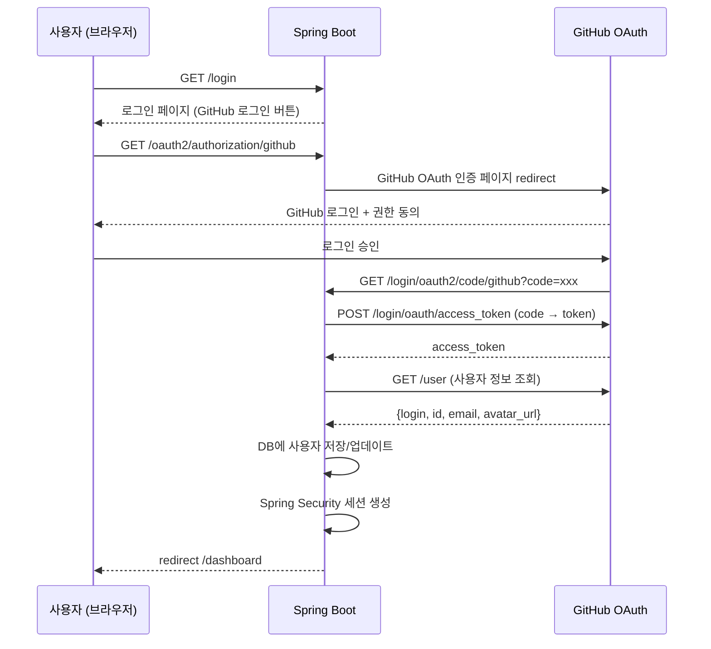

# F10: User Auth - SPEC

## 개요
GitHub OAuth 2.0을 통한 사용자 인증 시스템. Spring Security 기반으로
사용자 가입/로그인/세션 관리를 구현한다.

## 상태: 미구현

## 관련 파일 (예정)
- `SecurityConfig.java` - Spring Security 설정
- `OAuth2UserService.java` - GitHub OAuth 사용자 정보 처리
- `UserEntity.java` - 사용자 JPA Entity
- `UserRepository.java` - 사용자 JPA Repository
- `UserService.java` - 사용자 비즈니스 로직

## 시퀀스 다이어그램

### GitHub OAuth 로그인 흐름


## 범위 정의

### In-Scope
- GitHub OAuth 2.0 로그인 (Spring Security OAuth2 Client)
- 사용자 DB 저장 (users 테이블)
- 세션 관리 (Spring Session + Cookie)
- 로그아웃
- 사용자 프로필 조회/수정
- GitHub access_token 암호화 저장 (Repository 접근용)

### Out-of-Scope
- 이메일/비밀번호 인증
- 팀/조직 계정
- 2FA (GitHub이 처리)
- 소셜 로그인 (Google, Kakao 등)

## 의존성
- **의존**: Spring Security OAuth2 Client
- **의존**: MySQL (users 테이블)
- **피의존**: F11 (tenant-isolation), F12 (repository-management), 모든 Web UI

## 상세 설계

### DB 스키마: `users`
```sql
CREATE TABLE users (
    id              BIGINT AUTO_INCREMENT PRIMARY KEY,
    github_id       BIGINT NOT NULL UNIQUE,
    github_login    VARCHAR(255) NOT NULL,
    email           VARCHAR(255),
    name            VARCHAR(255),
    avatar_url      VARCHAR(500),
    github_token    VARCHAR(500) NOT NULL,  -- 암호화 저장
    plan            VARCHAR(20) NOT NULL DEFAULT 'FREE',  -- FREE, PRO
    created_at      TIMESTAMP DEFAULT CURRENT_TIMESTAMP,
    updated_at      TIMESTAMP DEFAULT CURRENT_TIMESTAMP ON UPDATE CURRENT_TIMESTAMP,

    INDEX idx_github_id (github_id),
    INDEX idx_github_login (github_login)
);
```

### Spring Security 설정
```yaml
spring:
  security:
    oauth2:
      client:
        registration:
          github:
            client-id: ${GITHUB_OAUTH_CLIENT_ID}
            client-secret: ${GITHUB_OAUTH_CLIENT_SECRET}
            scope: user:email, repo, read:org
```

### OAuth2 Scope
| Scope | 용도 |
|-------|------|
| `user:email` | 이메일 조회 |
| `repo` | Repository 접근 (PR, 파일 읽기) |
| `read:org` | 조직 Repository 접근 |

### 인증 필터 구조
```
요청 → Spring Security Filter Chain
  ├─ /api/webhook/** → 인증 없음 (GitHub Webhook)
  ├─ /login, /oauth2/** → 인증 없음 (로그인 플로우)
  ├─ /api/** → 세션 인증 필요
  └─ /dashboard/** → 세션 인증 필요 (미인증 → /login redirect)
```

## 에러 처리 정책

| 상황 | 동작 | 영향 |
|------|------|------|
| GitHub OAuth 인증 실패 | /login?error redirect | 사용자 로그인 불가 |
| GitHub API 사용자 정보 조회 실패 | 에러 페이지 표시 | 가입 불가 |
| 세션 만료 | /login redirect | 재로그인 필요 |
| github_token 만료 | OAuth 재인증 유도 | Repository 접근 불가 |
| 중복 가입 시도 (같은 github_id) | 기존 계정 업데이트 | 정상 |

## 테스트 케이스
1. GitHub OAuth 로그인 → users 테이블 저장 확인
2. 기존 사용자 재로그인 → 정보 업데이트 (토큰 갱신)
3. 미인증 /dashboard 접근 → /login redirect
4. 미인증 /api/webhook 접근 → 인증 없이 통과
5. 로그아웃 → 세션 삭제 + /login redirect
6. github_token 암호화 저장 확인

## 완료 조건
- [ ] Spring Security OAuth2 Client 설정
- [ ] users 테이블 생성 + Entity/Repository
- [ ] GitHub OAuth 로그인/로그아웃
- [ ] 세션 관리 (인증 필터)
- [ ] github_token 암호화 저장
- [ ] 단위 테스트 6개 이상
