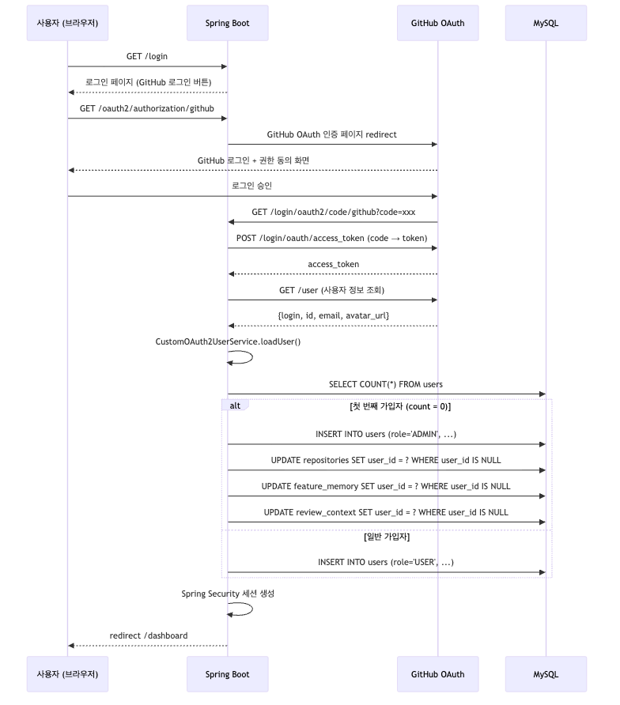

# F10: User Auth - SPEC

## 목적 (Purpose)

GitHub OAuth 2.0을 통한 사용자 인증/인가 시스템 구축. Spring Security 기반으로 사용자 가입/로그인/세션 관리를 처리하며, 기존 익명 데이터를 첫 번째 가입자(관리자)에게 귀속시킨다.

## 시퀀스 다이어그램

### GitHub OAuth 로그인 흐름



### 흐름 요약
1. 사용자가 `/login` 접근 → GitHub OAuth 인증 시작
2. GitHub에서 `code` 전달 → Spring Security가 자동으로 `access_token` 교환
3. `CustomOAuth2UserService`가 사용자 정보 조회 및 DB 저장/업데이트
4. 첫 번째 가입자는 `ADMIN` 역할 부여 + 기존 익명 데이터 귀속
5. 세션 생성 후 `/dashboard`로 리다이렉트

## 범위 정의

### In-Scope
- GitHub OAuth 2.0 로그인 (Spring Security OAuth2 Client)
- 사용자 DB 저장 (`users` 테이블)
- 세션 기반 인증/인가 (Cookie 방식)
- 로그아웃 기능
- `github_token` 암호화 저장 (AES-256-GCM 또는 Spring TextEncryptor)
- `anthropic_api_key` 암호화 저장 (사용자별 Claude API Key)
- API Key 저장 시 유효성 검증 (Anthropic API 테스트 호출)
- API Key 미설정 시 리뷰 비활성화 (설정 안내 메시지)
- 기존 익명 데이터 마이그레이션 (첫 가입자에게 귀속)
- Role 기반 접근 제어 (`ADMIN`, `USER`)

### Out-of-Scope
- 이메일/비밀번호 인증
- 팀/조직 계정
- 2FA (GitHub이 처리)
- 소셜 로그인 (Google, Kakao 등)
- 플랜/결제 기능 (F14와 분리)
- 사용자 프로필 수정 UI (Web UI Phase에서 구현)

## 입력/출력 (Inputs/Outputs)

| 입력 | 출처 | 형식 |
|------|------|------|
| OAuth 인증 코드 | GitHub OAuth callback | `?code=xxx` |
| 사용자 정보 | GitHub API `/user` | JSON |
| 세션 쿠키 | 브라우저 | `JSESSIONID` |

| 출력 | 대상 | 형식 |
|------|------|------|
| 로그인 성공 | 브라우저 | Redirect `/dashboard` |
| 로그인 실패 | 브라우저 | Redirect `/login?error` |
| 세션 쿠키 | 브라우저 | `Set-Cookie: JSESSIONID=...` |

## 행위 규칙 (Behavior Rules)

1. **첫 가입자 = 관리자**: `users` 테이블이 비어있으면 첫 번째 가입자는 `role='ADMIN'`
2. **익명 데이터 귀속**: 첫 가입자 생성 시 `user_id IS NULL`인 모든 레코드를 해당 사용자로 업데이트
3. **토큰 암호화**: `github_token`, `anthropic_api_key` 모두 평문 저장 금지, 반드시 암호화
4. **Webhook 경로 제외**: `/api/webhook/**`는 인증 필터에서 제외
5. **재로그인 시 토큰 갱신**: 기존 사용자의 `github_token`, `email`, `avatar_url` 업데이트
6. **CSRF 비활성화**: Webhook 엔드포인트 호환성을 위해 CSRF 보호 비활성화 (또는 Webhook 경로만 제외)
7. **API Key 미설정 시 리뷰 불가**: `anthropic_api_key`가 NULL이면 Webhook 수신해도 리뷰 스킵 + PR 코멘트로 안내
8. **API Key 유효성 검증**: 저장 시 Anthropic API에 간단한 테스트 호출 (`messages.create`로 "hello" 전송), 실패 시 저장 거부
9. **서비스 레벨 API Key 없음**: `application.yml`의 `ANTHROPIC_API_KEY` 제거, 모든 LLM 호출은 사용자별 Key 사용

## 상세 설계

### build.gradle 변경

기존 파일에 다음 의존성 추가:

```gradle
dependencies {
    // 기존 의존성 유지...

    // Spring Security + OAuth2
    implementation 'org.springframework.boot:spring-boot-starter-security'
    implementation 'org.springframework.boot:spring-boot-starter-oauth2-client'

    // 암호화 (선택: Spring Crypto 사용 시 불필요)
    // implementation 'org.springframework.security:spring-security-crypto'

    testImplementation 'org.springframework.security:spring-security-test'
}
```

### application.yml 변경

기존 `application.yml`에 다음 섹션 추가:

```yaml
spring:
  security:
    oauth2:
      client:
        registration:
          github:
            client-id: ${GITHUB_OAUTH_CLIENT_ID}
            client-secret: ${GITHUB_OAUTH_CLIENT_SECRET}
            scope:
              - user:email
              - repo
              - read:org
        provider:
          github:
            authorization-uri: https://github.com/login/oauth/authorize
            token-uri: https://github.com/login/oauth/access_token
            user-info-uri: https://api.github.com/user

# 암호화 키 (환경변수로 관리)
encryption:
  secret-key: ${ENCRYPTION_SECRET_KEY}  # 32바이트 이상
```

**OAuth2 Scope 설명**:
| Scope | 용도 |
|-------|------|
| `user:email` | 사용자 이메일 조회 |
| `repo` | Repository 접근 (PR, 파일 읽기) |
| `read:org` | 조직 Repository 접근 권한 |

### DB 스키마: `users`

```sql
CREATE TABLE users (
    id              BIGINT AUTO_INCREMENT PRIMARY KEY,
    github_id       BIGINT NOT NULL UNIQUE,
    github_login    VARCHAR(255) NOT NULL,
    email           VARCHAR(255),
    name            VARCHAR(255),
    avatar_url      VARCHAR(500),
    github_token    VARCHAR(500) NOT NULL,      -- AES-256-GCM 암호화 저장
    anthropic_api_key VARCHAR(500),             -- AES-256-GCM 암호화 저장, NULL 허용 (미설정)
    role            VARCHAR(20) NOT NULL DEFAULT 'USER',  -- ADMIN, USER
    created_at      TIMESTAMP DEFAULT CURRENT_TIMESTAMP,
    updated_at      TIMESTAMP DEFAULT CURRENT_TIMESTAMP ON UPDATE CURRENT_TIMESTAMP,

    INDEX idx_github_id (github_id),
    INDEX idx_github_login (github_login)
);
```

**기존 테이블 수정 (외래키 추가)**:
```sql
-- repositories 테이블에 user_id 추가
ALTER TABLE repositories
ADD COLUMN user_id BIGINT NULL,
ADD CONSTRAINT fk_repository_user FOREIGN KEY (user_id) REFERENCES users(id) ON DELETE SET NULL;

-- feature_memory 테이블에 user_id 추가
ALTER TABLE feature_memory
ADD COLUMN user_id BIGINT NULL,
ADD CONSTRAINT fk_feature_memory_user FOREIGN KEY (user_id) REFERENCES users(id) ON DELETE SET NULL;

-- review_context 테이블에 user_id 추가
ALTER TABLE review_context
ADD COLUMN user_id BIGINT NULL,
ADD CONSTRAINT fk_review_context_user FOREIGN KEY (user_id) REFERENCES users(id) ON DELETE SET NULL;
```

### Spring Security 설정 (SecurityConfig)

`SecurityConfig.java` 생성:

```java
package greensnaback0229.pr_review_server.config;

import org.springframework.context.annotation.Bean;
import org.springframework.context.annotation.Configuration;
import org.springframework.security.config.annotation.web.builders.HttpSecurity;
import org.springframework.security.config.annotation.web.configuration.EnableWebSecurity;
import org.springframework.security.web.SecurityFilterChain;

@Configuration
@EnableWebSecurity
public class SecurityConfig {

    @Bean
    public SecurityFilterChain filterChain(HttpSecurity http) throws Exception {
        http
            // CSRF 비활성화 (Webhook 호환성)
            .csrf(csrf -> csrf.disable())

            // 인증 규칙
            .authorizeHttpRequests(auth -> auth
                .requestMatchers("/api/webhook/**").permitAll()  // Webhook 제외
                .requestMatchers("/login", "/oauth2/**", "/error").permitAll()  // OAuth 플로우
                .requestMatchers("/api/**", "/dashboard/**").authenticated()  // 인증 필요
                .anyRequest().permitAll()
            )

            // OAuth2 로그인
            .oauth2Login(oauth2 -> oauth2
                .loginPage("/login")
                .defaultSuccessUrl("/dashboard", true)
                .failureUrl("/login?error=true")
            )

            // 로그아웃
            .logout(logout -> logout
                .logoutUrl("/logout")
                .logoutSuccessUrl("/login")
                .invalidateHttpSession(true)
                .deleteCookies("JSESSIONID")
            );

        return http.build();
    }
}
```

**주요 설정 설명**:
- **CSRF 비활성화**: Webhook은 CSRF 토큰 없이 동작하므로 전역 비활성화 (또는 `/api/webhook/**`만 제외)
- **세션 방식**: 기본 세션 기반 인증 (Stateful)
- **필터 체인 순서**: `OAuth2LoginAuthenticationFilter` → `UsernamePasswordAuthenticationFilter`

### OAuth2 사용자 처리 (CustomOAuth2UserService)

`CustomOAuth2UserService.java` 생성:

```java
package greensnaback0229.pr_review_server.auth;

import greensnaback0229.pr_review_server.auth.entity.User;
import greensnaback0229.pr_review_server.auth.repository.UserRepository;
import lombok.RequiredArgsConstructor;
import org.springframework.security.oauth2.client.userinfo.DefaultOAuth2UserService;
import org.springframework.security.oauth2.client.userinfo.OAuth2UserRequest;
import org.springframework.security.oauth2.core.user.OAuth2User;
import org.springframework.stereotype.Service;
import org.springframework.transaction.annotation.Transactional;

@Service
@RequiredArgsConstructor
public class CustomOAuth2UserService extends DefaultOAuth2UserService {

    private final UserRepository userRepository;
    private final EncryptionService encryptionService;

    @Override
    @Transactional
    public OAuth2User loadUser(OAuth2UserRequest userRequest) {
        OAuth2User oAuth2User = super.loadUser(userRequest);

        Long githubId = oAuth2User.getAttribute("id");
        String login = oAuth2User.getAttribute("login");
        String email = oAuth2User.getAttribute("email");
        String name = oAuth2User.getAttribute("name");
        String avatarUrl = oAuth2User.getAttribute("avatar_url");
        String accessToken = userRequest.getAccessToken().getTokenValue();

        // 암호화
        String encryptedToken = encryptionService.encrypt(accessToken);

        // 첫 번째 가입자 체크
        boolean isFirstUser = userRepository.count() == 0;
        String role = isFirstUser ? "ADMIN" : "USER";

        // 사용자 저장/업데이트
        User user = userRepository.findByGithubId(githubId)
            .map(existing -> {
                existing.setEmail(email);
                existing.setAvatarUrl(avatarUrl);
                existing.setGithubToken(encryptedToken);
                return existing;
            })
            .orElseGet(() -> {
                User newUser = User.builder()
                    .githubId(githubId)
                    .githubLogin(login)
                    .email(email)
                    .name(name)
                    .avatarUrl(avatarUrl)
                    .githubToken(encryptedToken)
                    .role(role)
                    .build();
                return userRepository.save(newUser);
            });

        // 첫 가입자면 기존 데이터 귀속
        if (isFirstUser) {
            migrateAnonymousData(user.getId());
        }

        return new CustomOAuth2User(user, oAuth2User.getAttributes());
    }

    private void migrateAnonymousData(Long userId) {
        // repositories, feature_memory, review_context의 user_id NULL → userId 업데이트
        // 구현은 각 Repository에서 처리
    }
}
```

### 인증 필터 구조

```
HTTP 요청
  ↓
SecurityFilterChain
  ├─ /api/webhook/** → permitAll() → WebhookController (인증 없음)
  ├─ /login, /oauth2/** → permitAll() → OAuth2LoginAuthenticationFilter
  ├─ /api/**, /dashboard/** → authenticated() → 세션 체크
  │    └─ 미인증 시 → redirect:/login
  └─ anyRequest() → permitAll()
```

**주요 필터**:
1. `OAuth2AuthorizationRequestRedirectFilter`: GitHub OAuth 인증 시작
2. `OAuth2LoginAuthenticationFilter`: GitHub 콜백 처리 (`/login/oauth2/code/github`)
3. `UsernamePasswordAuthenticationFilter`: 세션 기반 인증 검증

### github_token 암호화

**방식**: Spring Security Crypto 또는 AES-256-GCM

**EncryptionService.java**:
```java
package greensnaback0229.pr_review_server.auth;

import org.springframework.beans.factory.annotation.Value;
import org.springframework.security.crypto.encrypt.Encryptors;
import org.springframework.security.crypto.encrypt.TextEncryptor;
import org.springframework.stereotype.Service;

@Service
public class EncryptionService {

    private final TextEncryptor encryptor;

    public EncryptionService(@Value("${encryption.secret-key}") String secretKey) {
        // AES-256-GCM 방식 (Spring Security Crypto)
        this.encryptor = Encryptors.text(secretKey, "hex-encoded-salt");
    }

    public String encrypt(String plainText) {
        return encryptor.encrypt(plainText);
    }

    public String decrypt(String cipherText) {
        return encryptor.decrypt(cipherText);
    }
}
```

**주의사항**:
- `ENCRYPTION_SECRET_KEY`는 환경변수로 관리 (32바이트 이상)
- Salt는 고정값 또는 사용자별 랜덤 생성 (DB 저장 필요)

### Anthropic API Key 관리

#### 저장/수정 API

| Method | Path | 설명 |
|--------|------|------|
| `GET` | `/api/settings/api-key` | API Key 설정 상태 조회 (Key 자체는 마스킹) |
| `PUT` | `/api/settings/api-key` | API Key 저장/수정 (유효성 검증 후 암호화 저장) |
| `DELETE` | `/api/settings/api-key` | API Key 삭제 |

#### PUT /api/settings/api-key 흐름

```
사용자 → PUT /api/settings/api-key {apiKey: "sk-ant-..."}
  → EncryptionService.decrypt()로 기존 키와 비교 (중복 방지)
  → Anthropic API 테스트 호출 (messages.create, "hello")
    → 성공: 암호화 후 DB 저장, 200 OK
    → 실패 (401 Invalid API Key): 400 Bad Request + "유효하지 않은 API Key"
    → 실패 (네트워크): 502 + "API 연결 실패, 잠시 후 재시도"
```

#### GET /api/settings/api-key 응답

```json
{
  "hasApiKey": true,
  "maskedKey": "sk-ant-****...****a3f2",
  "lastValidatedAt": "2025-02-10T10:30:00Z"
}
```

#### ApiKeyService 구현

```java
@Service
@RequiredArgsConstructor
public class ApiKeyService {

    private final UserRepository userRepository;
    private final EncryptionService encryptionService;

    public void saveApiKey(Long userId, String rawApiKey) {
        // 1. 유효성 검증
        validateApiKey(rawApiKey);

        // 2. 암호화 저장
        String encrypted = encryptionService.encrypt(rawApiKey);
        User user = userRepository.findById(userId).orElseThrow();
        user.setAnthropicApiKey(encrypted);
        userRepository.save(user);
    }

    public String getDecryptedApiKey(Long userId) {
        User user = userRepository.findById(userId).orElseThrow();
        if (user.getAnthropicApiKey() == null) {
            return null;
        }
        return encryptionService.decrypt(user.getAnthropicApiKey());
    }

    private void validateApiKey(String apiKey) {
        // Anthropic API 테스트 호출
        try {
            AnthropicClient testClient = AnthropicOkHttpClient.builder()
                .apiKey(apiKey)
                .build();
            testClient.messages().create(MessageCreateParams.builder()
                .model("claude-sonnet-4-20250514")
                .maxTokens(10)
                .messages(List.of(MessageParam.ofUser("hello")))
                .build());
        } catch (AuthenticationException e) {
            throw new InvalidApiKeyException("유효하지 않은 API Key입니다.");
        } catch (Exception e) {
            throw new ApiKeyValidationException("API 연결 실패, 잠시 후 재시도해주세요.");
        }
    }
}
```

#### Webhook 수신 시 API Key 체크

```
Webhook 수신 → repository_id로 user_id 매핑
  → User.anthropic_api_key 조회
    → NULL: 리뷰 스킵 + PR 코멘트로 "API Key를 설정해주세요" 안내
    → 존재: 복호화 후 LlmClient에 전달 → 리뷰 수행
```

## 엣지 케이스

| 상황 | 처리 방식 |
|------|----------|
| GitHub OAuth 인증 중 네트워크 오류 | `/login?error=true` 리다이렉트, 사용자에게 재시도 안내 |
| `github_token` 만료 (403 Forbidden) | 로그인 페이지로 리다이렉트, 재인증 유도 |
| 동시에 2명이 첫 가입 시도 (Race Condition) | DB Unique 제약으로 1명만 성공, 나머지는 일반 `USER` |
| 기존 `ADMIN`이 재로그인 | 역할 유지, 토큰만 갱신 |
| `user_id IS NULL`인 데이터가 없는 상태에서 첫 가입 | 마이그레이션 쿼리는 0건 업데이트, 정상 동작 |
| Webhook 요청에 세션 쿠키가 포함된 경우 | `/api/webhook/**`는 `permitAll()`이므로 무시됨 |
| API Key 미설정 상태에서 Webhook 수신 | 리뷰 스킵 + PR 코멘트로 "API Key를 설정해주세요" 안내 |
| 유효하지 않은 API Key 저장 시도 | 테스트 호출 실패 → 400 Bad Request, 저장 거부 |
| API Key가 도중에 만료/폐기된 경우 | LLM 호출 실패 → 에러 로그 + PR 코멘트로 Key 확인 안내 |
| 사용자가 API Key를 삭제한 경우 | `anthropic_api_key = NULL`, 이후 리뷰 비활성화 |

## 에러 처리 정책

| 에러 상황 | HTTP 상태 | 동작 | 영향 |
|-----------|-----------|------|------|
| GitHub OAuth 인증 실패 | 302 | `/login?error=true` 리다이렉트 | 로그인 불가 |
| GitHub API 사용자 정보 조회 실패 | 500 | 에러 페이지 표시 | 가입 불가 |
| 세션 만료 | 302 | `/login` 리다이렉트 | 재로그인 필요 |
| `github_token` 복호화 실패 | 500 | 로그 기록 후 재인증 유도 | Repository 접근 불가 |
| 중복 `github_id` (DB Unique 위반) | - | 기존 레코드 업데이트 | 정상 |
| 암호화 키 누락 (`ENCRYPTION_SECRET_KEY`) | 500 | 애플리케이션 시작 실패 | 서비스 중단 |
| API Key 유효성 검증 실패 (401) | 400 | "유효하지 않은 API Key" 메시지 | Key 저장 거부 |
| API Key 유효성 검증 실패 (네트워크) | 502 | "API 연결 실패, 잠시 후 재시도" | Key 저장 보류 |
| `anthropic_api_key` 복호화 실패 | 500 | 에러 로그 + Key 재설정 안내 | 리뷰 불가 |

## 테스트 전략

### 단위 테스트
1. **CustomOAuth2UserService**:
   - 첫 가입자는 `ADMIN` 역할 부여 확인
   - 기존 사용자 재로그인 시 토큰 갱신 확인
   - 익명 데이터 마이그레이션 쿼리 실행 검증
2. **EncryptionService**:
   - 암호화/복호화 정합성 검증
   - 잘못된 키로 복호화 시 예외 발생 확인
3. **ApiKeyService**:
   - 유효한 API Key → 암호화 저장 확인
   - 유효하지 않은 API Key → `InvalidApiKeyException` 발생 확인
   - API Key 삭제 → `anthropic_api_key = NULL` 확인
   - 마스킹된 Key 반환 (`sk-ant-****...****a3f2`) 확인

### 통합 테스트
1. GitHub OAuth Mock 서버를 사용한 로그인 플로우 테스트
2. `/api/webhook/**` 경로는 인증 없이 통과 확인
3. `/dashboard` 미인증 접근 시 `/login` 리다이렉트 확인
4. 세션 쿠키 검증 (`JSESSIONID` 생성 확인)
5. `PUT /api/settings/api-key` → 유효성 검증 후 저장 확인
6. API Key 미설정 상태에서 Webhook → 리뷰 스킵 확인

### 수동 테스트
1. 실제 GitHub OAuth로 로그인 → `users` 테이블 저장 확인
2. 로그아웃 후 재접속 → 세션 삭제 확인
3. 첫 가입자가 기존 `repositories` 데이터 소유 확인
4. 설정 페이지에서 API Key 입력 → 유효성 검증 → 리뷰 활성화 확인

## 의존성

### 의존 (Depends On)
- Spring Security OAuth2 Client (외부 라이브러리)
- MySQL (`users` 테이블)
- 기존 Entity: `Repository`, `FeatureMemory`, `ReviewContext` (외래키 추가 필요)

### 피의존 (Depended By)
- F11 (tenant-isolation): `user_id` 기반 격리
- F12 (repository-management): Repository 소유자 식별
- 모든 Web UI 기능 (인증 전제)

### 제거된 의존성
- ~~F14 (pricing-plans)~~: `plan` 컬럼 삭제로 의존성 제거

## 완료 조건

- [x] `build.gradle`에 Spring Security + OAuth2 의존성 추가
- [x] `application.yml`에 GitHub OAuth 설정 추가 + `ANTHROPIC_API_KEY` 제거
- [x] `users` 테이블 생성 (role, github_token, anthropic_api_key 암호화 컬럼 포함)
- [x] 기존 테이블 (`repositories`, `feature_memory`, `review_context`)에 `user_id` 외래키 추가
- [x] `SecurityConfig.java` 구현 (CSRF 비활성화, Webhook 경로 제외)
- [x] `CustomOAuth2UserService.java` 구현 (첫 가입자 `ADMIN` 처리, 익명 데이터 마이그레이션)
- [x] `EncryptionService.java` 구현 (AES-256-GCM 또는 TextEncryptor)
- [x] `ApiKeyService.java` 구현 (저장/조회/삭제 + 유효성 검증)
- [x] API Key 관리 API 3개 (`GET/PUT/DELETE /api/settings/api-key`)
- [x] Webhook에서 API Key 미설정 사용자 스킵 + PR 코멘트 안내
- [x] 단위 테스트 10개 이상 (OAuth 플로우, 암호화, 역할 부여, API Key 관리)
- [x] 통합 테스트 6개 이상 (인증 필터, 세션 관리, API Key CRUD)
- [x] 환경변수 문서화 (`GITHUB_OAUTH_CLIENT_ID`, `GITHUB_OAUTH_CLIENT_SECRET`, `ENCRYPTION_SECRET_KEY`)
