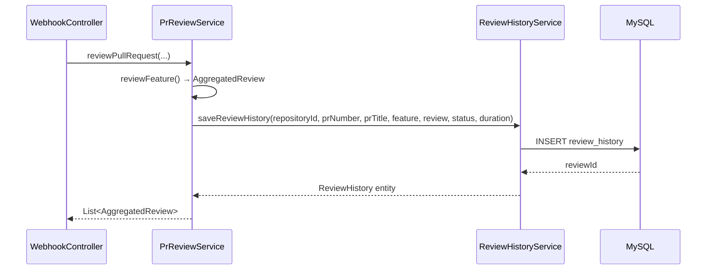
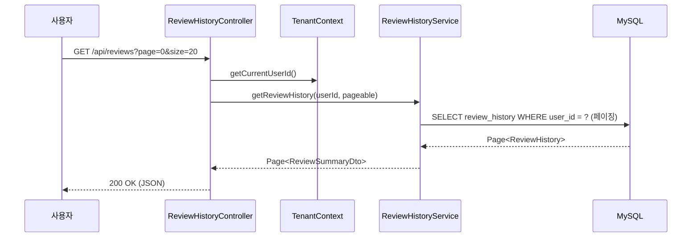

# F8: Review Dashboard - SPEC

## 목적 (Purpose)

리뷰 결과를 DB에 저장하고, REST API를 통해 조회할 수 있는 기능을 제공한다.
현재 리뷰 결과는 GitHub에만 게시되고 서버에 저장되지 않아 히스토리 조회가 불가능하다.
이 기능은 F16 (web-ui-dashboard)의 데이터 소스 역할을 한다.

## 시퀀스 다이어그램

### 리뷰 결과 저장 플로우


### 리뷰 히스토리 조회 플로우


### 흐름 요약
1. **저장**: PrReviewService에서 Feature별 리뷰 완료 후 → ReviewHistoryService.saveReviewHistory() 호출
2. **조회**: TenantContext 기반 user_id 격리 → 페이징된 리뷰 히스토리 반환
3. **통계**: Repository별 리뷰 수, 평균 코멘트 수, Feature별 분포 집계
4. **실패 기록**: 리뷰 실패 시에도 FAILED 상태로 저장하여 추적 가능

## 범위 정의

### In-Scope
- `review_history` 테이블 및 JPA Entity
- 리뷰 결과 DB 저장 (PrReviewService 연동)
- 리뷰 히스토리 조회 API (전체, Repository별, PR별) — 페이징
- Repository 통계 API (리뷰 수, 코멘트 평균, Feature 분포)
- 멀티 테넌트 격리 (user_id 기반, TenantContext)
- 리뷰 실패 기록 (FAILED 상태)

### Out-of-Scope
- 웹 프론트엔드 대시보드 UI (F16에서 구현)
- 실시간 알림
- 리뷰 수정/삭제
- 리뷰 결과 내용 검색 (전문 검색)

## 입력/출력 (Inputs/Outputs)

| 입력 | 출처 | 형식 |
|------|------|------|
| 리뷰 결과 | `PrReviewService` → `AggregatedReview` | Java 객체 |
| 리뷰 메타 | `WebhookController` → repositoryId, prNumber, prTitle | primitive |
| 현재 사용자 | `TenantContext.getCurrentUserId()` | Long |
| 페이징 파라미터 | Query params (?page, ?size, ?sort) | Pageable |

| 출력 | 대상 | 형식 |
|------|------|------|
| 리뷰 요약 목록 | REST API → 프론트엔드 | `Page<ReviewSummaryDto>` (JSON) |
| PR별 리뷰 상세 | REST API → 프론트엔드 | `PrReviewDetailResponse` (JSON) |
| Repository 통계 | REST API → 프론트엔드 | `RepositoryStatsResponse` (JSON) |

## 상세 설계

### DB 스키마

```sql
CREATE TABLE review_history (
    id                BIGINT AUTO_INCREMENT PRIMARY KEY,
    user_id           BIGINT NOT NULL,
    repository_id     BIGINT NOT NULL,
    pr_number         INT NOT NULL,
    pr_title          VARCHAR(500),
    feature_name      VARCHAR(255),
    general_review    TEXT,
    inline_comments   JSON,
    memory_suggestion JSON,
    status            VARCHAR(20) NOT NULL DEFAULT 'COMPLETED',
    inline_comment_count INT NOT NULL DEFAULT 0,
    review_duration_ms BIGINT,
    created_at        TIMESTAMP NOT NULL DEFAULT CURRENT_TIMESTAMP,

    INDEX idx_user_created (user_id, created_at),
    INDEX idx_user_repo (user_id, repository_id),
    INDEX idx_repo_pr (repository_id, pr_number)
);
```

**멀티 테넌트 격리**: 모든 조회 쿼리에 `WHERE user_id = ?` 포함 (F11 패턴 준수).

### JPA Entity

```java
@Entity
@Table(name = "review_history")
public class ReviewHistory {
    @Id @GeneratedValue(strategy = GenerationType.IDENTITY)
    private Long id;

    @Column(name = "user_id", nullable = false)
    private Long userId;

    @Column(name = "repository_id", nullable = false)
    private Long repositoryId;

    @Column(name = "pr_number", nullable = false)
    private Integer prNumber;

    @Column(name = "pr_title", length = 500)
    private String prTitle;

    @Column(name = "feature_name")
    private String featureName;

    @Column(name = "general_review", columnDefinition = "TEXT")
    private String generalReview;

    @Column(name = "inline_comments", columnDefinition = "JSON")
    private String inlineComments;  // JSON 문자열

    @Column(name = "memory_suggestion", columnDefinition = "JSON")
    private String memorySuggestion;  // JSON 문자열

    @Enumerated(EnumType.STRING)
    @Column(name = "status", nullable = false, length = 20)
    private ReviewStatus status;

    @Column(name = "inline_comment_count", nullable = false)
    private Integer inlineCommentCount;

    @Column(name = "review_duration_ms")
    private Long reviewDurationMs;

    @Column(name = "created_at", nullable = false, updatable = false)
    private LocalDateTime createdAt;
}
```

### ReviewStatus Enum

```java
public enum ReviewStatus {
    COMPLETED,
    FAILED
}
```

### JPA Repository

```java
public interface ReviewHistoryJpaRepository extends JpaRepository<ReviewHistory, Long> {
    // 전체 조회 (사용자 격리)
    Page<ReviewHistory> findByUserIdOrderByCreatedAtDesc(Long userId, Pageable pageable);

    // Repository별 조회
    Page<ReviewHistory> findByUserIdAndRepositoryIdOrderByCreatedAtDesc(
            Long userId, Long repositoryId, Pageable pageable);

    // PR별 조회
    List<ReviewHistory> findByUserIdAndRepositoryIdAndPrNumberOrderByCreatedAtDesc(
            Long userId, Long repositoryId, Integer prNumber);

    // 통계: Repository별 리뷰 수
    long countByUserIdAndRepositoryId(Long userId, Long repositoryId);

    // 통계: Repository별 상태별 리뷰 수
    long countByUserIdAndRepositoryIdAndStatus(Long userId, Long repositoryId, ReviewStatus status);

    // 통계: 최근 N일 리뷰 수
    long countByUserIdAndRepositoryIdAndCreatedAtAfter(
            Long userId, Long repositoryId, LocalDateTime after);
}
```

### REST API

#### 1. 전체 리뷰 조회
```
GET /api/reviews?page=0&size=20&sort=createdAt,desc
```
- 인증 필수 (TenantContext)
- 응답: `Page<ReviewSummaryDto>`

#### 2. Repository별 리뷰 조회
```
GET /api/reviews/{repositoryId}?page=0&size=20
```
- Repository 소유권 검증 (user_id 일치)
- 응답: `Page<ReviewSummaryDto>`

#### 3. PR별 리뷰 상세 조회
```
GET /api/reviews/{repositoryId}/pr/{prNumber}
```
- 응답: `PrReviewDetailResponse`

#### 4. Repository 통계 조회
```
GET /api/reviews/{repositoryId}/stats
```
- 응답: `RepositoryStatsResponse`

### DTO 설계

```java
@Getter @Builder
public class ReviewSummaryDto {
    private Long reviewId;
    private Long repositoryId;
    private int prNumber;
    private String prTitle;
    private String featureName;
    private String status;
    private int inlineCommentCount;
    private Long reviewDurationMs;
    private LocalDateTime createdAt;
}

@Getter @Builder
public class PrReviewDetailResponse {
    private Long repositoryId;
    private int prNumber;
    private String prTitle;
    private List<ReviewDetailDto> reviews;
    private int totalReviewCount;
}

@Getter @Builder
public class ReviewDetailDto {
    private Long reviewId;
    private String featureName;
    private String generalReview;
    private List<InlineComment> inlineComments;  // JSON → 역직렬화
    private String memorySuggestion;
    private String status;
    private Long reviewDurationMs;
    private LocalDateTime createdAt;
}

@Getter @Builder
public class RepositoryStatsResponse {
    private Long repositoryId;
    private long totalReviews;
    private long completedReviews;
    private long failedReviews;
    private double averageInlineComments;
    private long averageReviewDurationMs;
    private Map<String, Long> reviewsByFeature;
    private long last7DaysReviews;
    private long last30DaysReviews;
}
```

### PrReviewService 연동

리뷰 결과 저장 시점: `reviewFeature()` 메서드 내에서 `reviewAggregator.aggregate()` 이후.

```java
// PrReviewService.reviewFeature() 내부, 9번 단계 이후
// 10. 리뷰 히스토리 저장
try {
    Long userId = TenantContext.getCurrentUserId();
    if (userId != null) {
        long duration = System.currentTimeMillis() - startTime;
        reviewHistoryService.saveReviewHistory(
                userId, repositoryId, prNumber, prTitle, feature,
                aggregatedReview, duration, ReviewStatus.COMPLETED);
    }
} catch (Exception e) {
    log.warn("Failed to save review history for feature {}: {}", feature, e.getMessage());
}
```

실패 기록: `reviewFeature()` catch 블록에서 FAILED 상태로 저장.

```java
catch (Exception e) {
    // 실패 히스토리 저장
    try {
        Long userId = TenantContext.getCurrentUserId();
        if (userId != null) {
            reviewHistoryService.saveReviewHistory(
                    userId, repositoryId, prNumber, prTitle, feature,
                    null, 0L, ReviewStatus.FAILED);
        }
    } catch (Exception ex) {
        log.warn("Failed to save failed review history: {}", ex.getMessage());
    }
    log.error("Failed to review feature {}: {}", feature, e.getMessage(), e);
    return null;
}
```

## 행위 규칙 (Behavior Rules)

1. **리뷰 히스토리 저장은 리뷰 프로세스를 차단하지 않는다**: try-catch로 감싸고, 실패 시 경고 로그만 남김
2. **모든 조회는 TenantContext.getCurrentUserId() 기반 격리**: user_id가 null이면 빈 결과 반환
3. **inline_comments, memory_suggestion은 JSON 문자열로 저장**: ObjectMapper로 직렬화/역직렬화
4. **페이징 기본값**: page=0, size=20, sort=createdAt,desc
5. **Repository 소유권 검증**: 조회 시 user_id + repository_id 조합으로 자연 격리
6. **통계 API의 평균 계산**: 0건인 경우 0 반환 (ArithmeticException 방지)

## 엣지 케이스

| 상황 | 처리 방식 |
|------|----------|
| TenantContext에 userId 없음 (Webhook 경유) | userId가 null이면 저장 스킵 |
| inline_comments가 null/빈 목록 | inlineCommentCount=0, JSON은 "[]" 저장 |
| memorySuggestion이 null | JSON은 null 저장 |
| 리뷰 중 예외 발생 (LLM 타임아웃 등) | FAILED 상태로 히스토리 저장 |
| Repository가 삭제된 경우 조회 | FK 없이 repositoryId만 저장 → 조회 가능 |
| PR별 조회 시 리뷰 0건 | 빈 리스트 반환 (404 아님) |
| 통계에서 리뷰 0건인 Repository | 모든 값 0 반환 |
| JSON 역직렬화 실패 | 빈 리스트/null 반환, 에러 로그 |
| 동일 PR에 synchronize로 재리뷰 | 별도 row로 저장 (히스토리 누적) |

## 에러 처리 정책

| 에러 상황 | HTTP 상태 | 동작 |
|-----------|-----------|------|
| TenantContext 없음 (미인증) | 302 | `/login` redirect (Spring Security) |
| 잘못된 page/size 파라미터 | 400 | 에러 메시지 반환 |
| 존재하지 않는 repositoryId | 200 | 빈 페이지 반환 (데이터 격리상 자연 필터링) |
| JSON 파싱 오류 | 200 | 해당 필드 null/빈 리스트로 대체, 로그 경고 |
| DB 저장 실패 | - | 리뷰 프로세스 계속 (로그 경고만) |

## 테스트 전략

### 단위 테스트 (ReviewHistoryServiceTest)
1. `saveReviewHistory_정상저장` — COMPLETED 상태로 저장 확인
2. `saveReviewHistory_실패저장` — FAILED 상태, aggregatedReview=null 처리
3. `saveReviewHistory_inlineComments_JSON직렬화` — List → JSON 문자열 변환
4. `getReviewHistory_페이징` — 페이지 크기, 정렬 확인
5. `getReviewHistory_사용자격리` — 다른 userId 데이터 미포함
6. `getReviewsByRepository_정상조회` — repositoryId 필터링
7. `getReviewsByPr_상세조회` — JSON 역직렬화 포함
8. `getRepositoryStats_통계계산` — 평균, Feature 분포, 최근 활동
9. `getRepositoryStats_리뷰없음` — 모든 값 0
10. `calculateAverageInlineComments_0건` — ArithmeticException 방지

### 컨트롤러 테스트 (ReviewHistoryControllerTest)
1. `GET /api/reviews` 인증 → 200, 페이징 응답
2. `GET /api/reviews` 미인증 → 302 redirect
3. `GET /api/reviews/{repoId}` 인증 → 200, 필터링된 결과
4. `GET /api/reviews/{repoId}/pr/{prNumber}` 인증 → 200, 상세 응답
5. `GET /api/reviews/{repoId}/stats` 인증 → 200, 통계 응답
6. `GET /api/reviews/{repoId}/stats` TenantContext 없음 → 빈 응답

## 의존성

### 의존 (Depends On)
- F11 (tenant-isolation): TenantContext, user_id 격리 패턴
- F13 (usage-tracking): 동일한 PrReviewService 연동 패턴 참고
- `PrReviewService`: 리뷰 결과 저장 호출 지점
- `AggregatedReview`, `InlineComment`, `MemorySuggestion`: 기존 DTO

### 피의존 (Depended By)
- F16 (web-ui-dashboard): 대시보드 페이지에서 이 API 사용

## 수정 대상 파일

- **신규**: `review/entity/ReviewHistory.java` — JPA Entity
- **신규**: `review/entity/ReviewStatus.java` — Enum
- **신규**: `review/repository/ReviewHistoryJpaRepository.java`
- **신규**: `review/ReviewHistoryService.java` — 저장/조회/통계 비즈니스 로직
- **신규**: `review/ReviewHistoryController.java` — REST API
- **신규**: `review/dto/ReviewSummaryDto.java`
- **신규**: `review/dto/PrReviewDetailResponse.java`
- **신규**: `review/dto/ReviewDetailDto.java`
- **신규**: `review/dto/RepositoryStatsResponse.java`
- **수정**: `webhook/PrReviewService.java` — reviewFeature()에 히스토리 저장 추가
- **신규**: `review/ReviewHistoryServiceTest.java` — 10개 이상 테스트
- **신규**: `review/ReviewHistoryControllerTest.java` — 6개 이상 테스트

## 완료 조건

- [ ] `ReviewHistory` JPA Entity + `ReviewStatus` Enum 생성
- [ ] `ReviewHistoryJpaRepository` 생성 (페이징, 통계 쿼리)
- [ ] `ReviewHistoryService` 구현 (저장, 조회, 통계)
- [ ] `ReviewHistoryController` 구현 (4개 엔드포인트)
- [ ] DTO 4종 생성 (ReviewSummaryDto, PrReviewDetailResponse, ReviewDetailDto, RepositoryStatsResponse)
- [ ] `PrReviewService.reviewFeature()` 연동 (성공/실패 히스토리 저장)
- [ ] inline_comments JSON 직렬화/역직렬화 처리
- [ ] 멀티 테넌트 격리 (모든 쿼리에 user_id 조건)
- [ ] 단위 테스트 10개 이상 (ReviewHistoryServiceTest)
- [ ] 컨트롤러 테스트 6개 이상 (ReviewHistoryControllerTest)
- [ ] 전체 빌드 및 테스트 통과
