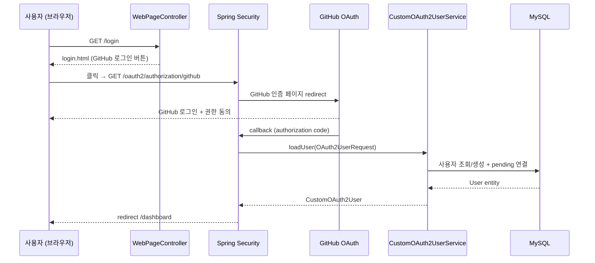
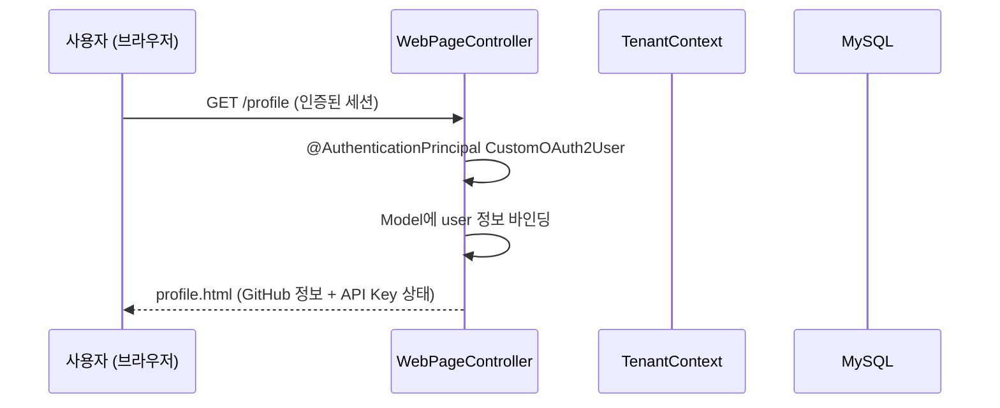
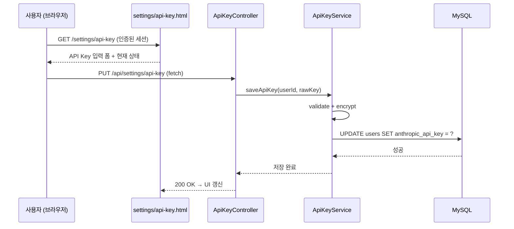

# F15: Web UI Auth - SPEC

## 목적 (Purpose)

Spring + Thymeleaf 기반 인증 관련 웹 페이지를 구현한다.
로그인, 프로필, API Key 설정 페이지와 F16/F17이 공유할 공통 레이아웃을 제공한다.

## 시퀀스 다이어그램

### GitHub OAuth 로그인 플로우


### 프로필 페이지 조회


### API Key 설정 플로우


### 흐름 요약
1. **로그인**: `/login` → GitHub OAuth → `CustomOAuth2UserService` → `/dashboard` redirect
2. **프로필**: `CustomOAuth2User`에서 User 정보 추출 → Model 바인딩 → Thymeleaf 렌더링
3. **API Key 설정**: 페이지에서 기존 `ApiKeyController` REST API를 fetch로 호출
4. **로그아웃**: `/logout` → 세션 무효화 → `/login` redirect

## 범위 정의

### In-Scope
- 공통 레이아웃 (`base.html`, navbar, footer) — F16/F17 공유
- 로그인 페이지 (`/login`) — GitHub OAuth 버튼
- 프로필 페이지 (`/profile`) — GitHub 정보 표시, API Key 상태
- API Key 설정 페이지 (`/settings/api-key`) — 등록/삭제 (기존 REST API 활용)
- 에러 페이지 (`error.html`) — 404, 500
- 반응형 디자인 (Bootstrap 5 CDN)
- `WebPageController` — 페이지 라우팅 전용 Controller

### Out-of-Scope
- 이메일/비밀번호 폼 (GitHub OAuth만 사용)
- 프로필 사진 업로드 (GitHub avatar 사용)
- 다크 모드
- 대시보드 페이지 (F16)
- 설정 페이지 (F17)

## 입력/출력 (Inputs/Outputs)

| 입력 | 출처 | 형식 |
|------|------|------|
| 현재 사용자 정보 | `@AuthenticationPrincipal CustomOAuth2User` | User entity |
| API Key 상태 | `ApiKeyService.getApiKeyStatus()` | `ApiKeyStatusResponse` |
| 인증 상태 | Spring Security Session | `SecurityContext` |

| 출력 | 대상 | 형식 |
|------|------|------|
| HTML 페이지 | 브라우저 | Thymeleaf 렌더링 |
| API Key 조작 | `ApiKeyController` | JSON (기존 REST API) |

## 행위 규칙 (Behavior Rules)

1. **미인증 사용자는 `/login`만 접근 가능**: 그 외 페이지 접근 시 `/login` redirect (SecurityConfig 기존 규칙)
2. **로그인 성공 시 `/dashboard` redirect**: SecurityConfig `defaultSuccessUrl("/dashboard", true)` 기존 설정 활용
3. **공통 레이아웃은 Thymeleaf Layout Dialect 사용**: `layout:decorate` 방식으로 모든 페이지가 `base.html` 상속
4. **API Key 조작은 기존 REST API 활용**: 페이지에서 JavaScript fetch로 `/api/settings/api-key` 호출
5. **프로필 페이지는 읽기 전용**: GitHub 정보 수정 불가 (OAuth로 자동 갱신)
6. **네비게이션은 현재 페이지 하이라이트**: 활성 페이지에 `active` 클래스 적용
7. **Bootstrap 5는 CDN 사용**: WebJars 대신 CDN으로 의존성 최소화

## 상세 설계

### 의존성 추가 (build.gradle)

```groovy
// Thymeleaf
implementation 'org.springframework.boot:spring-boot-starter-thymeleaf'
implementation 'nz.net.ultraq.thymeleaf:thymeleaf-layout-dialect:3.3.0'
// Thymeleaf Spring Security extras (sec:authorize 등)
implementation 'org.thymeleaf.extras:thymeleaf-extras-springsecurity6'
```

### 페이지 라우팅 (WebPageController)

```java
@Controller
@RequiredArgsConstructor
public class WebPageController {

    private final ApiKeyService apiKeyService;

    // 루트 → 인증 여부에 따라 redirect
    @GetMapping("/")
    public String index(@AuthenticationPrincipal CustomOAuth2User principal) {
        if (principal != null) {
            return "redirect:/dashboard";
        }
        return "redirect:/login";
    }

    // 로그인 페이지
    @GetMapping("/login")
    public String login() {
        return "login";
    }

    // 대시보드 (F16에서 구현, 임시 페이지)
    @GetMapping("/dashboard")
    public String dashboard(@AuthenticationPrincipal CustomOAuth2User principal, Model model) {
        model.addAttribute("user", principal.getUser());
        return "dashboard";
    }

    // 프로필 페이지
    @GetMapping("/profile")
    public String profile(@AuthenticationPrincipal CustomOAuth2User principal, Model model) {
        User user = principal.getUser();
        ApiKeyStatusResponse apiKeyStatus = apiKeyService.getApiKeyStatus(user.getId());

        model.addAttribute("user", user);
        model.addAttribute("apiKeyStatus", apiKeyStatus);
        return "profile";
    }

    // API Key 설정 페이지
    @GetMapping("/settings/api-key")
    public String apiKeySettings(@AuthenticationPrincipal CustomOAuth2User principal, Model model) {
        User user = principal.getUser();
        ApiKeyStatusResponse apiKeyStatus = apiKeyService.getApiKeyStatus(user.getId());

        model.addAttribute("user", user);
        model.addAttribute("apiKeyStatus", apiKeyStatus);
        return "settings/api-key";
    }
}
```

### 템플릿 구조

```
src/main/resources/templates/
├── layout/
│   └── base.html              -- 공통 레이아웃 (head, nav, footer)
├── fragments/
│   ├── navbar.html            -- 네비게이션 바
│   └── footer.html            -- 푸터
├── login.html                 -- 로그인 페이지
├── dashboard.html             -- 대시보드 (F16 전까지 임시)
├── profile.html               -- 프로필 페이지
├── settings/
│   └── api-key.html           -- API Key 설정
├── error.html                 -- 공통 에러 페이지
└── error/
    ├── 404.html               -- 404 에러
    └── 500.html               -- 500 에러
```

### 공통 레이아웃 (base.html)

```html
<!DOCTYPE html>
<html xmlns:th="http://www.thymeleaf.org"
      xmlns:layout="http://www.ultraq.net.nz/thymeleaf/layout"
      xmlns:sec="http://www.thymeleaf.org/extras/spring-security">
<head>
    <meta charset="UTF-8">
    <meta name="viewport" content="width=device-width, initial-scale=1.0">
    <title layout:title-pattern="$CONTENT_TITLE - PR Review">PR Review</title>
    <!-- Bootstrap 5 CDN -->
    <link href="https://cdn.jsdelivr.net/npm/bootstrap@5.3.3/dist/css/bootstrap.min.css"
          rel="stylesheet">
    <link href="https://cdn.jsdelivr.net/npm/bootstrap-icons@1.11.3/font/bootstrap-icons.min.css"
          rel="stylesheet">
</head>
<body>
    <!-- Navbar -->
    <div th:replace="~{fragments/navbar :: navbar}"></div>

    <!-- Content -->
    <main class="container py-4">
        <div layout:fragment="content"></div>
    </main>

    <!-- Footer -->
    <div th:replace="~{fragments/footer :: footer}"></div>

    <!-- Bootstrap JS -->
    <script src="https://cdn.jsdelivr.net/npm/bootstrap@5.3.3/dist/js/bootstrap.bundle.min.js"></script>
    <!-- Page-specific scripts -->
    <div layout:fragment="scripts"></div>
</body>
</html>
```

### 네비게이션 바 (navbar.html)

```html
<nav th:fragment="navbar" class="navbar navbar-expand-lg navbar-dark bg-dark">
    <div class="container">
        <a class="navbar-brand" href="/dashboard">
            <i class="bi bi-code-slash"></i> PR Review
        </a>

        <button class="navbar-toggler" type="button"
                data-bs-toggle="collapse" data-bs-target="#navbarNav">
            <span class="navbar-toggler-icon"></span>
        </button>

        <div class="collapse navbar-collapse" id="navbarNav">
            <!-- 인증된 사용자만 표시 -->
            <ul class="navbar-nav me-auto" sec:authorize="isAuthenticated()">
                <li class="nav-item">
                    <a class="nav-link" th:classappend="${currentPage == 'dashboard'} ? 'active'"
                       href="/dashboard">Dashboard</a>
                </li>
                <li class="nav-item">
                    <a class="nav-link" th:classappend="${currentPage == 'repositories'} ? 'active'"
                       href="/repositories">Repositories</a>
                </li>
                <li class="nav-item">
                    <a class="nav-link" th:classappend="${currentPage == 'settings'} ? 'active'"
                       href="/settings/api-key">Settings</a>
                </li>
            </ul>

            <!-- 프로필 드롭다운 -->
            <ul class="navbar-nav" sec:authorize="isAuthenticated()">
                <li class="nav-item dropdown">
                    <a class="nav-link dropdown-toggle" href="#" role="button"
                       data-bs-toggle="dropdown">
                        
                        <span th:text="${#authentication.principal.user.githubLogin}">user</span>
                    </a>
                    <ul class="dropdown-menu dropdown-menu-end">
                        <li><a class="dropdown-item" href="/profile">
                            <i class="bi bi-person"></i> Profile</a></li>
                        <li><hr class="dropdown-divider"></li>
                        <li>
                            <form th:action="@{/logout}" method="post">
                                <button type="submit" class="dropdown-item">
                                    <i class="bi bi-box-arrow-right"></i> Logout
                                </button>
                            </form>
                        </li>
                    </ul>
                </li>
            </ul>
        </div>
    </div>
</nav>
```

### 로그인 페이지 (login.html)

```html
<html layout:decorate="~{layout/base}">
<head><title>Login</title></head>
<body>
<div layout:fragment="content">
    <div class="row justify-content-center mt-5">
        <div class="col-md-6 col-lg-4">
            <div class="card shadow">
                <div class="card-body text-center p-5">
                    <h2 class="mb-4"><i class="bi bi-code-slash"></i> PR Review</h2>
                    <p class="text-muted mb-4">AI 기반 코드 리뷰 서비스</p>

                    <!-- OAuth 에러 메시지 -->
                    <div th:if="${param.error}" class="alert alert-danger">
                        로그인에 실패했습니다. 다시 시도해주세요.
                    </div>

                    <!-- 로그아웃 메시지 -->
                    <div th:if="${param.logout}" class="alert alert-info">
                        로그아웃되었습니다.
                    </div>

                    <!-- GitHub 로그인 버튼 -->
                    <a href="/oauth2/authorization/github"
                       class="btn btn-dark btn-lg w-100">
                        <i class="bi bi-github"></i> GitHub로 로그인
                    </a>
                </div>
            </div>
        </div>
    </div>
</div>
</body>
</html>
```

### 프로필 페이지 (profile.html)

```html
<html layout:decorate="~{layout/base}">
<head><title>Profile</title></head>
<body>
<div layout:fragment="content">
    <h2 class="mb-4">프로필</h2>
    <div class="row">
        <!-- GitHub 정보 -->
        <div class="col-md-4 text-center">
            
            <h4 th:text="${user.githubLogin}">username</h4>
            <p class="text-muted" th:text="${user.email ?: '이메일 미설정'}">email</p>
            <span class="badge bg-primary" th:text="${user.role}">USER</span>
        </div>

        <!-- 계정 정보 -->
        <div class="col-md-8">
            <div class="card mb-3">
                <div class="card-header">계정 정보</div>
                <div class="card-body">
                    <table class="table table-borderless mb-0">
                        <tr>
                            <th style="width:30%">GitHub ID</th>
                            <td th:text="${user.githubId}">12345</td>
                        </tr>
                        <tr>
                            <th>이름</th>
                            <td th:text="${user.name ?: '-'}">name</td>
                        </tr>
                        <tr>
                            <th>가입일</th>
                            <td th:text="${#temporals.format(user.createdAt, 'yyyy-MM-dd')}">2025-01-01</td>
                        </tr>
                    </table>
                </div>
            </div>

            <!-- API Key 상태 -->
            <div class="card">
                <div class="card-header">Anthropic API Key</div>
                <div class="card-body">
                    <div th:if="${apiKeyStatus.hasApiKey}">
                        <span class="badge bg-success">설정됨</span>
                        <code th:text="${apiKeyStatus.maskedKey}" class="ms-2">sk-ant-****</code>
                    </div>
                    <div th:unless="${apiKeyStatus.hasApiKey}">
                        <span class="badge bg-warning text-dark">미설정</span>
                        <p class="text-muted mt-2 mb-0">API Key를 설정해야 리뷰를 받을 수 있습니다.</p>
                    </div>
                    <a href="/settings/api-key" class="btn btn-outline-primary btn-sm mt-3">
                        API Key 관리
                    </a>
                </div>
            </div>
        </div>
    </div>
</div>
</body>
</html>
```

### API Key 설정 페이지 (settings/api-key.html)

```html
<html layout:decorate="~{layout/base}">
<head><title>API Key Settings</title></head>
<body>
<div layout:fragment="content">
    <h2 class="mb-4">API Key 설정</h2>

    <div class="row">
        <div class="col-md-8">
            <!-- 현재 상태 -->
            <div class="card mb-4">
                <div class="card-header">현재 상태</div>
                <div class="card-body">
                    <div th:if="${apiKeyStatus.hasApiKey}">
                        <span class="badge bg-success">설정됨</span>
                        <code th:text="${apiKeyStatus.maskedKey}" class="ms-2">sk-ant-****</code>
                        <button id="btn-delete" class="btn btn-outline-danger btn-sm ms-3">
                            삭제
                        </button>
                    </div>
                    <div th:unless="${apiKeyStatus.hasApiKey}">
                        <span class="badge bg-warning text-dark">미설정</span>
                    </div>
                </div>
            </div>

            <!-- API Key 입력 폼 -->
            <div class="card">
                <div class="card-header">API Key 등록 / 변경</div>
                <div class="card-body">
                    <div id="alert-area"></div>
                    <div class="mb-3">
                        <label for="apiKeyInput" class="form-label">Anthropic API Key</label>
                        <input type="password" id="apiKeyInput" class="form-control"
                               placeholder="sk-ant-api03-...">
                        <div class="form-text">
                            <a href="https://console.anthropic.com/settings/keys"
                               target="_blank">Anthropic Console</a>에서 발급받을 수 있습니다.
                        </div>
                    </div>
                    <button id="btn-save" class="btn btn-primary">저장</button>
                </div>
            </div>
        </div>

        <!-- 안내 사이드바 -->
        <div class="col-md-4">
            <div class="card bg-light">
                <div class="card-body">
                    <h6><i class="bi bi-info-circle"></i> 안내</h6>
                    <ul class="small mb-0">
                        <li>API Key는 AES 암호화되어 저장됩니다.</li>
                        <li>서비스는 API Key를 리뷰 수행에만 사용합니다.</li>
                        <li>비용은 사용자 본인의 Anthropic 계정에 청구됩니다.</li>
                    </ul>
                </div>
            </div>
        </div>
    </div>
</div>

<div layout:fragment="scripts">
<script th:inline="javascript">
    // CSRF 토큰 (Spring Security)
    const csrfToken = document.querySelector('meta[name="_csrf"]')?.content;
    const csrfHeader = document.querySelector('meta[name="_csrf_header"]')?.content;

    function showAlert(type, message) {
        document.getElementById('alert-area').innerHTML =
            `<div class="alert alert-${type} alert-dismissible fade show">
                ${message}
                <button type="button" class="btn-close" data-bs-dismiss="alert"></button>
            </div>`;
    }

    document.getElementById('btn-save')?.addEventListener('click', async () => {
        const apiKey = document.getElementById('apiKeyInput').value.trim();
        if (!apiKey) { showAlert('warning', 'API Key를 입력해주세요.'); return; }

        const headers = { 'Content-Type': 'application/json' };
        if (csrfHeader && csrfToken) headers[csrfHeader] = csrfToken;

        const res = await fetch('/api/settings/api-key', {
            method: 'PUT', headers, body: JSON.stringify({ apiKey })
        });
        const text = await res.text();
        if (res.ok) {
            showAlert('success', text);
            setTimeout(() => location.reload(), 1000);
        } else {
            showAlert('danger', text);
        }
    });

    document.getElementById('btn-delete')?.addEventListener('click', async () => {
        if (!confirm('API Key를 삭제하시겠습니까?')) return;

        const headers = {};
        if (csrfHeader && csrfToken) headers[csrfHeader] = csrfToken;

        const res = await fetch('/api/settings/api-key', { method: 'DELETE', headers });
        const text = await res.text();
        if (res.ok) {
            showAlert('success', text);
            setTimeout(() => location.reload(), 1000);
        } else {
            showAlert('danger', text);
        }
    });
</script>
</div>
</body>
</html>
```

### SecurityConfig 변경 사항

기존 설정에서 `/settings/**` 페이지 경로 인증 추가 필요:

```java
.authorizeHttpRequests(auth -> auth
    .requestMatchers("/api/webhook/**").permitAll()
    .requestMatchers("/login", "/oauth2/**", "/error").permitAll()
    // 기존: "/api/**", "/dashboard/**"
    // 추가: "/profile", "/settings/**"
    .requestMatchers("/api/**", "/dashboard/**", "/profile", "/settings/**").authenticated()
    .anyRequest().permitAll()
)
```

**참고**: 현재 SecurityConfig의 `.requestMatchers("/api/**", "/dashboard/**").authenticated()`에서 `/profile`과 `/settings/**`는 `anyRequest().permitAll()`에 매칭되므로 인증 규칙 추가 필요.

### CSRF 처리

API Key 설정 페이지에서 기존 REST API를 fetch로 호출하므로, `base.html`의 `<head>`에 CSRF meta 태그 추가:

```html
<meta name="_csrf" th:content="${_csrf.token}">
<meta name="_csrf_header" th:content="${_csrf.headerName}">
```

현재 SecurityConfig에서 `/api/settings/**`는 CSRF 무시 설정이므로 실제로는 불필요하지만, 향후 확장을 위해 포함.

## 엣지 케이스

| 상황 | 처리 방식 |
|------|----------|
| 미인증 사용자 `/profile` 접근 | Spring Security가 `/login` redirect |
| OAuth 로그인 실패 (GitHub 장애) | `/login?error=true` → 에러 메시지 표시 |
| 세션 만료 상태에서 페이지 접근 | `/login` redirect (Spring Security 기본 동작) |
| API Key 저장 실패 (유효하지 않은 키) | fetch 응답으로 에러 메시지 표시 (400) |
| `avatarUrl`이 null인 경우 | 기본 아이콘 표시 (Thymeleaf 조건 분기) |
| 모바일 화면에서 navbar | Bootstrap collapse로 햄버거 메뉴 |
| JavaScript 비활성화 | API Key 설정 불가 (폼 제출 방식 미지원, MVP 범위 외) |

## 에러 처리 정책

| 에러 상황 | HTTP 상태 | 동작 | 영향 |
|-----------|-----------|------|------|
| OAuth 로그인 실패 | 302 | `/login?error=true` redirect | 에러 메시지 표시 |
| 세션 만료 | 302 | `/login` redirect | 재로그인 필요 |
| 페이지 없음 | 404 | `error/404.html` 렌더링 | 사용자 안내 |
| 서버 오류 | 500 | `error/500.html` 렌더링 | 사용자 안내 |
| API Key 유효성 실패 | 400 | JSON 에러 메시지 | JS alert 표시 |

## 테스트 전략

### 단위 테스트
1. **WebPageController**:
   - `GET /` (인증) → redirect `/dashboard`
   - `GET /` (미인증) → redirect `/login`
   - `GET /login` → `login` 뷰 반환
   - `GET /profile` (인증) → Model에 user, apiKeyStatus 포함
   - `GET /settings/api-key` (인증) → Model에 apiKeyStatus 포함
2. **SecurityConfig**:
   - `/login` 미인증 접근 가능
   - `/profile` 미인증 접근 → redirect `/login`
   - `/settings/api-key` 미인증 접근 → redirect `/login`

### 통합 테스트 (MockMvc)
1. `GET /login` → 200, "GitHub" 텍스트 포함
2. `GET /profile` 미인증 → 302, `/login` redirect
3. `GET /profile` 인증 → 200, 사용자 정보 포함
4. `GET /settings/api-key` 인증 → 200
5. 로그아웃 → `/login` redirect

### 수동 테스트
1. GitHub OAuth 로그인 → 대시보드 이동 확인
2. 네비게이션 링크 동작 확인
3. API Key 입력 → 저장/삭제 동작 확인
4. 모바일 화면 반응형 확인
5. 로그아웃 후 보호된 페이지 접근 → 로그인 redirect

## 의존성

### 의존 (Depends On)
- F10 (user-auth): `CustomOAuth2User`, `User` entity, `ApiKeyService`, `ApiKeyController`
- Spring Security: OAuth2 login, session management
- Thymeleaf + Layout Dialect: 템플릿 엔진
- Bootstrap 5: CDN으로 UI 프레임워크

### 피의존 (Depended By)
- F16 (web-ui-dashboard): 공통 레이아웃 (`base.html`, navbar, footer) 상속
- F17 (web-ui-settings): 공통 레이아웃 상속, Settings 메뉴 확장

## 완료 조건

- [ ] `build.gradle`에 Thymeleaf + Layout Dialect 의존성 추가
- [ ] `WebPageController` 구현 (`/`, `/login`, `/dashboard`, `/profile`, `/settings/api-key`)
- [ ] `layout/base.html` 공통 레이아웃 (head, content, scripts)
- [ ] `fragments/navbar.html` 네비게이션 바 (인증 상태 분기, 드롭다운)
- [ ] `fragments/footer.html` 푸터
- [ ] `login.html` 로그인 페이지 (GitHub OAuth 버튼, 에러/로그아웃 메시지)
- [ ] `dashboard.html` 임시 대시보드 (F16 전까지 환영 메시지)
- [ ] `profile.html` 프로필 페이지 (GitHub 정보, API Key 상태)
- [ ] `settings/api-key.html` API Key 설정 페이지 (등록/삭제, fetch 연동)
- [ ] `error.html`, `error/404.html`, `error/500.html` 에러 페이지
- [ ] SecurityConfig 업데이트 (`/profile`, `/settings/**` 인증 추가)
- [ ] 단위 테스트 5개 이상 (WebPageController)
- [ ] 통합 테스트 5개 이상 (MockMvc)
- [ ] 반응형 디자인 (모바일 navbar collapse)
